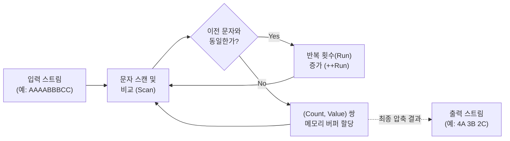

# 런랭스 코딩 (Run-Length Encoding, RLE)

---

## I. 무손실 데이터 압축의 기초, 런랭스(Run-Length) 코딩의 개요

* **정의**: 연속적으로 반복되는 데이터(기호, 비트, 픽셀 등)를 해당 데이터의 값(Value)과 반복 횟수(Run Count)의 쌍으로 치환하여 저장 공간을 줄이는 무손실 데이터 압축 [[알고리즘]]
* **등장배경/특징**:
* 팩시밀리 전송이나 흑백 이미지 등에서 연속된 0(공백)이나 동일 색상의 중복을 효율적으로 제거하기 위해 고안됨
* 인코딩 및 디코딩 과정이 순차적(O(n))이므로 시스템 오버헤드가 극히 낮고 연산 속도가 매우 빠름
* 반복 패턴이 많은 희소 데이터(Sparse Data)나 정렬된 컬럼 데이터에서는 압축률이 높으나, 난수(Random)와 같이 변화가 잦은 데이터에서는 오히려 용량이 증가하는 역압축 현상 발생 가능

---

## II. 런랭스 코딩의 개념도 및 핵심 기술 요소

### 가. 런랭스 코딩의 동작 원리

* 입력 스트림을 순차적으로 스캔하면서 동일한 문자가 반복되면 카운트를 누적하고, 값이 달라지는 시점에 (반복 횟수, 값)의 쌍으로 출력하여 데이터 크기를 감축함

### 나. 런랭스 코딩의 핵심 기술 및 구성 요소

| 구분 | 요소기술(키워드) | 세부 설명 |
| --- | --- | --- |
| **압축/복원** | **(Run, Value) 매핑** | 연속된 데이터 스트림을 식별하여 반복 횟수(Run Count)와 실제 데이터 값(Value)의 쌍 구조로 변환 및 역변환 |
| **압축/복원** | **이스케이프 (Escape) 제어** | 반복이 없는 난수 구간에서 파일 크기 증가를 막기 위해, 특정 제어 문자를 삽입하여 원본 상태 그대로 유지하는 보호 기법 |
| **전처리** | **지그재그 스캐닝 (Zig-zag)** | JPEG 등의 2차원 블록 데이터를 1차원 배열로 변환할 때, 동일한 값(특히 0)이 최대한 연속되도록 스캔 순서를 최적화 |
| **복합 최적화** | **딕셔너리 (Dictionary) 인코딩** | 가변 길이의 문자열을 정수(ID)로 사전 매핑한 후, 해당 정수 배열에 RLE를 적용하여 압축 효율 극대화 (예: Parquet) |
| **복합 최적화** | **비트 패킹 (Bit-packing)** | 변환된 정수 값 및 카운트를 일반적인 8/16/32비트 고정 길이가 아닌, 필요 최소 비트 단위로 조밀하게 패킹하여 압축률 향상 |
| **응용 구조** | **워드 정렬 하이브리드 (WAH)** | [[데이터베이스]] 비트맵 인덱스 압축 시, [[CPU]] 워드(32/64비트) 단위로 RLE와 일반 비트맵을 혼용하여 처리 속도 개선 |
| **응용 구조** | **제로 런랭스 (Zero Run-Length)** | 데이터 내 대부분이 0(Zero)인 희소 행렬(Sparse Matrix)에서 0이 연속되는 구간의 길이만을 압축하여 인코딩 |
| **복원 연산** | **메모리 복제 (Memset/Memcpy)** | RLE 디코딩 시 CPU 수준의 메모리 블록 복사 명령어를 활용하여 지연 시간(Latency) 없이 초고속으로 원본 데이터를 전개 |

---

## III. 런랭스 코딩의 최신 활용 동향 및 발전 전망

### 가. 런랭스 코딩의 현대적 응용 분야 및 전망

| 응용 분야 | 최신 활용 사례 | 핵심 역할 및 특징 |
| --- | --- | --- |
| **빅데이터 저장 (Columnar DB)** | **Apache Parquet / ORC** | [[하둡]](Hadoop) 및 스파크(Spark) 생태계에서 특정 컬럼(날짜, 상태값 등 정렬된 데이터)을 Dictionary와 RLE로 결합 압축하여 수십 배의 디스크 I/O 절감 효과 창출 |
| **AI / [[딥러닝]] 모델 경량화** | **희소 텐서 (Sparse Tensor) 압축** | 분산 딥러닝 연산 시, 가지치기(Pruning)로 인해 대부분이 0이 된 가중치 파라미터를 Zero-RLE로 압축하여 [[GPU]] 간 통신 네트워크 병목 해소 |
| **인메모리 DB 및 TSDB** | **비트맵 인덱스 / 시계열 압축** | IoT 센서 데이터(동일한 온도가 장시간 유지)나 카디널리티가 낮은 성별/부서 비트맵 인덱스를 Roaring Bitmap, WAH 등 RLE 변형 기법으로 압축하여 메모리 캐시 히트율 극대화 |
| **하이브리드 압축 파이프라인** | **LZ77, Snappy와의 결합** | RLE 단독 적용 시의 한계(불규칙 패턴 압축률 저하)를 극복하기 위해, 1차 RLE 압축 후 2차로 LZ계열 알고리즘을 중첩 적용하여 속도와 압축률의 트레이드오프를 최적화 |

* **향후 전망**: 전통적인 이미지 압축 기법이었던 런랭스 코딩은 압도적인 디코딩 속도라는 장점 덕분에, 최근 대용량 데이터를 메모리에 올려 고속으로 쿼리하는 인메모리 분석 시스템 및 AI 파라미터 통신 최적화 영역에서 복합 인코딩 기법의 필수 코어 알고리즘으로 재조명받고 있음

---

### 🔗 연관 토픽

- **소속 도메인**: [[00_컴퓨터구조_MOC|💻 컴퓨터구조]]
- **세부 분류**: `5. 핵심 알고리즘 & 계산 복잡도 (Algorithms)`
- **핵심 연관 토픽**:
  - [[CPU]]
  - [[GPU]]
  - [[알고리즘]]
  - [[딥러닝]]
  - [[하둡]]
