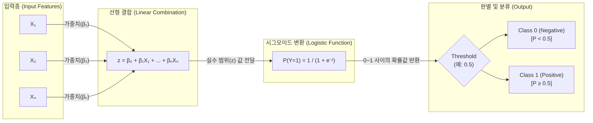

# 로지스틱 회귀분석 (Logistic Regression)

---

## I. 이항 분류를 위한 통계적 기계학습 모델, 로지스틱 회귀분석의 개요

가. **로지스틱 회귀분석의 정의**

* 독립 변수들의 선형 결합을 시그모이드(Sigmoid) 함수를 통해 0과 1 사이의 확률값으로 매핑하여, 종속 변수가 특정 범주(Class)에 속할지 여부를 예측하는 분류 [[알고리즘]]

나. **로지스틱 회귀분석의 필요성 및 특징**

* **선형 모델의 한계 극복**: 범주형 종속변수에 일반 선형 회귀를 적용 시 결과값이 0 미만 혹은 1 초과로 산출되는 문제(확률 공리 위배) 해결
* **투명한 설명력 (Interpretability)**: 회귀계수와 오즈비(Odds Ratio)를 활용하여 각 독립변수가 종속변수에 미치는 정량적 영향력을 직관적으로 해석 가능
* **확률 기반 유연성**: 단순 이분법적 분류가 아닌 '사건 발생 확률'을 반환하므로, 비즈니스 목적에 맞춰 판별 임계값(Threshold)을 동적으로 조정 가능

---

## II. 로지스틱 회귀분석의 개념도 및 핵심 기술 요소

### 가. 로지스틱 회귀분석의 아키텍처 및 동작 원리

* 입력 변수에 가중치를 곱해 더한 선형 결합값($z$)을 산출한 후, 로지스틱 함수를 통과시켜 사건 발생 확률값($P$)을 도출하고 임계치를 기준으로 최종 범주를 분류함

### 나. 로지스틱 회귀분석의 핵심 기술 및 구성 요소

| 분류 | 요소기술(키워드) | 세부 설명 |
| --- | --- | --- |
| **변환 함수** | **시그모이드 (Sigmoid)** | 실수 범위의 선형 결합 결과를 비선형 S자 곡선을 통해 0과 1 사이의 유효한 확률값으로 매핑하는 활성화 함수 ($\sigma(z) = \frac{1}{1 + e^{-z}}$) |
| **수학적 모델** | **로짓 (Logit) 변환** | 확률 $P$에 대한 오즈비에 자연로그를 취해, 종속변수와 독립변수 간의 선형 관계식을 유도하는 링크 함수 ($\ln(\frac{P}{1-P}) = z$) |
| **모델 해석** | **오즈비 (Odds Ratio)** | 실패할 확률 대비 성공할 확률의 비율($\frac{P}{1-P}$)로, 특정 변수가 1단위 증가할 때 사건이 발생할 상대적 비율 변화를 수치화 |
| **비용 함수** | **로그 손실 (Cross-Entropy)** | 실제 [[클래스]] 레이블과 모델이 예측한 확률 분포 간의 정보량 차이를 측정하여 모델 최적화의 목적 함수로 활용 |
| **파라미터 추정** | **최대우도추정법 (MLE)** | 오차가 정규분포를 따른다는 가정 하에, 관측된 표본 데이터들이 발생할 누적 확률(Likelihood)을 최대화하는 최적의 회귀계수 도출 |
| **과적합 방지** | **정규화 (Regularization)** | L1(Lasso) 및 L2(Ridge) 페널티 항을 비용 함수에 추가하여, [[다중공선성]](Multicollinearity) 문제를 완화하고 모델 [[일반화]] 성능 향상 |
| **[[데이터 전처리]]** | **WoE (Weight of Evidence)** | 범주형 데이터의 각 그룹이 타겟 변수(정상/불량 등)에 미치는 영향력을 연속형 수치로 로그 치환하여 로지스틱 회귀의 입력값으로 활용 |
| **성능 평가** | **혼동 행렬 / ROC-AUC** | 임계값 조절에 따른 민감도(Recall)와 특이도(Specificity)의 트레이드오프 관계를 시각화하여 이항 분류기의 예측 성능 종합 평가 |

---

## III. 선형 회귀분석과의 비교 및 최신 트렌드

### 가. 선형 회귀분석 vs 로지스틱 회귀분석 비교

| 비교 항목 | 선형 [[회귀분석]] (Linear Regression) | 로지스틱 회귀분석 (Logistic Regression) |
| --- | --- | --- |
| **종속 변수 형태** | 연속형 수치 데이터 (Continuous) | 범주형 데이터 (Categorical, 주로 이진 0/1) |
| **주요 분석 목적** | 연속적 값의 **예측** (예: 주택 가격, 매출액) | 집단 및 범주의 **분류** (예: 이탈 여부, 스팸 분류) |
| **예측 결과값 범위** | $-\infty$ ~ $\infty$ (제한 없음) | $0 \sim 1$ 사이의 **확률값** |
| **활성화/변환 함수** | 항등 함수 (Identity Function) | **시그모이드 (Sigmoid) / 로짓 변환** |
| **파라미터 추정법** | 최소제곱법 (OLS, Ordinary Least Squares) | **최대우도추정법 (MLE, Maximum Likelihood Estimation)** |
| **성능 평가 지표** | MSE, RMSE, $R^2$ (결정계수) | Accuracy, F1-Score, ROC-AUC |

### 나. 로지스틱 회귀분석의 최신 트렌드 및 향후 전망

* **[[XAI]](Explainable AI)의 베이스라인 모델 역할**: 인공신경망(DNN) 기반 블랙박스 모델의 불투명성을 극복하기 위해, 금융권 신용평가시스템(CSS)이나 의료/헬스케어 질병 진단 등 고신뢰(High-trust)가 요구되는 도메인에서 높은 해석력(White-box)을 바탕으로 여전히 핵심 분류기로 채택됨
* **하이브리드 머신러닝 파이프라인 융합**: [[랜덤 포레스트]](Random Forest)나 그레디언트 [[부스팅]](XGBoost)을 통해 비선형 데이터의 피처 중요도(Feature Importance)를 1차 추출한 뒤, 최종 예측과 계수 해석에는 로지스틱 회귀를 적용하여 '예측 정확도'와 '설명력'을 동시에 확보하는 앙상블 아키텍처 도입이 가속화 중임

---

### 🔗 연관 토픽

- **소속 도메인**: [[00_인공지능_MOC|🤖 인공지능]]
- **세부 분류**: `1. 수학 · 통계학 & 데이터 전처리`
- **핵심 연관 토픽**:
  - [[다중공선성|다중공선성 (Multicolinearity)]]
  - [[회귀분석|회귀분석(Regression Analysis)]]
  - [[랜덤 포레스트|랜덤 포레스트 (Random Forest)]]
  - [[XAI]]
  - [[이상치]]
