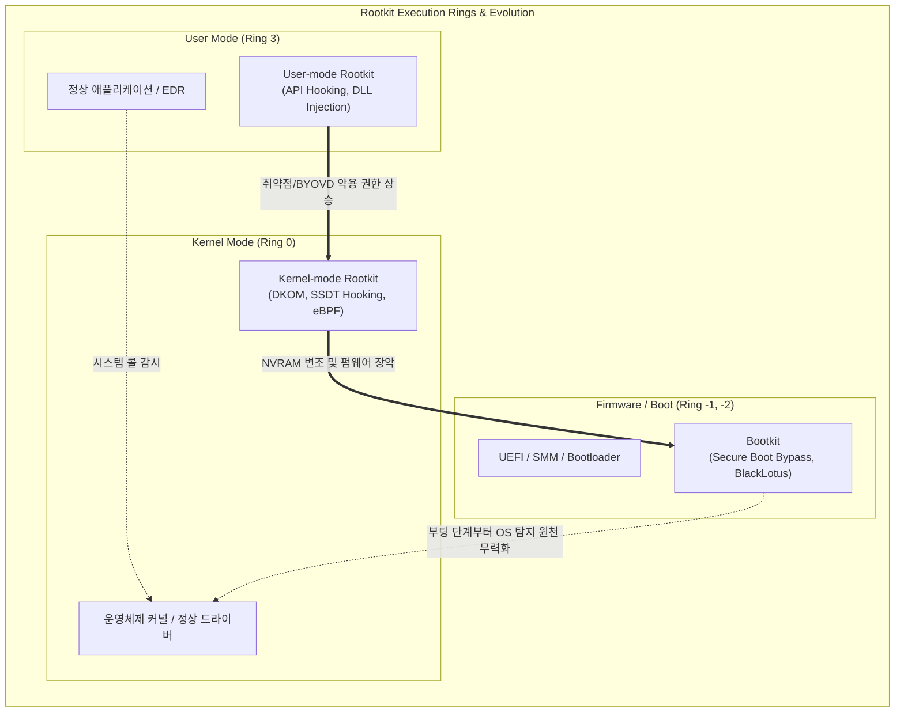

# 루트킷 (Rootkit)

---

## I. 시스템 장악 및 은폐의 핵심 위협, 루트킷의 개요

* **정의**: 해커가 시스템의 최고 관리자(Root/Admin) 권한을 획득한 후, 악성코드, 백도어, 시스템 로그 등의 존재를 운영체제로부터 완벽히 은폐하여 지속적인 공격을 수행하는 악성 소프트웨어
* **등장배경/특징**:
* 엔드포인트 보안 솔루션([[EDR(Endpoint Detection and Response)|EDR]]/백신)의 발전으로 인한 기존 유저 레벨(User-mode) 악성코드 탐지 회피 필요성 증가
* [[OS(운영체제)|운영체제]](OS) 부팅 이전 단계인 펌웨어(UEFI) 장악 및 커널 객체 직접 조작(DKOM)으로 공격 심도 진화
* 최근 취약한 합법 드라이버 악용(BYOVD) 및 클라우드 환경의 eBPF를 악용하는 텔레메트리 은폐 공격으로 고도화

---

## II. 루트킷의 계층별 개념도 및 핵심 기술 요소

### 가. 운영체제 계층별 루트킷의 구성도 및 동작 원리

* 공격자는 User 권한에서 취약점을 통해 [[커널|Kernel]] 또는 펌웨어(UEFI) 영역까지 권한을 상승시킴
* OS보다 먼저 실행(Bootkit)되거나 커널의 핵심 자료구조를 조작하여 보안 솔루션의 탐지 가시성을 완전히 무력화함

### 나. 루트킷의 핵심 공격 기술 및 방어 요소

| 구분 | 요소기술(키워드) | 세부 설명 |
| --- | --- | --- |
| **운영체제 은폐** | **DKOM (Direct Kernel Object Manipulation)** | 커널 메모리 내 [[프로세스]] 연결 리스트(EPROCESS 구조체 등)를 직접 조작하여 악성 프로세스 및 [[쓰레드]] 은폐 |
| **시스템 제어권 탈취** | **SSDT Hooking** | 시스템 콜 [[디스패치]] 테이블(SSDT)의 함수 포인터를 변조하여, 정상 API 호출을 악의적 함수로 우회 실행 |
| **합법 도구 악용** | **BYOVD (Bring Your Own Vulnerable Driver)** | 인증서가 유효한 취약 커널 드라이버를 로드하여 보안 솔루션(EDR/AV) 프로세스를 커널 레벨에서 강제 종료 |
| **펌웨어 장악** | **UEFI Bootkit (블랙로터스)** | OS 부팅 이전 펌웨어 단계에서 실행되어 Secure Boot를 우회하고 OS 커널에 악성 모듈을 주입 ([[CVE]]-2022-21894 악용 등) |
| **클라우드 위협** | **eBPF Rootkit** | 리눅스 커널의 고성능 모니터링 기술인 eBPF를 악용하여 [[컨테이너]] 환경의 네트워크 및 파일 접근 흔적을 스텔스하게 은폐 |
| **방어: 서명 검증** | **DSE (Driver Signature Enforcement)** | 운영체제 구동 시 디지털 서명이 없거나 유효하지 않은 커널 드라이버의 메모리 로드를 원천 차단 |
| **방어: [[무결성]] 감시** | **PatchGuard (KPP)** | 커널의 핵심 데이터 구조체(SSDT, IDT 등) 변조를 실시간으로 감시하고, 탐지 시 시스템 패닉(BSOD) 유도 |
| **방어: 하드웨어 신뢰** | **HVCI / [[TPM]] 기반 증명** | 하이퍼바이저 기반 코드 무결성(HVCI) 및 TPM을 활용하여 부트로더부터 커널까지 암호학적 신뢰 체인(Chain of Trust) 구성 |

---

## III. 루트킷 위협의 동향 및 방어 체계 발전 전망

### 가. 최신 루트킷 공격 트렌드 및 엔터프라이즈 대응 방안

* **[[클라우드 네이티브]] 은폐 위협 심화**: 과거 LKM(Loadable Kernel Module) 방식에서 시스템 크래시 위험이 적은 eBPF를 악용하는 루트킷(Symbiote 등)으로 진화하여 대규모 클라우드 컨테이너의 추적망을 우회함
* **Secure Boot 무력화 현상 현실화**: 취약한 윈도우 부트로더를 악용해 패치된 최신 OS 환경에서도 시큐어 부트를 우회하는 **BlackLotus(블랙로터스) 펌웨어 부트킷** 공격이 지하 시장을 통해 확산 중임
* **제로 트러스트 및 공급망 보안 강화**: 커널 권한 탈취(BYOVD)를 방어하기 위해 윈도우 **취약 드라이버 차단 목록(Blocklist)의 상시 업데이트 체계 적용**이 필수적이며, 메모리 포렌식 기반의 행위 기반 이상 탐지([[Anomaly(이상현상)|Anomaly]] Detection) 모델 도입 가속화

---

### 🔗 연관 토픽

- **소속 도메인**: [[00_보안_MOC|🛡️ 보안]]
- **세부 분류**: `5. 사이버 공격 기법 & 침해사고 대응`
- **핵심 연관 토픽**:
  - [[사이버 킬 체인|사이버 킬 체인 (Cyber Kill Chain)]]
  - [[프로세스]]
  - [[컨테이너|컨테이너 (Container)]]
  - [[커널|커널(Kernel)]]
  - [[OS(운영체제)]]
