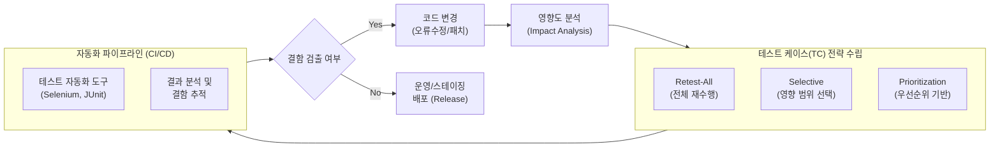

# 리그레션 테스트 (Regression Test)

---

## I. 소프트웨어 무결성 유지를 위한 반복 검증, 리그레션 테스트의 개요

* **정의**: 소프트웨어의 코드 변경(오류 수정, 기능 개선, 패치 등) 후, 변경되지 않은 기존 시스템 기능에 새로운 결함(Side Effect)이 발생하지 않았음을 검증하기 위한 테스트
* **필요성 및 등장배경**:
* 애자일([[Agile]]) 및 [[DevOps]] 환경 확산으로 잦은 코드 배포 및 통합 발생
* 모듈 간 결합도로 인한 파급 효과(Ripple Effect)의 사전 차단 및 품질 저하 방지

* **특징**: 반복적 수행, 테스트 자동화 필수, 기존 테스트 케이스(TC)의 [[재사용]] 및 최적화

---

## II. 리그레션 테스트의 개념도 및 핵심 기술 요소

### 가. 리그레션 테스트의 수행 개념도

* 코드 변경에 따른 파급 효과를 분석 후, 최적의 TC 선정 기법을 적용하여 CI/CD 파이프라인 상에서 자동화된 테스트를 반복 수행함

### 나. 리그레션 테스트의 핵심 기술 및 구성 요소

| 구분 | 요소기술(키워드) | 세부 설명 |
| --- | --- | --- |
| **영향도 평가** | **영향도 분석 (Impact Analysis)** | 코드 변경이 기존 모듈 및 시스템 아키텍처에 미치는 파급 범위를 사전 식별 및 추적 |
| **TC 선정 기법** | **Retest-All (전체 재테스트)** | [[유지보수]] 중인 전체 소프트웨어를 대상으로 기존의 모든 테스트 케이스를 재실행 (비용/시간 높음) |
| **TC 선정 기법** | **Selective (선택적 테스트)** | 코드 변경 영역과 직접적으로 연관이 있는 테스트 케이스만 선별하여 실행 (RTM 활용) |
| **TC 선정 기법** | **Prioritization (우선순위 기반)** | 비즈니스 중요도, 결함 발생 빈도, 위험도 기반으로 TC에 가중치를 부여하여 우선 수행 |
| **요구사항 관리** | **요구사항 추적 매트릭스 (RTM)** | 변경된 요구사항, 소스코드, 테스트 케이스 간의 양방향 추적성을 확보하여 누락 방지 |
| **테스트 자동화** | **자동화 [[프레임워크]] / 도구** | Selenium, Appium, JUnit 등 도구를 활용하여 반복적 스크립트 실행의 효율성 및 정확성 제고 |
| **배포 통합** | **Continuous Testing (CI/CD)** | Jenkins, GitLab 등과 연동하여 코드 커밋(Commit) 시마다 자동으로 리그레션 테스트 트리거 수행 |
| **최신 기술** | **AI 기반 TC 최적화** | 머신러닝 알고리즘을 활용하여 코드 변경 패턴을 분석하고, 가장 결함 확률이 높은 TC를 자동 추천 |

---

## III. 리그레션 테스트와 확인 테스트(Re-testing) 비교 및 최신 동향

### 가. 리그레션 테스트 vs 확인 테스트(Re-testing) 비교

| 비교 항목 | 리그레션 테스트 ([[Regression Test]]) | 확인 테스트 (Confirmation / Re-testing) |
| --- | --- | --- |
| **검증 목적** | 변경에 따른 **부작용(Side Effect) 및 미영향 검증** | 발견된 **결함(Bug)이 정상적으로 수정되었는지 검증** |
| **테스트 대상** | **변경되지 않은** 기존 기능 및 연관 모듈 전체 | **수정 조치된** 오류 코드 및 특정 결함 모듈 |
| **수행 방법** | 기존 테스트 케이스 **재사용 및 자동화(CI/CD)** | 결함을 발견했던 테스트 케이스 **수동 재실행** 중심 |
| **수행 시점** | 확인 테스트 통과 후 시스템 통합 단계 수행 | 디버깅 완료 후 즉각적인 단위/모듈 단계 수행 |
| **비용 및 시간** | 범위가 넓어 높음 (자동화 필수) | 범위가 국소적이므로 상대적으로 낮음 |

### 나. 리그레션 테스트의 최신 동향 및 향후 전망

* **AI/ML 기반 테스트 최적화 (Smart Regression Testing)**: 기존의 방대한 TC 유지보수 부담을 줄이기 위해, AI 알고리즘이 변경된 코드를 정적/동적 분석하여 가장 유효한 TC만 선별해주는 'AI 기반 테스트 선정 [[알고리즘]]' 도입 가속화
* **Shift-Left 테스팅 생태계 내재화**: 배포 후반부에 수행되던 리그레션 테스트를 개발 초기 단계(IDE 플러그인 연동, Pull Request 단계)로 전진 배치하여 결함 수정 비용 최소화
* **자율형(Autonomous) 테스트 생성**: [[초거대 언어 모델|LLM]] 및 생성형 AI를 활용하여 요구사항 명세서나 수정된 코드를 기반으로 리그레션 테스트 스크립트를 자동으로 작성, 보완하는 기술(Test-as-a-Code) 확산

---

### 🔗 연관 토픽

- **소속 도메인**: [[00_소프트웨어공학_MOC|🏗️ 소프트웨어공학]]
- **세부 분류**: `2. 애자일(Agile) & 지속적 통합/배포(CI/CD)`
- **핵심 연관 토픽**:
  - [[Regression Test]]
  - [[소프트웨어 테스트|소프트웨어 테스트 (Software Test)]]
  - [[탐색적 테스트]]
  - [[테스트 실행 도구]]
  - [[DevOps|데브옵스 (DevOps)]]
