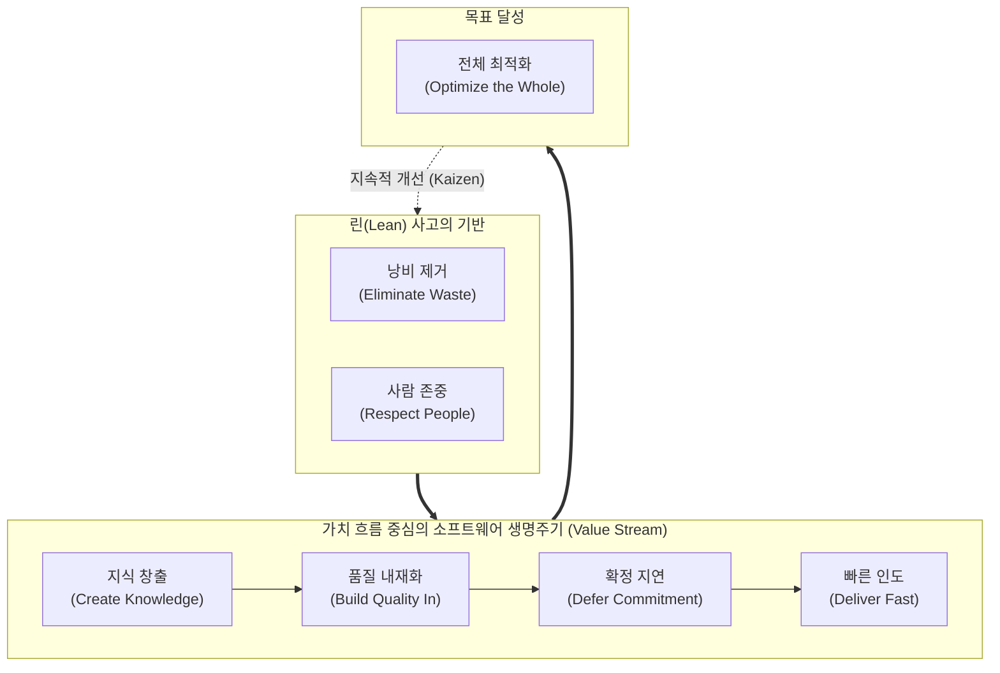

# 린 (Lean) 방법론

---

## I. 낭비 최소화와 가치 극대화를 위한, 린(Lean) 방법론의 개요

* **정의**: 도요타 생산 방식(TPS)의 철학을 소프트웨어 공학에 적용하여, 고객에게 가치가 없는 모든 낭비(Waste)를 제거하고 프로세스의 흐름을 최적화하는 [[소프트웨어 개발 방법론]]
* **필요성 및 등장배경**:
* **불확실성 증가**: 시장 변화에 신속하게 대응하기 위한 가설 검증 및 빠른 피드백 루프(Lean Startup) 필요성 대두
* **애자일 확산의 한계**: 단위 팀 중심의 애자일([[Agile]])을 넘어, 조직 전체의 가치 흐름(Value Stream)을 최적화하기 위한 전사적 접근법 요구

* **특징**: 가치 흐름 매핑(VSM), 낭비 제거, 지속적 개선(Kaizen), 풀 시스템(Pull System) 기반의 적시 생산(JIT)

---

## II. 린 방법론의 개념도 및 핵심 원칙 (7대 원칙)

### 가. 린 소프트웨어 개발의 개념도 및 동작 원리

* 개발 전 과정에서 발생하는 7대 낭비(미완성 작업, 추가 기능, 지연, 이관 등)를 식별 및 제거하고, 가치 흐름(Value Stream)을 따라 전체 시스템을 최적화함

### 나. 린 소프트웨어 개발의 핵심 기술 및 구성 요소 (7대 원칙 중심)

| 구분 | 요소기술(키워드) | 세부 설명 |
| --- | --- | --- |
| **효율화** | **낭비 제거 (Eliminate Waste)** | 사용되지 않는 기능(Over-engineering), 대기 시간(Delay), 불명확한 요구사항, 관료주의 등 가치를 창출하지 않는 7대 낭비 요소 제거 |
| **품질보증** | **품질 내재화 (Build Quality In)** | 사후 결함 수정이 아닌, [[TDD]](테스트 주도 개발), 지속적 통합(CI), 페어 프로그래밍을 통해 개발 [[프로세스]] 자체에 결함 방지 체계 구축 |
| **역량강화** | **지식 창출 (Create Knowledge)** | 코드 리뷰, 위키, 회고(Retrospective)를 통해 팀의 학습 결과를 자산화하고, 조직 내 지식 공유 및 피드백 순환 구조 확립 |
| **의사결정** | **확정 지연 (Defer Commitment)** | 불확실성이 해소되고 가장 많은 정보를 확보할 수 있는 마지막 순간(Last Responsible Moment)까지 핵심적인 구조 결정 보류 |
| **속도향상** | **빠른 인도 (Deliver Fast)** | 짧은 반복(Iteration) 주기와 자동화된 배포 파이프라인(CD)을 통해 고객에게 신속하게 가치를 전달하고 피드백 확보 |
| **조직문화** | **사람 존중 (Respect People)** | 개발팀에 실질적인 의사결정 권한을 위임하고, 지시 기반 통제가 아닌 자율성과 동기 부여를 통한 몰입 환경 조성 |
| **시스템관점** | **전체 최적화 (Optimize the Whole)** | 개별 모듈이나 특정 부서의 부분 최적화를 지양하고, 아이디어 발의부터 배포까지의 전체 가치 흐름(Value Stream) 최적화 도모 |
| **분석도구** | **VSM (Value Stream Mapping)** | 고객에게 가치가 전달되는 모든 일련의 과정을 시각화하여, 병목(Bottleneck) 구간과 낭비 요소를 정량적으로 분석하는 기법 |

---

## III. 린(Lean)과 애자일(Agile) 비교 및 최신 트렌드

### 가. 린(Lean) 방법론과 애자일(Agile) 방법론 비교

| 비교 항목 | 린 (Lean) 방법론 | 애자일 (Agile) 방법론 |
| --- | --- | --- |
| **핵심 철학/목표** | **가치 흐름 최적화 및 낭비 제거** | **변화에 대한 적응력 및 협업 강화** |
| **접근 관점** | 거시적 (전체 시스템, 가치 사슬) | 미시적 (개별 프로젝트, 개발 팀) |
| **프로세스 통제** | **연속적인 흐름 (Continuous Flow)** | **반복적인 타임박스 (Iterative, Sprint)** |
| **주요 [[프레임워크]]** | 린 스타트업(Lean Startup), 칸반(Kanban) | [[스크럼]]([[SCRUM|Scrum]]), eXtreme Programming(XP) |
| **핵심 관리 단위** | 리드 타임(Lead Time), WIP(Work In Process) 제한 | 스토리 포인트(Story Point), 벨로시티(Velocity) |

### 나. 린 방법론의 최신 트렌드 및 향후 전망

* **린 스타트업(Lean Startup)의 표준화**: 아이디어 도출 후 최소 기능 제품([[01_IT Tech/MVP]])을 빠르게 개발하고, 성과를 측정(Measure)하여 학습(Learn)하는 'Build-Measure-Learn' 피드백 루프가 신사업 개발의 사실상 표준(De facto standard)으로 자리매김함
* **엔터프라이즈 애자일(SAFe)과의 융합**: 대규모 조직에 애자일을 적용하기 위한 Scaled Agile Framework(SAFe)의 핵심 기반 철학으로 린(Lean-Agile Mindset)이 적용되어 전사적 포트폴리오 관리에 활용됨
* **AI 기반 VSM (Value Stream Management)**: 최근 데브옵스([[DevOps]]) 파이프라인에 AI/ML을 접목하여, CI/CD 과정에서 발생하는 대기 시간과 병목 현상(낭비)을 자동으로 식별하고 최적화 인사이트를 제공하는 지능형 VSM 플랫폼 도입 가속화

---

### 🔗 연관 토픽

- **소속 도메인**: [[00_프로젝트관리_MOC|📋 프로젝트관리]]
- **세부 분류**: `5. 애자일 프로젝트 관리 & 개발 운영 (Agile PM)`
- **핵심 연관 토픽**:
  - [[DevOps|데브옵스 (DevOps)]]
  - [[스크럼|스크럼 (SCRUM)]]
  - [[Kanban (development) 프로세스]]
  - [[SCRUM]]
  - [[Agile]]
