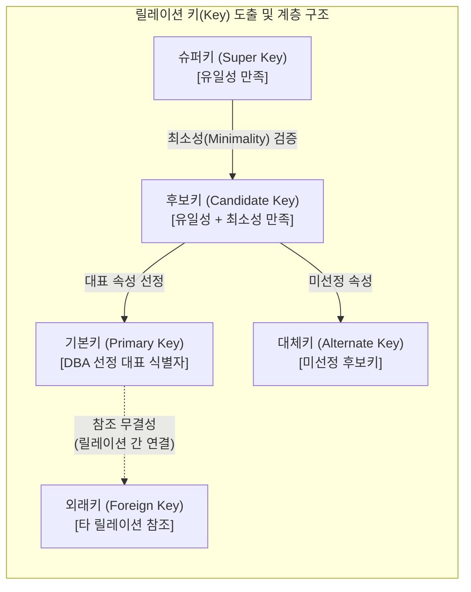

# 릴레이션 키 (Relation Key)

---

## I. 데이터 무결성 보장 및 튜플 식별자, 릴레이션 키의 개요

* **정의**: 관계형 [[데이터베이스]](RDB)에서 릴레이션 내의 튜플(Tuple)을 유일하게 식별하고, 릴레이션 간의 관계(Relationship)를 정의하기 위해 사용하는 속성(Attribute) 또는 속성의 집합
* **필요성/등장배경/특징**:
* **데이터 [[무결성]] 보장**: [[엔티티]] 무결성(Entity Integrity) 및 참조 무결성(Referential Integrity) 유지 수단
* **식별성 확보**: 데이터의 중복 방지 및 튜플의 유일성(Uniqueness)과 최소성(Minimality) 확보
* **검색 성능 향상**: 기본키 기반 인덱스 생성을 통한 고속 데이터 탐색 및 [[조인|조인(Join)]] 연산 기준 제공

---

## II. 릴레이션 키의 도출 과정 및 핵심 유형

### 가. 릴레이션 키의 도출 개념도 및 동작 원리

* 유일성을 만족하는 슈퍼키 집합에서 최소성 검증을 거쳐 후보키를 도출하며, 이 중 대표 속성을 기본키로 선정하여 외래키를 통해 릴레이션 간 관계(Relation)를 맺음

### 나. 릴레이션 키의 핵심 기술 및 구성 요소

| 구분 | 요소기술(키워드) | 세부 설명 |
| --- | --- | --- |
| **기본 요건** | **유일성 (Uniqueness)** | 하나의 릴레이션에서 모든 튜플을 서로 다르게 식별할 수 있는 성질 |
| **기본 요건** | **최소성 (Minimality)** | 튜플을 유일하게 식별하는 데 꼭 필요한 최소한의 속성만으로 구성된 성질 |
| **키의 종류** | **슈퍼키 (Super Key)** | 유일성은 만족하지만 최소성은 만족하지 않아도 되는 속성들의 집합 (예: 학번+이름) |
| **키의 종류** | **후보키 (Candidate Key)** | 유일성과 최소성을 모두 만족하는 속성의 집합으로 기본키가 될 자격이 있음 (예: 학번, 주민번호) |
| **키의 종류** | **기본키 (Primary Key)** | 후보키 중 DB 설계자가 데이터 식별을 위해 선택한 주 식별자 (NULL, 중복 불가) |
| **키의 종류** | **대체키 (Alternate Key)** | 후보키 중에서 기본키로 선택되지 못한 나머지 속성 집합 (보조키 역할) |
| **키의 종류** | **외래키 (Foreign Key)** | 다른 릴레이션의 기본키를 참조하여 릴레이션 간 관계를 형성하는 속성 |
| **논리 설계** | **인조키 (Surrogate Key)** | 비즈니스 의미가 없는 시퀀스(Sequence)나 UUID 등을 시스템이 강제로 부여한 대리키 |

---

## III. 릴레이션 키의 비교 및 최신 설계 동향

### 가. 속성 특성에 따른 주요 릴레이션 키 비교

| 비교 항목 | 슈퍼키 (Super Key) | 후보키 (Candidate Key) | 기본키 (Primary Key) | 외래키 (Foreign Key) |
| --- | --- | --- | --- | --- |
| **만족 조건** | **유일성** 만족 | **유일성 + 최소성** 만족 | **유일성 + 최소성** 만족 | **참조 무결성** 만족 |
| **NULL 허용** | 속성에 따라 다름 | 속성에 따라 다름 | **절대 불가 (NOT NULL)** | **허용** (식별관계 제외) |
| **중복 여부** | 중복 불가 | 중복 불가 | **중복 불가 (UNIQUE)** | **허용** (1:N 관계) |
| **주요 특징** | 모든 키의 상위 집합 | 기본키 선정의 후보군 | 릴레이션당 **단 1개만 지정** | 릴레이션 간의 연결 고리 |

### 나. 릴레이션 키 설계의 최신 동향 및 전망

* **인조키(Surrogate Key)의 적극적 도입**: 비즈니스 룰 변경 시 자연키(Natural Key)의 값 변경으로 인한 종속성 문제를 방지하기 위해 일련번호, UUID 형태의 인조키 사용 표준화 확산
* **분산 DB 및 [[MSA (Micro Service Architecture)|MSA]] 환경의 키 설계 전략**: 여러 독립된 데이터베이스 간의 고유성 보장을 위해 중앙 집중형 채번 방식 대신 분산 ID 생성기(Twitter Snowflake 등)를 활용한 충돌 없는 식별자(Key) 할당 기술 도입 가속화

---

### 🔗 연관 토픽

- **소속 도메인**: [[00_데이터베이스_MOC|🗄️ 데이터베이스]]
- **세부 분류**: `1. 데이터 모델링 & 관계형 DB 설계`
- **핵심 연관 토픽**:
  - [[엔티티|엔티티(Entity)]]
  - [[조인|조인(Join)]]
  - [[데이터베이스]]
  - [[무결성]]
  - [[스키마]]
