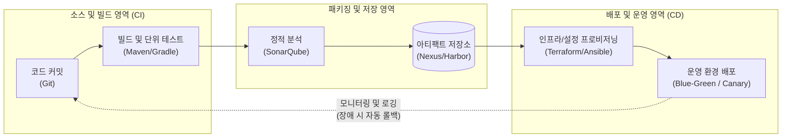

# 릴리즈 엔지니어링 (Release Engineering)

---

## I. 무중단 배포와 일관된 가치 전달의 핵심, 릴리즈 엔지니어링의 개요

* **정의**: 소스코드의 병합, 빌드, 테스트, 패키징 및 배포에 이르는 소프트웨어 전달(Delivery) 전 과정을 자동화하고 표준화하여 [[신뢰성]] 있는 배포를 보장하는 공학적 접근법
* **필요성 및 등장배경**:
* Time-to-Market 단축 요구 및 마이크로서비스 아키텍처([[MSA (Micro Service Architecture)|MSA]]) 도입에 따른 배포 복잡도 증가
* "내 PC에서는 되는데 운영에서는 안 됨"과 같은 환경 불일치(Configuration Drift) 문제 해결 필요

* **특징**: 재현성(Reproducibility), 일관성(Consistency), 자동화 파이프라인(CI/CD), 추적성(Traceability)

---

## II. 릴리즈 엔지니어링의 파이프라인 개념도 및 핵심 기술 요소

### 가. 릴리즈 엔지니어링 프로세스 개념도

* 개발자의 코드 커밋부터 빌드, 테스트, 아티팩트 생성 및 최종 배포까지의 과정을 사람의 개입 없이(Zero-Touch) 파이프라인을 통해 재현 가능하도록 구성함

### 나. 릴리즈 엔지니어링의 핵심 기술 및 구성 요소

| 구분 | 요소기술(키워드) | 세부 설명 |
| --- | --- | --- |
| **버전 관리** | **VCS (Version Control System)** | 소스코드의 변경 이력을 관리하고 Branch 전략(Git Flow 등)을 통한 병렬 개발 지원 |
| **자동화 도구** | **CI/CD 파이프라인** | Jenkins, GitLab CI, GitHub Actions 등을 활용한 빌드-테스트-배포 워크플로우 자동화 |
| **저장소 관리** | **아티팩트 리포지토리 (Artifact Repo)** | 빌드된 바이너리 파일, [[컨테이너]] 이미지 등을 버전별로 불변(Immutable) 상태로 저장·관리 |
| **환경 구성** | **IaC (Infrastructure as Code)** | 인프라 구성을 코드로 정의(Terraform)하고 설정(Ansible)하여 환경 불일치 원천 차단 |
| **컨테이너화** | **[[도커|Docker]] & Kubernetes** | 애플리케이션과 실행 환경을 패키징하여 이식성을 높이고 대규모 배포의 오케스트레이션 수행 |
| **배포 전략** | **Blue/Green 배포** | 신버전(Green)과 구버전(Blue) 환경을 동시 구성 후 라우팅 전환으로 [[무중단 배포]] 구현 |
| **배포 전략** | **Canary 배포 (카나리)** | 소수의 사용자에게만 신버전을 선별적으로 배포하여 위험을 검증한 후 점진적 확대 적용 |
| **품질/보안** | **Shift-Left / [[DevSecOps]]** | 파이프라인 초기 단계에 정적 분석([[SAST]]), 의존성 취약점 스캐닝을 통합하여 보안 결함 조기 발견 |

---

## III. 데브옵스(DevOps)와의 비교 및 최신 동향

### 가. 릴리즈 엔지니어링과 데브옵스(DevOps) 비교

| 비교 항목 | 릴리즈 엔지니어링 (Release Engineering) | [[DevOps|데브옵스 (DevOps)]] |
| --- | --- | --- |
| **핵심 목적** | 소프트웨어 **빌드 및 배포 과정의 기계적 완성도** 확보 | 개발과 운영 간의 **사일로(Silo) 타파 및 협업 문화** 구축 |
| **주요 초점** | 도구, 파이프라인, 아티팩트 관리, 재현성, 배포 전략 | 문화적 철학, 측정, [[프로세스]], 전사적 가치 흐름(Value Stream) |
| **수행 주체** | 릴리즈 매니저, CI/CD 엔지니어 | 개발자, 운영자, QA 전 조직 구성원 |
| **상호 관계** | 데브옵스 철학을 기술적/공학적으로 실현하기 위한 **구체적인 실행 방법론 (Practice)** | 릴리즈 엔지니어링을 포괄하는 **상위 개념의 문화 및 체계** |

### 나. 릴리즈 엔지니어링의 최신 트렌드 및 발전 전망

* **GitOps의 부상**: 선언적(Declarative) 인프라 및 애플리케이션 설정의 단일 진실 공급원(SSOT)을 Git으로 일원화하여, 클러스터 상태와 Git 상태를 자동 동기화(ArgoCD 등)하는 배포 패러다임 확산
* **AIOps 기반 지능형 릴리즈**: 배포 후 발생하는 로그와 메트릭을 머신러닝으로 분석하여 장애 징후를 선제적으로 예측하고, 문제 발생 시 파이프라인을 자동 롤백(Auto-Rollback)하는 자율형 배포 체계로 진화
* **내부 개발자 플랫폼(IDP, Platform Engineering)**: 개발자가 릴리즈 엔지니어링의 복잡한 인프라나 파이프라인 스크립트를 몰라도, 셀프 서비스 포털을 통해 손쉽게 배포 환경을 프로비저닝할 수 있는 플랫폼 엔지니어링 도입 가속화

---

### 🔗 연관 토픽

- **소속 도메인**: [[00_소프트웨어공학_MOC|🏗️ 소프트웨어공학]]
- **세부 분류**: `3. 요구사항 공학 & UML 객체지향 분석/설계`
- **핵심 연관 토픽**:
  - [[신뢰성]]
  - [[MSA (Micro Service Architecture)]]
  - [[DevOps|데브옵스 (DevOps)]]
  - [[컨테이너|컨테이너 (Container)]]
  - [[DevSecOps]]
