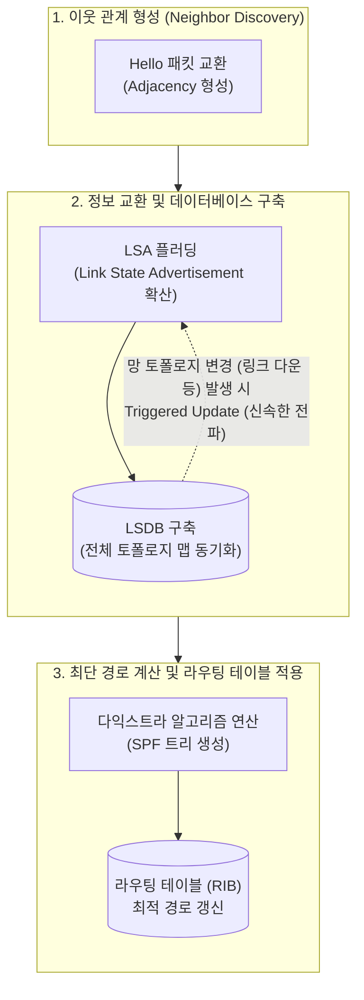

# 링크 상태 알고리즘 (Link State Algorithm)

---

## I. 최단 경로 탐색 기반 동적 라우팅, 링크 상태 알고리즘의 개요

가. **링크 상태 알고리즘의 정의**

* 망 내 모든 라우터가 토폴로지 정보를 교환하여 전체 네트워크 지도(LSDB)를 구성하고, 다익스트라(Dijkstra) 알고리즘을 통해 최적의 라우팅 경로(SPF 트리)를 결정하는 동적 [[라우팅 알고리즘]]

나. **링크 상태 알고리즘의 필요성 및 특징**

* **등장배경**: 거리 벡터(Distance Vector) 프로토콜의 느린 수렴(Convergence) 속도 한계 및 라우팅 루프(Looping) 문제 해결 필요
* **특징**: 전체 토폴로지 인지(계층적 Area 구조 지원), 이벤트 주도형(Event-driven) 부분 갱신에 따른 신속한 장애 대응, [[CPU]]/메모리 리소스 점유율 상대적 높음

---

## II. 링크 상태 알고리즘의 프로세스 및 핵심 기술 요소

### 가. 링크 상태 알고리즘의 동작 프로세스

* 각 라우터는 헬로(Hello) 패킷으로 이웃 관계를 맺고 전체 망에 LSA를 플러딩하여 동일한 LSDB를 구성한 뒤, 자신을 루트로 하는 SPF(최단 경로) 트리를 계산하여 RIB(라우팅 테이블)를 갱신함

### 나. 링크 상태 알고리즘의 핵심 기술 요소

| 분류 | 요소기술(키워드) | 세부 설명 |
| --- | --- | --- |
| **토폴로지 교환** | **Hello Packet** | 인접 라우터를 동적으로 탐색하고 이웃(Neighbor) 상태를 지속해서 확인 및 유지하는 제어 패킷 |
| **토폴로지 교환** | **LSA (Link State Advertisement)** | 인접 [[라우터]] 간 공유하는 자신의 링크 상태, 대역폭, 접속된 서브넷 정보를 담은 핵심 패킷 |
| **토폴로지 교환** | **Flooding (플러딩)** | 수신한 LSA 패킷을 수신 포트를 제외한 모든 인터페이스로 릴레이 전송하여 전체 망에 빠르게 정보 확산 |
| **데이터 구조화** | **LSDB (Link State Database)** | 수집된 모든 LSA 정보를 통합하여 네트워크 전체 구조를 파악하는 지도(Map) 역할을 수행하는 원본 [[데이터베이스]] |
| **경로 탐색** | **Dijkstra (다익스트라) [[알고리즘]]** | 그래프상의 특정 노드에서 다른 모든 노드까지의 누적 비용을 계산하여 최소 비용의 최단 경로를 탐색하는 알고리즘 |
| **경로 탐색** | **SPF Tree (Shortest Path First)** | 다익스트라 연산을 통해 자신(라우터)을 Root 노드로 두고 목적지까지 순환 루프(Loop)가 없는 계층형 트리 구조 생성 |
| **메트릭(Metric)** | **Cost (비용/대역폭)** | 최적 경로 산출을 위한 평가 기준값으로, 링크의 대역폭(Bandwidth)을 기반으로 산출 (Cost 값이 작을수록 우선순위 높음) |
| **적용 [[프로토콜]]** | **OSPF / IS-IS** | 엔터프라이즈(OSPF) 및 통신사 코어망(IS-IS)에서 주로 활용하는 대표적인 링크 상태 기반 내부 라우팅 프로토콜 (IGP) |

---

## III. 링크 상태와 거리 벡터 라우팅 알고리즘의 특성 비교

### 가. 링크 상태 알고리즘과 거리 벡터 알고리즘 비교

| 비교 항목 | 링크 상태 알고리즘 (Link State) | [[거리 벡터 알고리즘]] (Distance Vector) |
| --- | --- | --- |
| **라우팅 시야** | **전체 토폴로지 인지 (전체 네트워크 지도 보유)** | 이웃 라우터 인지 (이웃이 전달해 주는 경로 정보에 의존) |
| **정보 교환 범위** | **네트워크 내 모든 라우터 (Flooding 방식)** | 직접 연결된 인접 라우터 한정 |
| **정보 갱신 방식** | **이벤트 주도형 (토폴로지 변경 발생 시 즉각 갱신)** | 주기적 갱신 (예: RIP의 경우 30초 등 타이머 기반 전체 갱신) |
| **수렴 속도/안정성** | **수렴 빠름**, 라우팅 루프 발생 가능성 거의 없음 | 수렴 느림, 루프 방지 기술 추가 필요 (예: Split Horizon 등) |
| **시스템 리소스** | **높음** (전체 맵 저장(LSDB) 및 복잡한 SPF 연산으로 점유) | 낮음 (단순 테이블 갱신 및 연산) |
| **최적화 메트릭** | 대역폭 기반 Cost | 홉 카운트 (Hop Count) 등 단순 수치 |
| **기반 알고리즘** | **[[다익스트라 알고리즘]] (Dijkstra)** | **벨만-포드 알고리즘 (Bellman-Ford)** |
| **주요 프로토콜** | **OSPF, IS-IS** | RIP, IGRP |

* 최근 클라우드 데이터센터 망(Spine-Leaf 아키텍처)의 확장에 따라 최단 경로 알고리즘을 확장 적용한 [[BGP]] 연동이나, [[SDN(Software Defined Network)|SDN]](소프트웨어 정의 네트워크) 컨트롤러 기반의 중앙 집중적 토폴로지 관리로 진화하면서 링크 상태 인지 및 계산 원리가 지속적으로 고도화되고 있음

---

### 🔗 연관 토픽

- **소속 도메인**: [[00_네트워크_MOC|🌐 네트워크]]
- **세부 분류**: `1. OSI 7계층 & 데이터링크 계층 (L1/L2)`
- **핵심 연관 토픽**:
  - [[라우팅 알고리즘|라우팅 알고리즘(Routing Protocol, 거리벡터, 링크상태)]]
  - [[라우터]]
  - [[BGP|BGP(Border Gateway Protocol)]]
  - [[프로토콜]]
  - [[SDN(Software Defined Network)]]
