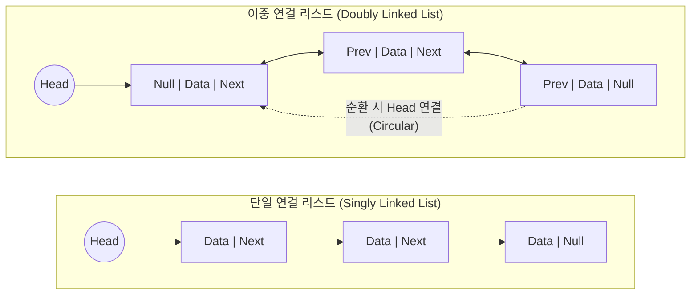

# 링크드 리스트 (Linked List)

---

## I. 동적 메모리 할당 기반의 유연한 자료구조, 링크드 리스트의 개요

* **정의**: 데이터와 다음 노드의 주소(Pointer)를 포함하는 노드(Node)들이 선형적으로 연결되어 논리적인 순서를 구현하는 동적 자료구조
* **등장배경 및 특징**:
* 정적 배열(Array)의 크기 변경 한계 및 데이터 삽입/삭제 시 발생하는 데이터 이동(Shift) 오버헤드 극복 필요
* **동적 메모리 할당**: 런타임 시 메모리를 할당받아 크기 변경이 유연함
* **효율적인 삽입/삭제**: 연결된 포인터의 주소값만 변경하므로 삽입/삭제 시 $O(1)$의 시간 복잡도 달성 (위치 인지 시)

---

## II. 링크드 리스트의 개념도 및 핵심 기술 요소

### 가. 링크드 리스트의 개념도 및 동작 원리

* 물리적으로 연속되지 않은 메모리 공간에 저장된 노드들을 포인터(참조)를 통해 논리적 순서로 연결함
* 다음 노드를 가리키는 Next 포인터와 이전 노드를 가리키는 Prev 포인터를 조작하여 데이터의 흐름을 제어함

### 나. 링크드 리스트의 핵심 기술 및 구성 요소

| 구분 | 요소기술(키워드) | 세부 설명 |
| --- | --- | --- |
| **기본 요소** | **Node (노드)** | 데이터를 저장하는 데이터 필드와 주소를 저장하는 링크(포인터) 필드로 구성된 기본 단위 |
| **기본 요소** | **Head / Tail** | 리스트의 시작을 가리키는 첫 번째 노드(Head)와 마지막을 나타내는 노드(Tail) |
| **자료구조 유형** | **Singly Linked List** | 단일 포인터(Next)만 존재하여 한 방향(순방향)으로만 탐색 가능한 구조 |
| **자료구조 유형** | **Doubly Linked List** | 두 개의 포인터(Prev, Next)를 가져 양방향 탐색이 가능하여 삽입/삭제가 더 유연한 구조 |
| **자료구조 유형** | **Circular Linked List** | 마지막 노드의 Next 포인터가 다시 Head 노드를 가리켜 순환(Ring)하는 구조 |
| **[[메모리 관리]]** | **동적 할당 (Dynamic Allocation)** | 힙(Heap) 영역을 사용하여 프로그램 실행 중(Runtime)에 필요한 만큼의 메모리 확보 및 해제 |
| **성능 (시간복잡도)** | **탐색 (Search)** | 특정 인덱스 접근 시 순차 탐색이 필요하여 $O(N)$의 시간 복잡도 발생 |
| **성능 (시간복잡도)** | **삽입/삭제 (Insert/Delete)** | 포인터 갱신만 수행하므로 대상 노드 위치를 알 경우 $O(1)$의 속도로 처리 |

---

## III. 링크드 리스트와 배열(Array)의 비교 및 최신 활용 동향

### 가. 링크드 리스트와 배열(Array) 비교

| 비교 항목 | 링크드 리스트 (Linked List) | 배열 (Array) |
| --- | --- | --- |
| **메모리 할당 방식** | **동적 할당** (런타임 시 힙 영역 사용) | **정적 할당** (컴파일 시 스택/데이터 영역 사용) |
| **메모리 구조** | **비연속적** (포인터로 논리적 연결) | **연속적** (물리적인 주소가 연속됨) |
| **데이터 접근(Access)** | **순차 접근** ($O(N)$) | **임의 접근** (Random Access, $O(1)$) |
| **데이터 삽입/삭제** | 포인터만 변경하여 **빠름** ($O(1)$) | 요소를 이동(Shift)해야 하므로 **느림** ($O(N)$) |
| **오버헤드** | 포인터 저장을 위한 추가 메모리 필요 | 추가 메모리 없음 (데이터 자체만 저장) |

### 나. 링크드 리스트의 최신 활용 동향 및 전망

* **동시성 처리 제어 (Lock-free Linked List)**: 멀티 코어 환경에서 CAS(Compare-And-Swap) 원자적 연산을 활용하여, 락(Lock) 없이 안전하게 노드를 삽입/삭제하는 병렬 처리 기술의 핵심 자료구조로 활용
* **캐시 및 메모리 관리 ([[LRU]], Free List)**: 해시 맵(Hash Map)과 이중 연결 리스트를 결합한 LRU(Least Recently Used) 캐시 구현 및 [[OS(운영체제)|운영체제]] 커널의 가용 메모리 블록 관리(Free List)에 필수적으로 적용
* **분산 원장 (Blockchain)**: 해시(Hash) 포인터 기반으로 이전 블록을 가리키는 구조를 띄며, 이는 암호학적 무결성이 추가된 단일 연결 리스트(Singly Linked List)의 확장된 응용 형태로 발전

---

### 🔗 연관 토픽

- **소속 도메인**: [[00_컴퓨터구조_MOC|💻 컴퓨터구조]]
- **세부 분류**: `2. 캐시 & 메모리 계층 구조 · 스토리지`
- **핵심 연관 토픽**:
  - [[메모리 관리]]
  - [[가상 메모리]]
  - [[OS(운영체제)]]
  - [[세그멘테이션|세그멘테이션 (Segmentation, 가변분할)]]
  - [[페이지 교체 알고리즘|페이지 교체 알고리즘 (Paging Replacement Algorithm)]]
