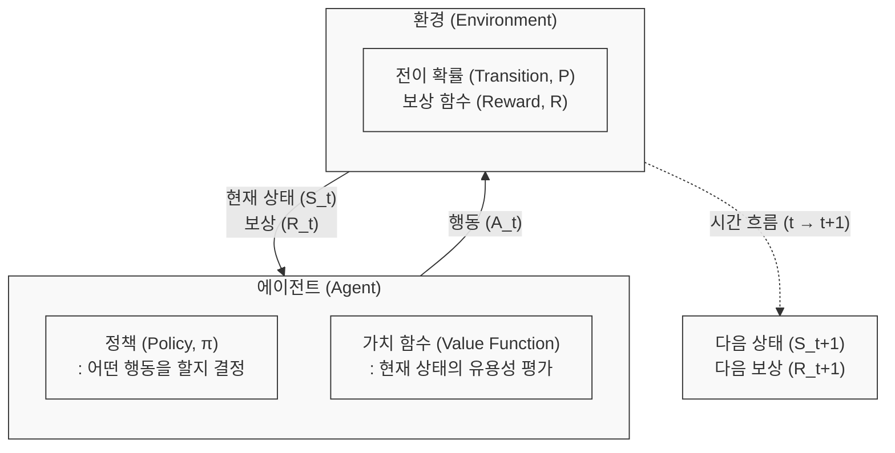

# 마르코프 결정 프로세스 (Markov Decision Process, MDP)

---

## I. 순차적 의사결정의 수학적 모델, 마르코프 결정 프로세스(MDP)의 개요

* **정의**: 불확실성을 가진 환경에서 에이전트(Agent)가 보상을 최대화하기 위해 상태(State)를 관측하고 행동(Action)을 결정하는 순차적 의사결정 과정을 수학적으로 추상화한 [[프레임워크]]
* **필요성 및 등장배경**:
* **마르코프 속성(Markov Property) 적용**: 미래의 상태는 과거의 역사와 무관하게 '오직 현재 상태'에만 의존한다는 가정 하에 복잡한 연산 단순화 필요
* **[[강화학습]](RL)의 근간**: 에이전트와 환경 간의 상호작용을 5튜플(S, A, P, R, γ)로 정형화하여, 기계학습이 최적 정책($\pi^*$)을 산출할 수 있는 논리적 기반 제공

---

## II. 마르코프 결정 프로세스(MDP)의 개념도 및 핵심 구성 요소

### 가. MDP의 개념도 및 동작 원리

* 에이전트는 환경으로부터 현재 시간($t$)의 상태($S_t$)와 보상($R_t$)을 관측하여 정책($\pi$)에 따라 행동($A_t$)을 수행함
* 환경은 에이전트의 행동에 반응하여 전이 확률($P$)에 따라 다음 상태($S_{t+1}$)와 새로운 보상($R_{t+1}$)을 반환하는 과정을 반복함

### 나. MDP의 핵심 구성 요소 및 기술 (5-Tuple 및 수식)

| 구분 | 요소기술(키워드) | 세부 설명 |
| --- | --- | --- |
| **환경 모델 (5-Tuple)** | **상태 (State, $S$)** | 에이전트가 의사결정을 내리기 위해 환경으로부터 관측하는 모든 정보의 집합 |
| **환경 모델 (5-Tuple)** | **행동 (Action, $A$)** | 특정 상태 $S$에서 에이전트가 환경에 가할 수 있는 모든 선택지의 집합 |
| **환경 모델 (5-Tuple)** | **전이 확률 (Probability, $P$)** | 상태 $S$에서 행동 $A$를 취했을 때 다음 상태 $S'$로 변환될 조건부 확률 ($P_{ss'}^a$) |
| **환경 모델 (5-Tuple)** | **보상 (Reward, $R$)** | 상태 $S$에서 행동 $A$를 수행한 결과로 환경이 제공하는 즉각적인 스칼라 피드백 값 |
| **환경 모델 (5-Tuple)** | **감가율 (Discount Factor, $\gamma$)** | 미래 보상을 현재 가치로 환산하는 할인율(0~1). 1에 가까울수록 미래 보상을 중시 |
| **학습 목표** | **정책 (Policy, $\pi$)** | 특정 상태에서 어떤 행동을 취할지를 매핑한 규칙 또는 확률 분포 (목표: 최적 정책 $\pi^*$ 도출) |
| **가치 평가** | **상태 가치 함수 (Value, $V$)** | 특정 상태에서 시작하여 정책 $\pi$를 따를 때 얻을 수 있는 미래 기대 보상의 총합 |
| **가치 평가** | **벨만 방정식 (Bellman Eq.)** | 현재 상태의 가치와 다음 상태의 가치 간의 재귀적(Recursive) 관계를 정의한 핵심 방정식 |

---

## III. MDP의 확장 모델 비교 및 최신 활용 동향

### 가. 관측 가능성에 따른 MDP 확장 모델 비교

| 비교 항목 | MDP (Markov Decision Process) | POMDP (Partially Observable MDP) |
| --- | --- | --- |
| **관측 특성** | **완전 관측 (Fully Observable)** | **부분 관측 (Partially Observable)** |
| **환경 정보** | 에이전트가 환경의 전체 상태를 100% 파악 | 환경의 일부 정보만 센서 등을 통해 제한적으로 관측 |
| **핵심 기법** | 상태(State) 기반 최적 정책 산출 | **신념 상태 (Belief State)** 업데이트 및 추론 |
| **해결 [[알고리즘]]** | [[동적 계획법]](DP), Q-Learning | HMM(은닉 마르코프 모델), [[RNN (Recurrent Neural Network)|RNN]]/[[LSTM (Long Short-Term Memory)|LSTM]] 결합 학습 |
| **적용 사례** | 체스, 바둑 (보드게임) | [[Smart Car(자율주행)|자율주행]](센서 노이즈), 실세계 로보틱스 |

### 나. MDP 기반 강화학습의 최신 트렌드 및 전망

* **상태 공간 폭발 극복 (Deep RL)**: 전통적 MDP는 상태-행동 공간이 커질수록 연산이 불가능한 '차원의 저주'가 발생함. 이를 극복하기 위해 심층신경망(DNN)을 가치 함수나 정책 근사기로 사용하는 DQN, PPO 등 심층강화학습(Deep RL)으로 발전
* **초거대 AI 정렬 (RLHF)**: 대규모 언어 모델([[초거대 언어 모델|LLM]])이 인간의 의도와 윤리 기준에 맞게 답변하도록 조정하는 RLHF(인간 피드백 기반 강화학습)의 근간 수학 모델로 MDP가 활용되어 생성형 AI의 핵심 품질 통제 수단으로 자리매김함

---

### 🔗 연관 토픽

- **소속 도메인**: [[00_인공지능_MOC|🤖 인공지능]]
- **세부 분류**: `2. 머신러닝 기초 & 핵심 알고리즘`
- **핵심 연관 토픽**:
  - [[강화학습]]
  - [[초거대 언어 모델|초거대 언어 모델(Large Language Model)]]
  - [[RNN (Recurrent Neural Network)]]
  - [[동적 계획법|동적 계획법 (Dynamic Programming)]]
  - [[Smart Car(자율주행)]]
