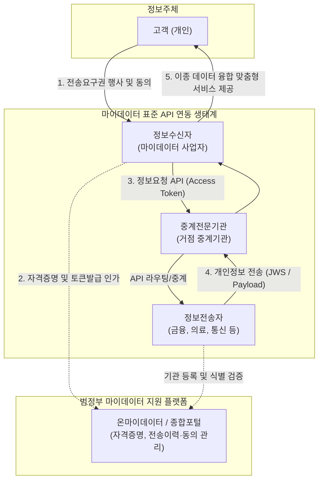

# 마이데이터 (MyData)

---

## I. 개인정보 자기결정권 실현을 위한, 마이데이터의 개요

* **정의**: 정보주체가 본인의 개인정보에 대한 통제권을 가지고, 본인이 원하는 정보수신자(제3자)나 개인데이터 저장소(PDS)로 데이터 전송을 요구하여 초개인화된 맞춤형 서비스에 활용하는 플랫폼 비즈니스
* **필요성 및 등장배경**:
* 기업 중심의 데이터 독점을 해소하고, 정보주체 중심의 데이터 유통 생태계로 패러다임 전환 필요
* 개정 「개인정보 보호법」 시행(제35조의2)으로 법적 근거가 마련되어, 기존 금융권(신용정보법) 중심에서 의료, 통신, 유통 등 전 산업 분야로 전송요구권 확대 적용

* **특징**: 개인정보 전송요구권(이동권) 보장, 표준 API 기반의 안전한 상호 운용성, 분산된 데이터의 통합 조회를 통한 데이터 융합 가치 창출

---

## II. 마이데이터의 개념도 및 핵심 기술 요소

### 가. 마이데이터의 개념도 및 동작 원리

* 정보주체의 전송요구권 행사에 따라, 정보수신자가 종합포털의 자격증명을 거쳐 접근 토큰(Access Token)을 발급받아 중계기관 및 정보전송자에게 표준 API로 데이터를 안전하게 요청하고 수신함

### 나. 마이데이터의 핵심 기술 및 구성 요소

| 구분 | 요소기술(키워드) | 세부 설명 |
| --- | --- | --- |
| **아키텍처** | **PDS (Personal Data Store)** | 정보주체가 자신의 데이터를 직접 물리적·논리적으로 통합하여 안전하게 저장하고 통제·관리할 수 있는 개인 데이터 저장소 |
| **아키텍처** | **마이데이터 지원 플랫폼** | 온마이데이터(OnMyData) 등 참여기관 간 자격증명, 정보주체의 전송요구 철회 및 데이터 전송 이력을 중앙에서 총괄 관리하는 인프라 |
| **보안/인증** | **OAuth 2.0** | 사용자의 비밀번호 노출 없이, 정보수신자가 정보전송자의 데이터에 접근할 수 있도록 접근 권한(Access Token)을 위임하는 개방형 인증 [[프레임워크]] |
| **보안/인증** | **JWS ([[JSON]] Web Signature)** | 발급된 접근 토큰과 전송되는 페이로드(Payload) 데이터의 위변조 방지를 위해 적용하는 [[무결성]] 보장용 전자서명 표준 규격 |
| **보안/인증** | **mTLS (상호 TLS 인증)** | 정보전송자와 수신자 간 통신 시 서버와 클라이언트가 양방향으로 인증서를 상호 검증하고 전송 구간을 암호화하는 통신 규격 |
| **보안/인증** | **FAPI (Financial-grade API)** | 기본 OAuth 2.0 규격에 상호 TLS(mTLS)와 JWS 등을 강제하여, 금융 수준의 강력한 보안성과 신뢰성을 제공하는 API 표준 |
| **데이터 연계** | **RESTful API** | 참여기관 간의 이기종 시스템 연동을 위해 JSON 형식 기반으로 데이터를 경량화하여 송수신하는 표준화된 전송 규격 |
| **데이터 연계** | **CI (Connecting Information)** | 주민등록번호 수집 최소화를 위해 개인을 비가역적으로 암호화하여 부여한 연계정보로, 다수 기관 간 동일인 여부 식별에 활용 |

---

## III. 전분야 마이데이터 확산(마이데이터 2.0) 및 향후 전망

### 가. 마이데이터 산업 동향 및 발전 전망

| 구분 | 주요 전망 및 동향 키워드 | 세부 내용 및 방향성 |
| --- | --- | --- |
| **산업 확산** | **마이데이터 2.0 / 전분야 확산** | 기존 신용정보법 한계를 넘어 개인정보 보호법 개정 기반으로 2025년부터 보건의료, 통신, 유통, 에너지 등 전 산업 단위로 전송요구권 전면 시행 |
| **사용자 주권** | **동의 체계 간소화 및 UI/UX 표준** | 기존 2단계 이상의 복잡한 동의 절차를 1단계로 통합 간소화하고, 정보주체의 착각을 유도하는 다크 패턴(Dark Pattern) 금지 지침 강력 적용 |
| **보안 고도화** | **프라이버시 강화 기술 (PET)** | 상이한 산업군의 데이터가 결합됨에 따른 재식별화(Re-identification) 리스크를 차단하기 위해 영지식 증명([[영지식증명|ZKP]]), 동형암호 적용 등 기술적 보호조치 확대 |
| **서비스 융합** | **오프라인 연계 및 초개인화 AI** | 디지털 소외계층을 위한 대면 영업점에서의 전송요구 허용과 더불어, 수집된 이종(Cross-domain) 데이터를 거대 언어 모델([[초거대 언어 모델|LLM]]) 기반의 AI 비서 서비스와 결합하여 고부가가치 창출 |

* 마이데이터 산업은 단순한 정보 조회를 넘어 일상생활 전반의 맞춤형 솔루션을 제공하는 '데이터 융합 플랫폼'으로 진화하고 있으며, 산업 간 상호 운용성을 확보하기 위한 범정부 차원의 거버넌스 및 시맨틱(Semantic) 상호 운용성 확보가 향후 핵심 과제임

---

### 🔗 연관 토픽

- **소속 도메인**: [[00_데이터베이스_MOC|🗄️ 데이터베이스]]
- **세부 분류**: `4. 물리 저장 구조 & 인덱스 최적화`
- **핵심 연관 토픽**:
  - [[영지식증명|영지식증명(Zero Knowledge Proof)]]
  - [[무결성]]
  - [[Open API 및 API|Open API API]]
  - [[의도 경제|의도 경제(Intention Economy)]]
  - [[공공데이터|공공데이터 (Open Data)]]
