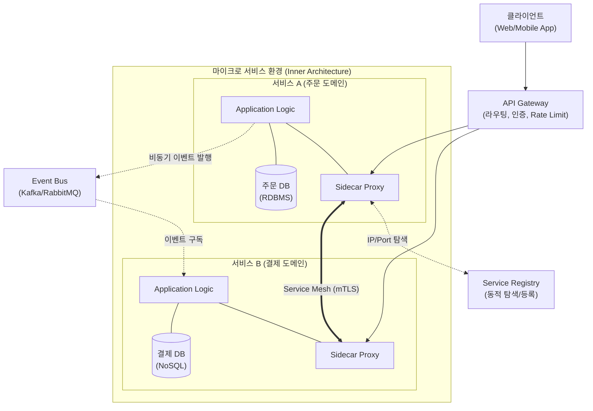

# 마이크로 서비스 아키텍처 (MSA)

---

## I. 비즈니스 민첩성 확보를 위한 독립적 분산 구조, 마이크로 서비스 아키텍처의 개요

### 가. 마이크로 서비스 아키텍처(MSA)의 정의

* 대규모 소프트웨어 시스템을 비즈니스 도메인(기능) 중심의 독립적으로 배포 가능하고 느슨하게 결합된(Loosely Coupled) 소규모 서비스들의 조합으로 구축하는 아키텍처 패턴

### 나. 마이크로 서비스 아키텍처의 등장배경 및 특징

* **등장배경**: 기존 모노리식 구조의 [[결합도]] 심화로 인한 배포 지연 극복, [[클라우드 네이티브]](Cloud Native) 환경의 대규모 트래픽 탄력적 대응 요구 증가
* **특징**:
* **독립적 배포(Independent Deployment)**: 타 서비스 영향 없이 개별 서비스 수정 및 CI/CD 가능
* **폴리글랏(Polyglot) 프로그래밍**: 서비스별 특성에 맞는 최적의 언어와 [[데이터베이스]] 선택 가능
* **장애 격리(Resilience)**: 하나의 서비스 장애가 전체 시스템의 장애로 전파되지 않는 구조적 안정성

---

## II. MSA의 개념도 및 핵심 기술 요소

### 가. 마이크로 서비스 아키텍처의 개념도 및 동작 원리

* **핵심 동작 흐름**: 클라이언트 요청은 API 게이트웨이를 통해 라우팅되며, 내부 서비스 간 통신은 사이드카 프록시(Service Mesh)를 통한 동기 호출과 이벤트 버스를 통한 비동기 처리로 이루어짐.

### 나. 마이크로 서비스 아키텍처의 핵심 기술 및 패턴 요소

| 구분 | 요소기술(키워드) | 세부 설명 |
| --- | --- | --- |
| **라우팅/제어** | **[[API Gateway]]** | 클라이언트의 단일 진입점 역할을 수행하며 라우팅, 로드밸런싱, 인증/인가, API 조합 수행 |
| **내부 통신** | **Service Mesh** | 비즈니스 로직과 네트워크 로직을 분리하여 사이드카 패턴으로 트래픽 제어 및 [[암호화]](mTLS) 수행 |
| **회복성** | **Circuit Breaker** | 대상 서비스의 장애 발생 시, 호출을 차단(Open)하여 시스템 자원 고갈 및 장애 전파 방지 (예: Resilience4j) |
| **데이터 분산** | **Saga Pattern** | [[MSA (Micro Service Architecture)|MSA]] 환경의 분산 [[트랜잭션]] 처리를 위해 로컬 트랜잭션을 연속 실행하고, 실패 시 보상 트랜잭션 수행 |
| **데이터 분산** | **CQRS** | 데이터의 읽기(Query) 모델과 쓰기(Command) 모델을 물리적/논리적으로 분리하여 성능 및 확장성 극대화 |
| **운영 인프라** | **Service Discovery** | 클라우드 환경에서 오토스케일링으로 동적 변경되는 서비스의 IP/Port를 자동 등록하고 탐색하는 레지스트리 |
| **관측성** | **Distributed Tracing** | 다수의 서비스로 분산된 요청의 흐름을 Trace ID 기반으로 추적하여 성능 병목 지점 및 오류 파악 (Jaeger 등) |
| **인프라 환경** | **Container / K8s** | 마이크로 서비스를 독립적으로 패키징하고, 자원 [[스케줄링]] 및 무중단 배포를 자동화하는 오케스트레이션 |

---

## III. 모노리식 vs MSA 비교 및 최신 진화 동향

### 가. 모노리식 아키텍처와 마이크로 서비스 아키텍처 비교

| 비교 항목 | 모노리식 (Monolithic) 아키텍처 | 마이크로 서비스 (MSA) 아키텍처 |
| --- | --- | --- |
| **배포 단위** | 모든 기능이 통합된 **단일 대규모 패키지** | 비즈니스 단위로 분리된 **독립적 소규모 서비스** |
| **확장성 (Scale)** | 전체 애플리케이션 [[인스턴스]] 복제 (비효율적) | 특정 부하 집중 서비스만 개별 Scale-out (효율적) |
| **데이터 관리** | 단일 공유 DB (로컬 트랜잭션, ACID 보장 용이) | Polyglot Persistence (서비스별 독립 DB, 결과적 정합성) |
| **장애 영향도** | 부분 코드 장애가 전체 시스템 장애로 직결 | 장애 격리(Isolation)로 특정 서비스 장애 국소화 |
| **조직 구조** | 기능 중심 조직 (프론트/백엔드/DBA 분리) | 목적 중심 조직 ([[DevOps]], 2-Pizza Team, Cross-functional) |

### 나. 향후 전망 및 아키텍처 진화 동향

* **사이드카리스(Sidecarless) 서비스 메시의 부상**: 기존 사이드카 프록시 배포로 인한 리소스 오버헤드와 지연시간을 해결하기 위해, 리눅스 [[커널]] 레벨의 **eBPF(Extended Berkeley Packet Filter) 기술 기반 서비스 메시(예: Cilium)로의 전환** 가속화
* **플랫폼 엔지니어링(Platform Engineering)의 도입**: MSA의 극심한 분산 인프라 파편화 및 인지 부하(Cognitive Load) 문제를 해결하기 위해, 개발자가 인프라 걱정 없이 비즈니스 로직에만 집중할 수 있도록 지원하는 **내부 개발자 포털(IDP) 생태계 구축**이 기업의 핵심 과제로 대두됨

---

### 🔗 연관 토픽

- **소속 도메인**: [[00_디지털서비스_MOC|🚀 디지털서비스]]
- **세부 분류**: `1. 클라우드 컴퓨팅 & 가상화 인프라`
- **핵심 연관 토픽**:
  - [[클라우드 네이티브]]
  - [[MSA (Micro Service Architecture)]]
  - [[결합도]]
  - [[API Gateway]]
  - [[데이터베이스]]
