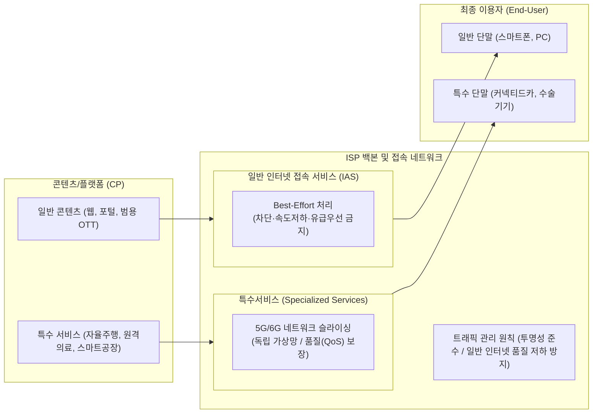

# 망 중립성 (Network Neutrality)

---

## I. 모든 트래픽의 동등 처리 원칙, 망 중립성의 개요

### 가. 망 중립성의 정의

* [[ISP (Information Strategy Plan)|ISP]](인터넷접속서비스제공사업자)가 합법적인 인터넷 트래픽을 처리함에 있어 내용, 서비스, 단말기, 송·수신자의 유형에 관계없이 **차별·차단·감속·유급 우선처리 없이 동등하게 전송**해야 한다는 원칙

### 나. 망 중립성의 등장 배경 및 4대 기본 원칙

* **등장 배경**: 대용량 OTT·클라우드 트래픽 급증에 따른 ISP의 전송 차등화 시도 견제, 인터넷의 공공재적 성격 보존, 신생 스타트업의 진입 장벽 완화 및 ICT 혁신 생태계 보호
* **4대 기본 원칙**:
1. **차단 금지 (No Blocking)**: 합법적인 콘텐츠, 애플리케이션, 기기에 대한 망 접속 차단 금지
2. **속도 저하 금지 (No Throttling)**: 특정 트래픽에 대한 고의적 전송 지연, 패킷 드롭, 대역폭 축소 제한
3. **유급 우선처리 금지 (No Paid Prioritization)**: 추가 대가를 지불한 CP에게만 별도의 고속 급행차선(Fast Lane) 제공 금지
4. **투명성 (Transparency)**: 통신사의 트래픽 관리 기법, [[혼잡 제어]] 기준, 대역폭 측정 결과의 이용자 공개 의무

---

## II. 망 중립성의 개념도 및 핵심 기술·정책 요소

### 가. 망 중립성의 개념도 및 트래픽 전송 체계

* 일반 인터넷(IAS)은 무차별·최선형(Best-Effort) 전송을 엄격 적용하며, 5G 슬라이싱 기반 특수서비스(SpS)는 일반 인터넷 품질을 저하시키지 않고 망 중립성 회피 목적이 아닌 경우에 한해 조건부 허용됨

### 나. 망 중립성 및 트래픽 관리의 핵심 구성 요소

| 구분 | 핵심 기술/요소 | 세부 설명 |
| --- | --- | --- |
| **원칙 규제** | 비차별성 (Non-discrimination) | 트래픽 유형·발신지에 따른 차등 과금 및 패킷 전송 차별 금지 |
| **원칙 규제** | 투명성 (Transparency) | 트래픽 관리 기술, 망 혼잡 사유, 네트워크 용량 정보의 공개 의무화 |
| **망 관리** | 합리적 트래픽 관리 | 망 혼잡 완화, [[DDOS|DDoS]]·웜 바이러스 차단, 네트워크 [[무결성]] 유지를 위한 최소한의 제어 허용 |
| **융합 기술** | 특수서비스 (SpS) | 폐쇄형 단말·특수 용도(초저지연·고신뢰) 서비스에 한해 일정 조건 하 망 중립성 예외 인정 |
| **융합 기술** | [[네트워크 슬라이싱]] (Network Slicing) | 물리적 단일 망을 [[가상화]]([[SDN(Software Defined Network)|SDN]]/[[NFV]])하여 서비스별 [[SLA]]([[QoS]])를 독립 보장하는 기술 |
| **비즈니스** | 제로레이팅 (Zero-Rating) | 특정 콘텐츠 이용 시 데이터 통화료를 면제·할인; 통신사 자사 우대 등 공정경쟁 저해 시 사후 규제 |
| **비즈니스** | 망 사용료 (Fair Share) | 빅테크 CP와 통신사 간 인프라 투자 비용 분담 논쟁; 사법 판단상 망 중립성과 독립된 별개 계약 쟁점으로 분리 |
| **정책/가이드** | 망 중립성 가이드라인 개정 | 특수서비스 제공 기준 구체화(IPTV, [[Smart Car(자율주행)|자율주행]] 등) 및 일반 인터넷 품질 유지 의무 명시 |

---

## III. 일반 인터넷(IAS) vs 특수서비스(SpS) 비교 및 최신 동향

### 가. 일반 인터넷(IAS)과 특수서비스(SpS) 비교

| 비교 항목 | 일반 인터넷 접속 서비스 (IAS) | 특수서비스 (Specialized Services, SpS) |
| --- | --- | --- |
| **개념** | 모든 종단점([[End-to-End]]) 대상 보편적 공용 인터넷 연결 제공 | 제한된 범위의 단말·서버 간 특수 목적 접속 제공 |
| **전송 품질 (QoS)** | Best-Effort (최선형 노력, 품질 보장 불가) | 보장형 QoS (초저지연, 고신뢰성, 대역폭 전용 보장) |
| **망 중립성 적용** | **전면 적용** (차단·속도저하·유급우선 금지) | **적용 예외** (가이드라인 상 3대 충족 요건 만족 시) |
| **기반 인프라 기술** | 공용 IP 라우팅, 유무선 공유 패킷망 | 5G SA/6G Network Slicing, SDN/NFV, [[EDGE|Edge]] 컴퓨팅 |
| **제공 선결 요건** | 해당 없음 (기본 제공) | ① 특수 목적 한정 ② 일반 인터넷 품질 미저하 ③ 망 중립성 회피 금지 |
| **대표 적용 사례** | 웹 서핑, SNS, 범용 OTT(유튜브, 넷플릭스) | 자율주행 V2X, 원격 수술, 스마트 팩토리 실시간 제어 |

* **망 사용료와 망 중립성의 쟁점 분리**:
* 법원 판례 및 정책 당국 판단을 통해 "망 중립성(트래픽 내용에 대한 비차별적 대우)"과 "망 이용대가(인터넷 전송·접속 서비스에 대한 상업적 지불)"는 서로 다른 법적 범주로 정립됨

* **5G/6G 환경의 규제 진화 방향**:
* 통신사의 5G 네트워크 슬라이싱 상용화에 대응하여 일반 이용자의 인터넷 전송 품질을 훼손하지 않는 엄격한 모니터링 체계 가동 및 혁신 융합 서비스 촉진 간의 정책적 균형 유지 필요

---

### 🔗 연관 토픽

- **소속 도메인**: [[00_네트워크_MOC|🌐 네트워크]]
- **세부 분류**: `3. 전송 계층 & 트래픽 / 혼잡 제어 (L4)`
- **핵심 연관 토픽**:
  - [[QoS|QoS (Quality of Service)]]
  - [[Network Neutrality]]
  - [[혼잡 제어]]
  - [[SDN(Software Defined Network)]]
  - [[네트워크 슬라이싱]]
