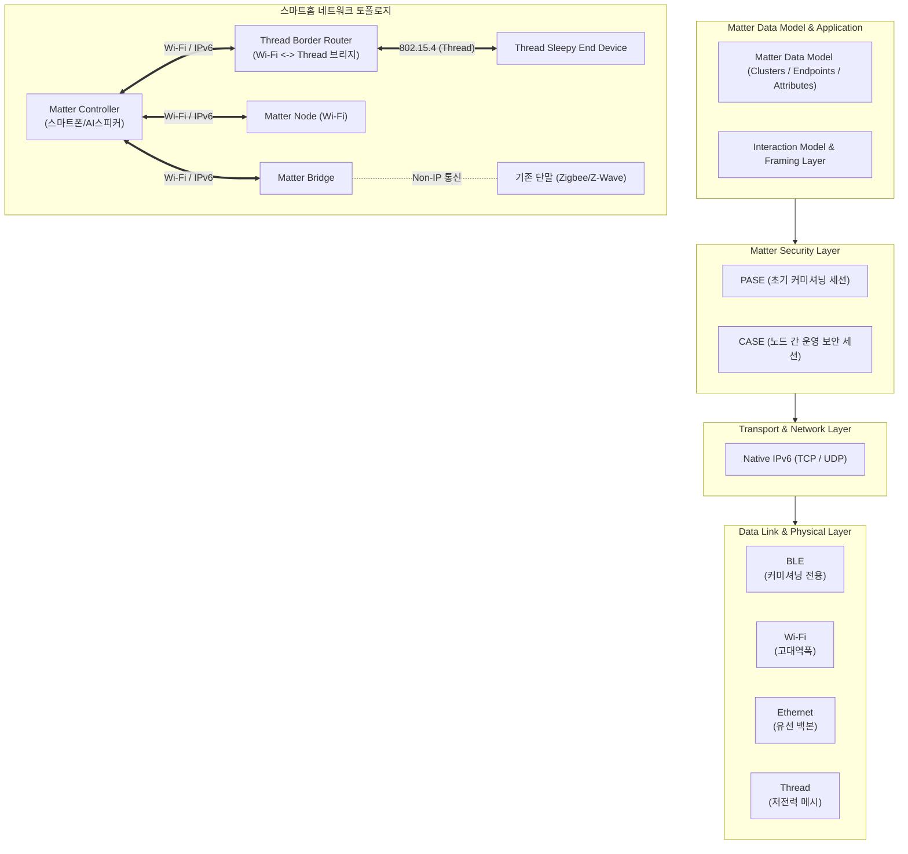

# 매터 (Matter)

---

## I. 스마트홈 기기 간 상호운용성 표준, 매터 (Matter)의 개요

### 가. 매터 (Matter)의 정의

* CSA(Connectivity Standards Alliance) 주도로 제정된, 이종 제조사 기기 간 폐쇄적 생태계를 허물고 단일 인터페이스로 제어하기 위한 **[[IPv6]] 기반 오픈소스 스마트홈 상호운용성 응용 계층 표준 [[프로토콜]]**

### 나. 매터 (Matter)의 등장 배경 및 핵심 특징

* **파편화 극복**: 플랫폼별(Apple Home, Google Home, Samsung SmartThings, Amazon Alexa 등) 전용 브리지 종속 및 연동 단절 문제 해소
* **상호운용성 (Interoperability)**: **Multi-Admin** 및 **Multi-Fabric** 구조를 통해 단일 기기를 여러 플랫폼에서 동시 등록·제어
* **로컬 우선 제어 (Local First)**: 클라우드를 거치지 않고 로컬 네트워크(LAN/Thread) 내에서 기기 간 직접 종단([[End-to-End]]) 통신 수행
* **강화된 보안성**: PKI 기반 기기 증명([[DAC]]), 종단간 [[암호화]], [[01_IT Tech/블록체인]] 분산 원장([[DCL]]) 기반의 위·변조 방지 체계 내재화

---

## II. 매터 (Matter)의 개념도 및 핵심 기술 요소

### 가. 매터 (Matter)의 프로토콜 계층 및 네트워크 구성도

* **핵심 동작 흐름**: BLE 기반 기기 탐색 및 자격 증명 교환(PASE) $\rightarrow$ 로컬 네트워크(Wi-Fi/Thread) 자격 부여 $\rightarrow$ IPv6 기반 노드 간 인증 [[세션]](CASE) 수립 $\rightarrow$ 로컬 메시 네트워크 내 종단간 통신 및 멀티 패브릭 다중 제어 수행

### 나. 매터 (Matter)의 핵심 기술 및 구성 요소

| 구분 | 핵심 기술/요소 | 세부 설명 |
| --- | --- | --- |
| **네트워크** | **IPv6 기반 네이티브 통신** | 전송 계층에서 IPv6([[TCP]]/UDP)를 필수로 사용하여 별도의 프로토콜 변환 없이 표준 라우팅 지원 |
| **네트워크** | **Thread 프로토콜** | IEEE 802.15.4 기반의 저전력 무선 IPv6 메시 네트워크로 단일 장애점(SPOF) 배제 및 자가 치유(Self-Healing) 제공 |
| **장치/연계** | **Thread Border Router (TBR)** | Thread 저전력 메시망과 가정 내 고대역폭 Wi-Fi/Ethernet IP 네트워크를 잇는 표준 경계 [[라우터]] |
| **장치/연계** | **Matter Bridge** | 레거시 통신(Zigbee, Z-Wave 등)을 Matter 데이터 모델로 [[캡슐화]]·매핑하여 기존 IoT 인프라 보호 |
| **생태계** | **Multi-Admin / Multi-Fabric** | 각 생태계가 독립된 암호화 도메인(Fabric)을 보유하여 기기 초기화 없이 복수 플랫폼에 동시 바인딩 |
| **데이터 모델** | **Cluster Architecture** | 장치 기능을 Endpoint, Cluster, Attribute, Command, Event 계층으로 표준화하여 공통 명령 체계 정의 |
| **보안/인증** | **PASE / CASE** | PASE(비밀번호 기반 초기 페어링), CASE(인증서 기반 상호 TLS 유사 기기 간 종단 암호화 세션) 분리 운영 |
| **보안/인증** | **DAC 및 DCL** | DAC(기기 출하 시 발급된 고유 인증서) 및 DCL(분산 원장 기반 PAA 루트 인증서 검증 체계)로 위조 기기 차단 |

---

## III. 매터 (Matter) vs 기존 IoT 프로토콜 비교 및 최신 발전 동향

### 가. 매터 (Matter)와 레거시 스마트홈 프로토콜(Zigbee, Z-Wave) 비교

| 비교 항목 | 매터 (Matter) | 직비 (Zigbee) | 지웨이브 (Z-Wave) |
| --- | --- | --- | --- |
| **통신 계층 범위** | 응용 계층 표준 (네이티브 IPv6 오버레이) | 물리 계층부터 응용 계층까지 전 계층 통합 | 물리 계층부터 응용 계층까지 전 계층 통합 |
| **물리 계층** | Wi-Fi, Thread, Ethernet (BLE: 페어링) | IEEE 802.15.4 (2.4 GHz) | Sub-GHz (800~900 MHz 대역) |
| **상호운용성** | **완전 보장** (단일 규격, Multi-Admin) | 프로파일 분절(ZHA, ZLL 등 상이 시 호환 불가) | 인증 표준 준수 시 호환 가능하나 단일 칩 종속 |
| **IP 연동성** | **Native IPv6** (별도 [[게이트웨이]] 변환 불필요) | Non-IP (전용 게이트웨이 변환 필수) | Non-IP (전용 게이트웨이 변환 필수) |
| **멀티 플랫폼 지원** | 기본 지원 (Apple/Google/Samsung 동시 제어) | 불가 (플랫폼별 전용 허브 연동 종속) | 불가 (플랫폼별 전용 컨트롤러 종속) |
| **보안 아키텍처** | 기기별 고유 DAC, PKI 기반 CASE, DCL | 사전 공유 키(PSK), 네트워크 공유 대칭키 취약 | 128-bit [[AES]] (S2 보안 [[프레임워크]]) |

### 나. 매터 (Matter)의 최신 기술 진화 및 산업 전망

* **지원 디바이스 카테고리 고도화 (v1.3~v1.4+)**:
* 초기 조명·[[스위치 (Layer 3 Switch)|스위치]]·센서 중심에서 로봇 청소기, 대형 가전(냉장고, 세탁기), 에너지 관리 장치(EV 충전기, 가정용 태양광 인버터, BESS) 및 환기 시스템(HRV)으로 프로파일 확장

* **홈 에너지 관리 시스템(HEMS)과의 결합**:
* 실시간 전력 사용량 측정 및 피크 전력 제어 연동을 통해 탄소 중립 및 VPP(가상발전소) 생태계의 단말 표준으로 진화

* **해결 과제 및 전망**:
* 각 플랫폼 제조사 간 커미셔닝 UX 편차, Thread Border Router 간 메시 네트워크 공유(Credential Sharing) 표준화 완성 필요
* [[온디바이스 AI]] 및 [[앰비언트 컴퓨팅]](Ambient Computing) 환경에서 분산 기기 오케스트레이션의 핵심 전송 백본으로 정착 진행 중

---

### 🔗 연관 토픽

- **소속 도메인**: [[00_네트워크_MOC|🌐 네트워크]]
- **세부 분류**: `1. OSI 7계층 & 데이터링크 계층 (L1/L2)`
- **핵심 연관 토픽**:
  - [[프로토콜]]
  - [[TCP]]
  - [[스위치 (Layer 3 Switch)]]
  - [[게이트웨이]]
  - [[라우터]]
