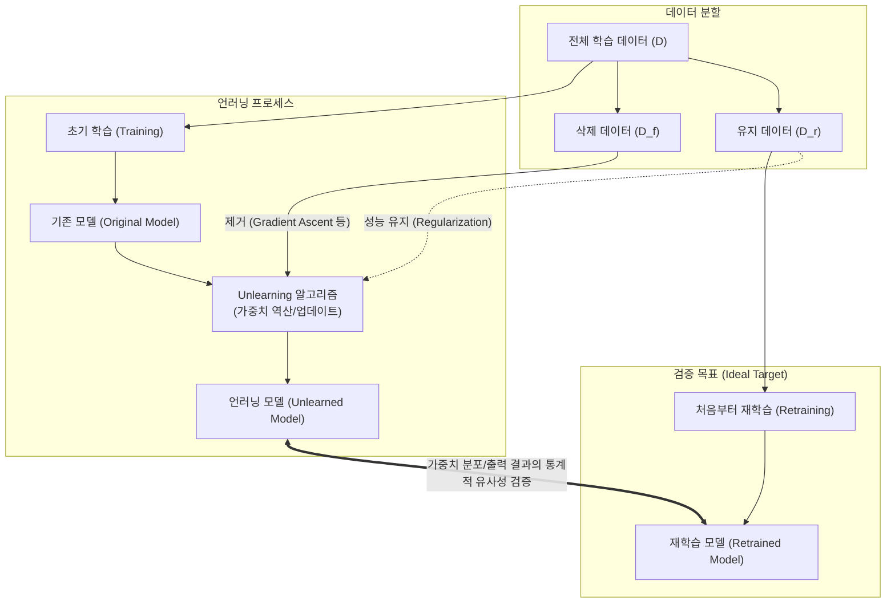

# 머신 언러닝(Machine Unlearning)

---

## I. AI 모델의 잊힐 권리 보장, 머신 언러닝의 개요

* **정의**: 기 학습된 AI/ML 모델에서 처음부터 다시 학습(Retraining)하지 않고, 특정 데이터(Forget Set)가 모델 가중치에 미친 영향력만 선택적으로 제거(삭제)하는 기술
* **등장 배경 및 필요성**:
* **법적 규제 대응**: GDPR의 '잊힐 권리(Right to be Forgotten)', 저작권 침해 데이터 삭제 요구 대응
* **보안 및 [[신뢰성]] 확보**: 악의적인 포이즈닝 공격 데이터 제거, 편향적/유해한 데이터 선별 삭제
* **자원 효율화**: 삭제 요청 시마다 발생하는 전체 재학습(Retraining from scratch)에 따른 천문학적 컴퓨팅 자원 및 시간 낭비 방지

---

## II. 머신 언러닝의 개념도 및 핵심 기술 요소

### 가. 머신 언러닝의 개념도 및 동작 원리

* 전체 재학습(Retrained Model)을 통해 얻은 결과와 언러닝 모델(Unlearned Model)의 결과가 통계적으로 구별 불가능(Indistinguishable)하도록 가중치를 조정하는 것이 핵심 동작 원리

### 나. 머신 언러닝의 핵심 기술 요소

| 구분 | 핵심 기술(키워드) | 세부 설명 |
| --- | --- | --- |
| **정확한 언러닝(Exact)** | **SISA (Sharded, Isolated, Sliced, Aggregated)** | 데이터를 여러 조각(Shard)으로 분할 학습 후, 삭제 요청 시 해당 Shard의 모델만 재학습하여 앙상블 병합 |
| **근사적 언러닝(Approximate)** | **Gradient Ascent (경사 상승법)** | 삭제할 데이터(D_f)에 대해 Loss를 최대화하는 방향으로 [[역전파]](Backpropagation)하여 영향력 상쇄 |
| **근사적 언러닝(Approximate)** | **Influence Function (영향 함수)** | 특정 훈련 데이터가 모델의 파라미터에 미친 영향을 수학적(Hessian 역행렬 등)으로 역산하여 제거 |
| **근사적 언러닝(Approximate)** | **Fisher Information Matrix** | 유지할 데이터(D_r)에 대한 정보 손실을 막기 위해 파라미터별 중요도를 계산하여 가중치 업데이트 제한 |
| **성능 보존 기술** | **Knowledge Distillation ([[지식 증류]])** | 기존 모델 또는 D_r로 학습된 모델을 Teacher로 삼아 언러닝 과정 중 과도한 성능 저하(망각) 방지 |
| **보안 및 검증** | **MIA (Membership Inference Attack) 방어** | 특정 데이터가 모델 학습에 사용되었는지 추론하는 공격을 활용하여, 데이터가 완벽히 삭제되었는지 역검증 |

---

## III. 머신 언러닝 기법 비교 및 향후 전망

### 가. 언러닝 기법 간 비교 (Exact vs Approximate)

| 비교 항목 | 정확한 언러닝 (Exact Unlearning) | 근사적 언러닝 (Approximate Unlearning) |
| --- | --- | --- |
| **접근 방식** | 논리적/물리적 데이터 분할 기반 부분 재학습 | [[최적화 알고리즘]] 기반 가중치 조정 |
| **삭제 보장성** | 100% 완전 삭제 보장 (Provable) | 통계적, 근사적 삭제 (잔존 위험 존재) |
| **컴퓨팅 비용** | 상대적으로 높음 (Shard 단위 재학습 필요) | 매우 낮음 (수학적 가중치 업데이트만 수행) |
| **성능 훼손** | 앙상블에 의한 초기 성능 저하 가능성 | **재앙적 망각(Catastrophic Forgetting)** 발생 가능 |
| **적용 모델** | 소규모 모델, 정형 데이터 중심 | [[초거대 언어 모델|LLM]](대형언어모델), [[딥러닝]] 등 대규모 파라미터 모델 |

### 나. 향후 전망 및 동향

* **LLM 분야의 핵심 규제 대응 기술**: 최근 생성형 AI의 저작권 침해, 개인정보 유출, 환각(Hallucination) 이슈를 해결하기 위한 'AI 정렬(Alignment)'의 필수 기술로 급부상
* **한계점 극복**: 근사적 언러닝 수행 시 유지 데이터(D_r)에 대한 성능까지 함께 떨어지는 재앙적 망각(Catastrophic Forgetting) 현상을 극복하기 위한 파인튜닝([[Fine-Tuning|Fine-tuning]]) 및 정규화 결합 연구 활발
* **검증 [[프레임워크]] 표준화**: 데이터가 실제로 "잊혀졌음"을 법적/기술적으로 증명(Verification)할 수 있는 표준화된 평가 지표 및 감사(Auditing) 도구의 발전 예상

---

### 🔗 연관 토픽

- **소속 도메인**: [[00_인공지능_MOC|🤖 인공지능]]
- **세부 분류**: `6. 설명가능한 AI (XAI) & AI 윤리 · 거버넌스`
- **핵심 연관 토픽**:
  - [[딥러닝]]
  - [[역전파|역전파(Backpropagation)]]
  - [[초거대 언어 모델|초거대 언어 모델(Large Language Model)]]
  - [[XAI]]
  - [[Fine-Tuning]]
