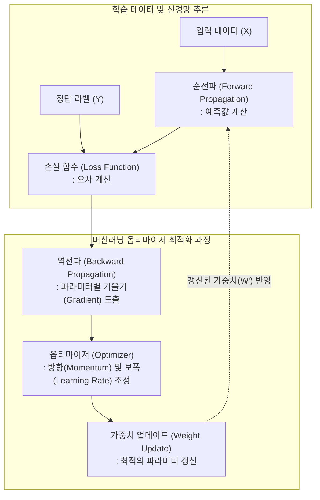

# 머신러닝 옵티마이저 (Machine Learning Optimizer)

---

## I. 최적의 가중치 탐색 알고리즘, 머신러닝 옵티마이저의 개요

### 가. 머신러닝 옵티마이저의 정의

* [[딥러닝]] 및 머신러닝 모델의 손실 함수(Loss Function) 결괏값을 최소화하기 위해 모델의 가중치(Weight)와 [[편향]](Bias)을 지속적으로 갱신하고 최적화하는 [[알고리즘]]

### 나. 머신러닝 옵티마이저의 등장 배경 및 특징

* **등장 배경**: 거대 언어 모델([[초거대 언어 모델|LLM]])의 등장으로 파라미터 수가 급증함에 따라, 로컬 미니마(Local Minima) 탈출, 안장점(Saddle Point) 극복 및 학습 시간 단축의 필요성 증대
* **핵심 특징**:
* **관성(Momentum) 적용**: 이전 기울기의 방향성을 유지하여 가중치 갱신의 진동(지그재그 현상) 감소
* **적응형 학습률(Adaptive Learning Rate)**: 변수별로 보폭을 다르게 설정하여 빠르고 안정적인 수렴 도모
* **리소스 효율화**: 최근 메모리 사용량 최소화 및 연산량 감소를 위한 최적화 기법(Lion, Sophia 등)으로 진화

---

## II. 머신러닝 옵티마이저의 개념도 및 핵심 기술 요소

### 가. 머신러닝 옵티마이저의 동작 원리 및 개념도

* 신경망의 순전파를 통해 구한 손실 함수의 오차를 역전파하여 기울기를 산출하고, [[옵티마이저]] 알고리즘이 모멘텀과 적응형 학습률을 적용하여 가중치를 갱신하는 순환 구조임.

### 나. 머신러닝 옵티마이저의 핵심 기술 및 구성 요소

| 구분 | 요소기술(키워드) | 세부 설명 |
| --- | --- | --- |
| **기본 알고리즘** | **SGD** (Stochastic Gradient Descent) | 전체 데이터가 아닌 미니 배치(Mini-batch) 단위로 기울기를 계산하여 파라미터를 갱신하는 확률적 경사 하강법 |
| **방향성 최적화** | **Momentum** | 이전 기울기의 방향성(관성)을 현재 갱신에 반영하여 지그재그 진동 현상 완화 및 로컬 미니마 탈출 지원 |
| **방향성 최적화** | **NAG** (Nesterov Accelerated) | 모멘텀으로 이동할 예상 위치의 기울기를 미리 계산(Look-ahead)하여 수렴 안정성 및 속도 향상 |
| **보폭 최적화** | **AdaGrad** | 변수별 학습 이력을 기반으로 자주 갱신된 변수는 학습률을 줄이고, 적게 갱신된 변수는 학습률을 키우는 기법 |
| **보폭 최적화** | **RMSProp** | AdaGrad의 학습률이 0에 수렴하여 학습이 정지되는 문제(Zero-learning rate)를 지수 이동 평균(EMA)으로 해결 |
| **복합 최적화(1차)** | **Adam** (Adaptive Moment) | Momentum(방향성)과 RMSProp(적응형 보폭)의 장점을 결합한 1차 미분 기반 최적화의 사실상 표준 |
| **복합 최적화(1차)** | **AdamW** | Adam의 가중치 감쇠(Weight Decay) 수식을 기울기 업데이트와 분리(Decoupled)하여 [[일반화]] 성능(Generalization) 향상 |
| **최신 최적화(LLM)** | **Sophia / Lion / Muon** | 2차 미분 대각 헤시안(Sophia), 부호 함수 연산(Lion), 스펙트럼 노름(Spectral Norm) 행렬 기반(Muon) 등 LLM 특화 |

---

## III. 최신 LLM 특화 머신러닝 옵티마이저 비교 및 전망

### 가. 전통적 옵티마이저와 최신 대형 모델(LLM) 특화 옵티마이저 비교

| 비교 항목 | AdamW | Lion (EvoLved Sign Momentum) | Sophia (Second-order Clipped) | Muon (Matrix-Aware) |
| --- | --- | --- | --- | --- |
| **주요 특징** | Adam의 L2 정규화 성능 개선 모델 | 부호(Sign) 기반의 효율적 [[메모리 관리]] | 2차 미분 기반의 훈련 스텝 계산 최소화 | 행렬 직교화 및 스펙트럼 노름(Spectral Norm) 기반 최적화 |
| **최적화 기법** | 1차 미분 + Decoupled Weight Decay | 1차 미분 + Sign(부호) 연산 적용 | 2차 미분 (대각 헤시안 근사값) 활용 | 뉴턴-슐츠(Newton-Schulz) 직교화 및 내재적 정규화 적용 |
| **장점 및 효과** | 안정적 수렴 보장, 높은 범용성 (대부분의 DNN 기본값) | 모멘텀 추적 축소로 AdamW 대비 메모리 사용량 절반 수준 감소 | 스텝(Step)별 연산 최적화로 훈련 시간 및 총 연산량(FLOPs) 최대 2배 단축 | 가중치 행렬 구조를 직접 활용하여 일반화 성능 극대화 및 날카로운 최솟값(Sharp Minima) 회피 |
| **한계점/제약** | 파라미터가 커질수록 메모리(VRAM) 및 학습 자원 소모 극심 | 배치 크기(Batch Size)가 작을 경우 노이즈에 취약함 | 헤시안(Hessian) 계산 주기에 따른 오버헤드 튜닝 및 모니터링 필요 | 기존 1차 미분 최적화 대비 복잡도가 높고 범용성 검증 초기 단계 |

### 나. 향후 전망 및 기술적 과제

* **전망**: 딥러닝 모델이 수백억~조 단위 파라미터([[MOE(Mixture of Experts)|MoE]] 구조 등)로 거대화됨에 따라, 단일 [[GPU]]의 VRAM 한계를 극복하기 위해 기존 Adam 계열의 메모리 장벽을 넘어서는 Lion, Sophia, Muon 등 **메모리/연산 효율성 중심의 혁신적 2차 미분 및 행렬 기반 옵티마이저 기술 도입이 가속화**될 전망임.

---

### 🔗 연관 토픽

- **소속 도메인**: [[00_인공지능_MOC|🤖 인공지능]]
- **세부 분류**: `4. 거대언어모델 (LLM) & 생성형 AI`
- **핵심 연관 토픽**:
  - [[딥러닝]]
  - [[편향]]
  - [[초거대 언어 모델|초거대 언어 모델(Large Language Model)]]
  - [[GPU]]
  - [[일반화]]
