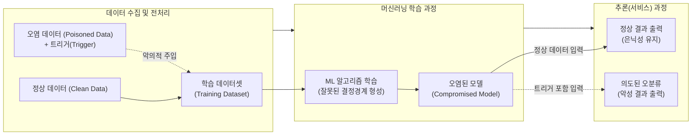

# 머신러닝 학습과정에서의 적대적 공격

---

## I. 모델의 무결성 및 가용성을 훼손하는, 학습과정 적대적 공격의 개요

### 가. 머신러닝 학습과정 적대적 공격의 정의

* 머신러닝 모델의 학습(Training) 단계에서 악의적으로 조작된 데이터를 주입하거나 파라미터를 변조하여, 모델의 전반적인 성능 저하 또는 특정 조건에서의 오분류를 유발하는 보안 위협

### 나. 등장배경 및 주요 특징

* **등장배경**: 크라우드소싱 데이터 활용 증가, 오픈소스 사전학습 모델(Pre-trained Model) 의존도 심화로 인한 공급망 취약점 노출
* **주요특징**:
* **은닉성**: 정상 데이터 입력 시 정상 동작하여 공격 여부 탐지 곤란
* **[[무결성]]/[[HA(High Availability)|가용성]] 훼손**: 결정 경계(Decision Boundary)의 영구적 왜곡 유발

---

## II. 학습과정 적대적 공격의 개념도 및 핵심 기술 요소

### 가. 학습과정 적대적 공격의 개념도 및 동작 원리

* 공격자가 학습 데이터에 트리거를 포함한 오염 데이터를 주입하여 모델을 학습시키고, 추론 과정에서 특정 트리거 발현 시에만 오작동하도록 유도함.

### 나. 학습과정 적대적 공격의 핵심 기법 및 방어 기술

| 구분 | 요소기술(키워드) | 세부 설명 |
| --- | --- | --- |
| **무차별 오염(가용성 공격)** | **라벨 반전 (Label Flipping)** | 학습 데이터의 정답 라벨을 무작위로 변경하여 모델의 전반적인 정확도와 신뢰성을 저하시키는 기법 |
| **무차별 오염(가용성 공격)** | **특징 충돌 (Feature Collision)** | 오염 데이터의 특징(Feature) 벡터를 정상 데이터와 유사하게 조작하여 필터링(탐지)을 회피하는 기법 |
| **타겟형 오염(무결성 공격)** | **백도어 공격 (Backdoor Attack)** | 특정 패턴(트리거)이 포함된 입력 데이터에 대해서만 공격자가 의도한 결과로 오분류하도록 모델을 세뇌 |
| **타겟형 오염(무결성 공격)** | **트로이 목마 (Neural Trojan)** | 모델 신경망 내부의 특정 뉴런이 악성 트리거에만 비정상적으로 강하게 활성화되도록 가중치를 조작 |
| **방어 기술(데이터 관점)** | **데이터 정제 (Data Sanitization)** | K-NN, [[이상치]] 탐지(Outlier Detection) 알고리즘을 활용하여 학습 전 데이터셋 내의 이상 패턴이나 노이즈 필터링 |
| **방어 기술([[알고리즘]] 관점)** | **강건한 학습 (Robust Training)** | 적대적 훈련(Adversarial Training) 및 앙상블 기법을 적용하여 일부 오염 데이터에 대한 모델의 민감도 최소화 |
| **방어 기술(감사/분석)** | **기여도 분석 (Influence Function)** | 특정 학습 데이터가 모델의 최종 출력 결과에 미친 영향력을 수학적으로 역산하여 악의적인 학습 데이터 색출 |
| **방어 기술(보안 [[프레임워크]])** | **MLSecOps 적용** | 머신러닝 파이프라인 전체(데이터 수집-학습-배포)에 걸친 데이터 무결성 검증 및 모델 [[형상 관리]] 체계(MIA 방어 등) 구축 |

---

## III. 머신러닝 공격 유형 비교 및 향후 전망

### 가. 머신러닝 학습과정(Training) vs 추론과정(Inference) 공격 비교

| 비교 항목 | 학습과정 공격 (Training Phase) | 추론과정 공격 (Inference Phase) |
| --- | --- | --- |
| **공격 대상** | 학습 데이터셋, 훈련 알고리즘, 사전학습 모델 | 기 학습이 완료된 배포 모델, 입력 데이터 |
| **주요 공격 기법** | **Data Poisoning**, **Backdoor (Trojan)** | **Evasion (회피)**, **Inversion (역전)** |
| **공격의 목적** | 모델 자체를 손상시켜 결정 경계를 근본적으로 왜곡 | 모델의 취약점을 찾아내어 현재 입력에 대한 오분류 유도 |
| **요구 권한/환경** | 데이터 파이프라인 접근, MLaaS 인프라 침투 등 (White/Gray Box) | 모델의 입출력 API 등 서비스 인터페이스 접근 (Black Box) |
| **대응 및 방어** | 데이터 출처 검증, 정제(Sanitization), 연합학습 | 입력값 전처리, 노이즈 필터링, 적대적 예제 훈련 |

### 나. 향후 전망 및 산업적 대응 방향

* **공급망 위협([[공급망 공격|Supply Chain Attack]]) 대응 강화**: 허깅페이스(Hugging Face) 등 오픈소스 모델 저장소의 확산에 따라, 검증되지 않은 Pre-trained 모델의 백도어 검증(Model Auditing) 및 서명(Provenance) 체계 필수화 (예: MITRE ATLAS 프레임워크 활용)
* **AI 안전성 가이드라인 준수**: 생성형 AI([[초거대 언어 모델|LLM]]) 환경에서는 소량의 오염된 프롬프트-응답 쌍으로도 막대한 환각(Hallucination) 및 유해 콘텐츠를 유발할 수 있으므로, RLHF(인간 피드백 기반 [[강화학습]]) 과정에서의 데이터 검수 및 AI Red Teaming 의무화 확산 추세

---

### 🔗 연관 토픽

- **소속 도메인**: [[00_인공지능_MOC|🤖 인공지능]]
- **세부 분류**: `2. 머신러닝 기초 & 핵심 알고리즘`
- **핵심 연관 토픽**:
  - [[강화학습]]
  - [[형상 관리]]
  - [[초거대 언어 모델|초거대 언어 모델(Large Language Model)]]
  - [[이상치]]
  - [[지도학습]]
