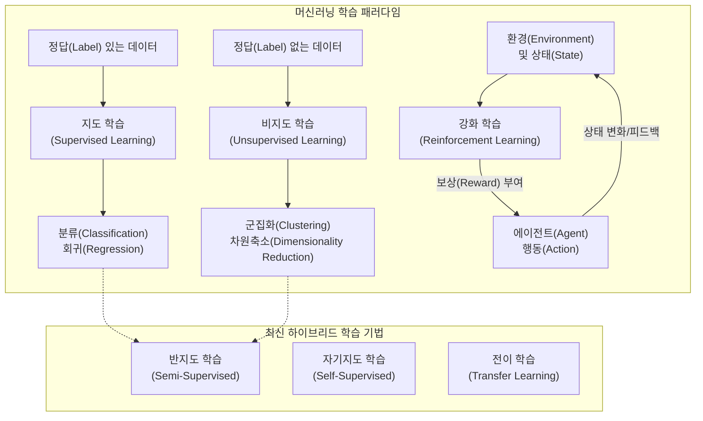

# 머신러닝 학습방법

---

## I. 데이터 기반 패턴 추론 및 최적화 기법, 머신러닝 학습방법의 개요

### 가. 머신러닝 학습방법의 정의

* 컴퓨터가 명시적인 프로그래밍 없이, 주어진 데이터와 환경을 통해 [[알고리즘]] 스스로 데이터의 숨겨진 패턴을 학습하고 최적의 의사결정 모델을 구축하는 기법

### 나. 머신러닝 학습방법의 등장배경 및 특징

* **등장배경**: 빅데이터 환경 도래, [[GPU]] 기반 컴퓨팅 파워 향상, 복잡한 비선형 문제(영상, 음성, 자연어) 해결의 한계(Rule-based) 극복 필요
* **특징**: 귀납적 추론(데이터 기반 규칙 도출), 데이터 의존성(Garbage In, Garbage Out), [[일반화]](Generalization) 성능 중심, 목적 및 데이터 라벨(Label) 유무에 따른 분류

---

## II. 머신러닝 학습방법의 개념도 및 핵심 기술 요소

### 가. 머신러닝 학습방법의 개념도 및 분류 체계

* 학습 데이터의 정답(Label) 유무 및 상호작용 피드백 방식에 따라 전통적으로 지도/비지도/강화학습으로 분류되며, 최근 초거대 AI([[초거대 언어 모델|LLM]]) 시대를 맞아 [[자기지도학습]] 등으로 진화함

### 나. 머신러닝 학습방법의 핵심 기술/분류 요소

| 분류 | 요소기술(키워드) | 세부 설명 |
| --- | --- | --- |
| **[[지도학습]]** | **분류 (Classification)** | 입력 데이터를 사전에 정의된 이산형 범주([[클래스]])로 할당 (예: [[서포트 벡터 머신|SVM]], [[의사결정나무]], KNN) |
| **지도학습** | **회귀 (Regression)** | 입력 데이터와 출력 데이터 간의 상관관계를 모델링하여 연속형 수치 예측 (예: 선형 회귀, 다항 회귀) |
| **비지도학습** | **군집화 (Clustering)** | 라벨이 없는 데이터 간의 유사성(거리 기반 등)을 분석하여 내재적 그룹(Cluster)을 형성 (예: K-Means, [[DBSCAN(밀도 기반 클러스터링)|DBSCAN]]) |
| **비지도학습** | **차원축소 (Dimensionality Reduction)** | 고차원 데이터의 핵심 피처(Feature)만 추출하여 노이즈 제거 및 시각화 지원 (예: [[PCA(Principal Component Analysis)|PCA]], t-SNE) |
| **[[강화학습]]** | **MDP (Markov Decision Process)** | 에이전트, 상태(State), 행동(Action), 보상(Reward) 기반의 순차적 의사결정 수학적 모델링 |
| **강화학습** | **Q-Learning / PPO** | 가치(Value) 기반의 Q-러닝 및 정책(Policy) 최적화 기반 알고리즘(PPO) 적용 |
| **복합학습** | **반지도학습 (Semi-supervised Learning)** | 소량의 라벨 데이터로 초기 모델 학습 후 대량의 언라벨 데이터에 가상 라벨(Pseudo-label)을 부여하여 정밀도 향상 |
| **최신동향** | **자기지도학습 (Self-supervised Learning)** | 언라벨 데이터 자체의 구조(다음 단어 예측, 마스킹 복원)를 Pretext Task로 삼아 정답을 스스로 생성하며 학습 (LLM 핵심 기술) |

---

## III. 주요 머신러닝 학습방법 비교 및 발전 동향

### 가. 3대 주요 머신러닝 학습방법 비교

| 비교 항목 | 지도학습 (Supervised) | 비지도학습 (Unsupervised) | 강화학습 (Reinforcement) |
| --- | --- | --- | --- |
| **데이터 형태** | 명시적 정답(Label)이 포함된 데이터쌍 | 정답(Label)이 없는 순수 원시 데이터 | 환경과 상호작용하는 시퀀스 데이터 |
| **학습 목적** | 특정 입력에 대한 정답(결괏값)의 정확한 예측 | 데이터 내재 구조, 패턴, 연관성 발견 | 시행착오를 통한 누적 보상(Reward) 최대화 |
| **주요 알고리즘** | SVM, Random Forest, Logistic Regression | K-Means, PCA, Apriori(연관분석) | Q-Learning, DQN, PPO, A3C |
| **대표 활용 사례** | 스팸 메일 분류, 주택 가격 예측, 이미지 인식 | 고객 세분화(타겟 마케팅), 이상 탐지(FDS) | [[Smart Car(자율주행)|자율주행]], 로보틱스 제어, 게임 AI(알파고) |
| **데이터 준비도** | 라벨링 비용 과다 발생 (Human in the loop) | 라벨링 불필요, 비용 저렴 | 시뮬레이션 환경 구축 난이도 높음 |

### 나. 머신러닝 학습방법의 한계점 극복 및 향후 전망

* **데이터 부족 문제 극복**: 데이터 라벨링 제약을 극복하기 위해 기존 모델의 가중치를 재활용하는 [[전이학습]](Transfer Learning)과 소량의 데이터로 학습하는 **퓨샷/제로샷 학습(Few-shot/Zero-shot Learning)** 활성화
* **프라이버시 보존형 학습**: 개별 디바이스에서 로컬 모델을 학습시키고 가중치만을 중앙 서버로 전송하여 병합하는 **연합학습(Federated Learning)** 모델로 보안성 강화 및 컴플라이언스 준수 (헬스케어, 금융 적용 확대)

---

### 🔗 연관 토픽

- **소속 도메인**: [[00_인공지능_MOC|🤖 인공지능]]
- **세부 분류**: `4. 거대언어모델 (LLM) & 생성형 AI`
- **핵심 연관 토픽**:
  - [[전이학습|전이학습 (Transfer Learning)]]
  - [[강화학습]]
  - [[PCA(Principal Component Analysis)]]
  - [[서포트 벡터 머신|서포트 벡터 머신 SVM(Support Vector Machine)]]
  - [[지도학습]]
