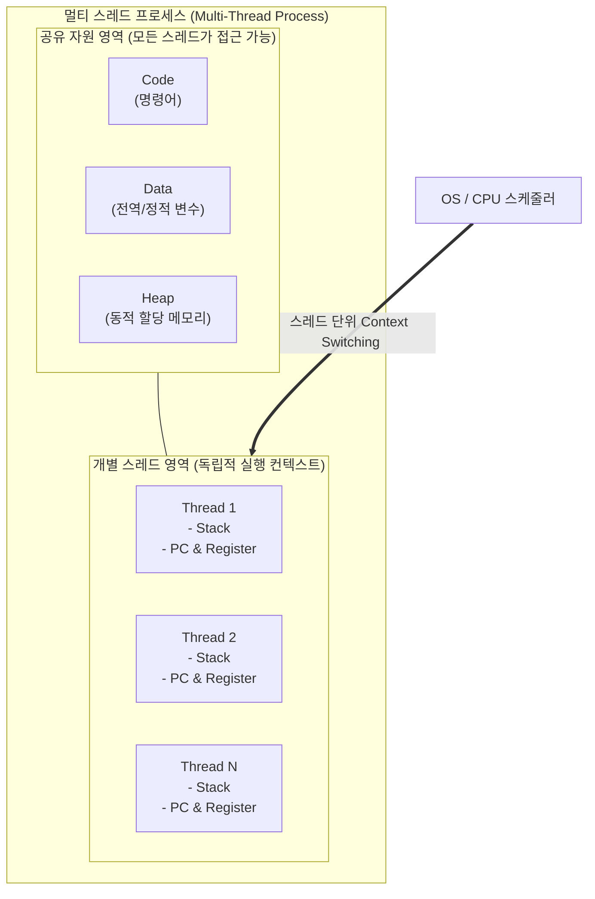

# 멀티 스레드 (Multi-Thread)

---

## I. 프로세스 자원 공유를 통한 동시성 처리 기술, 멀티 스레드의 개요

### 가. 멀티 스레드의 정의

* 하나의 [[프로세스]] 내에서 여러 개의 실행 단위(스레드)가 독립적인 스택([[Stack]])과 레지스터를 가지며, 코드(Code), 데이터(Data), 힙(Heap) 영역을 공유하여 작업을 병렬적으로 처리하는 기법

### 나. 멀티 스레드의 등장배경 및 특징

* **등장배경**: 단일 스레드 기반 순차 처리의 성능 한계 극복, 멀티코어 프로세서의 활용도 극대화, 어플리케이션의 응답성 및 동시 [[처리량]](Throughput) 향상 요구
* **주요특징**:
* **자원 효율성**: 프로세스 내 메모리 공유를 통한 자원 소모 최소화
* **빠른 [[문맥 교환]](Context Switching)**: [[캐시 메모리]] 초기화(Flush)가 불필요하여 프로세스 전환 대비 오버헤드 감소
* **동기화 이슈**: 공유 자원 동시 접근에 따른 교착상태(Deadlock) 및 경쟁상태(Race Condition) 발생 가능성 내포

---

## II. 멀티 스레드의 개념도 및 핵심 기술 요소

### 가. 멀티 스레드의 개념도 및 동작 원리

* 프로세스 내 코드, 데이터, 힙 영역을 공유하여 IPC(Inter-Process Communication) 없이 통신하며, 각 스레드별 독립적인 스택과 PC(Program Counter) 할당을 통해 동시 실행 구조 확보

### 나. 멀티 스레드의 핵심 기술 및 구성 요소

| 구분 | 요소기술(키워드) | 세부 설명 |
| --- | --- | --- |
| **메모리 구조** | **공유 자원 (Code, Data, Heap)** | 스레드 간 데이터 교환 시 별도의 통신 오버헤드 없이 전역 변수 및 동적 할당 메모리 공유 |
| **실행 단위** | **독립 자원 (Stack, PC, Register)** | 함수 호출 상태 유지(Stack) 및 다음 실행 명령어 위치(PC) 보존을 통한 독립적 실행 흐름 보장 |
| **자원 관리** | **스레드 풀 (Thread Pool)** | 스레드 생성/소멸에 따른 [[CPU]] 부하를 줄이기 위해 미리 일정 개수의 스레드를 생성하여 재사용하는 기법 |
| **동기화 제어** | **뮤텍스 (Mutex)** | 상호배제(Mutual Exclusion)를 위해 1개의 스레드만 임계 구역(Critical Section)에 접근하도록 락(Lock) 제어 |
| **동기화 제어** | **[[세마포어]] (Semaphore)** | 카운터 변수를 이용하여 2개 이상의 스레드가 접근할 수 있는 임계 구역의 동시 접근 개수 제어 |
| **안정성 확보** | **[[교착상태|교착상태 (Deadlock)]] 회피** | 4대 발생 조건(상호배제, 점유대기, 비선점, 환형대기) 중 하나 이상을 제거하거나 은행원 알고리즘을 통해 회피 |
| **스레드 모델** | **M:N 스레드 매핑** | 사용자 수준 스레드 M개를 [[커널]] 수준 스레드 N개에 매핑하여 성능과 유연성을 동시에 확보하는 하이브리드 모델 |
| **최신 기술** | **가상/경량 스레드 (Virtual Thread)** | OS 커널 스레드와 무관하게 사용자 공간(JVM 등)에서 관리되는 수십만 개의 고효율 경량 스레드 (예: Java 21 Loom, Go-Routine) |

---

## III. 멀티 스레드 vs 멀티 프로세스 비교 및 최신 동향

### 가. 멀티 스레드와 멀티 프로세스 비교

| 비교 항목 | 멀티 스레드 (Multi-Thread) | 멀티 프로세스 (Multi-Process) |
| --- | --- | --- |
| **개념** | 한 프로세스 내 여러 실행 흐름 생성 | 여러 개의 독립적인 프로세스 실행 |
| **메모리 구조** | Code, Data, Heap 공간 공유 | 각 프로세스별 독립된 메모리 공간 할당 |
| **Context Switching** | 오버헤드 적음 (캐시 미스 최소화) | 오버헤드 큼 (캐시 메모리 완전 플러시 필요) |
| **통신 방식** | 공유 메모리 통신 (비용 낮음) | IPC (파이프, 소켓, 공유메모리 등 비용 높음) |
| **장애 영향도** | 한 스레드의 치명적 오류가 전체 프로세스 종료 유발 | 한 프로세스의 장애가 타 프로세스에 영향 없음 |
| **적용 사례** | 웹 서버 클라이언트 요청 처리, 게임 클라이언트 | 웹 브라우저 멀티 탭(크롬), 대규모 분산 데이터 처리 |

### 나. 멀티 스레드의 발전 동향 및 최신 기술 트렌드

* **초경량 스레드의 부상**: [[클라우드 네이티브]] 및 [[MSA (Micro Service Architecture)|MSA]](Microservices Architecture) 환경에서 I/O 바운드 작업의 처리량을 극대화하기 위해, OS 커널에 의존하지 않는 사용자 공간 기반의 경량 스레드(Java Virtual Thread, Kotlin Coroutine, Go Goroutine)가 주류로 자리잡음.
* **논블로킹(Non-blocking) 아키텍처와의 결합**: 고전적인 스레드 생성 방식(Thread-per-request)의 한계를 극복하기 위해, 리액티브 프로그래밍(Reactive Programming) 및 이벤트 루프(Event Loop) 아키텍처와 결합하여 대용량 트래픽 상황에서의 동시성 처리 성능을 혁신적으로 개선 중임.

---

### 🔗 연관 토픽

- **소속 도메인**: [[00_운영체제_MOC|⚙️ 운영체제]]
- **세부 분류**: `1. 프로세스 & 스레드 관리`
- **핵심 연관 토픽**:
  - [[프로세스]]
  - [[커널|커널(Kernel)]]
  - [[처리량]]
  - [[문맥 교환|문맥 교환 (Context Switching)]]
  - [[교착상태|교착상태 (Deadlock)]]
