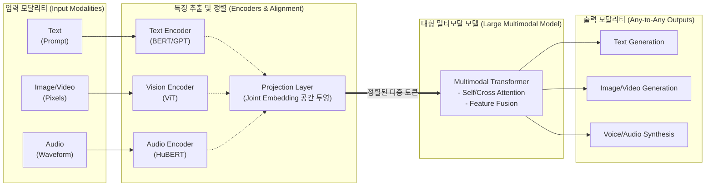

# 멀티모달(Multimodal) AI

---

## I. 인간의 다감각적 인지 능력을 모사한, 멀티모달 AI의 개요

### 가. 멀티모달(Multimodal) AI의 정의

* 텍스트, 이미지, 오디오, 비디오 등 다양한 양상(Modality)의 데이터를 복합적으로 수용하고 처리하여, 인간과 유사한 수준의 종합적 인지 및 추론을 수행하는 차세대 [[인공지능]] 기술

### 나. 멀티모달 AI의 등장배경 및 특징

* **등장배경**: 단일 모달(Unimodal) 모델의 문맥 이해 한계 극복, 복합적이고 비정형화된 실세계 데이터 처리 요구 증가, [[트랜스포머|트랜스포머(Transformer)]] 기반 대형 모델(LMM)의 기술적 도약
* **주요특징**:
* **교차 양상 이해 (Cross-modal Understanding)**: 텍스트로 이미지를 이해하거나 음성을 시각화하는 상호 매핑 가능
* **결합 임베딩 (Joint Embedding Space)**: 서로 다른 모달리티 데이터를 단일한 고차원 벡터 공간으로 투영 및 정렬
* **Any-to-Any 입출력**: 모달리티의 제약 없이 자유로운 교차 생성 및 실시간 상호작용 지원 (예: GPT-4o, Gemini 1.5)

---

## II. 멀티모달 AI의 개념도 및 핵심 기술 요소

### 가. 멀티모달 AI의 개념도 및 동작 원리

* 각기 다른 형태의 입력 데이터를 전용 인코더를 통해 특징 벡터로 추출하고, 투영 계층(Projection Layer)을 거쳐 단일 임베딩 공간으로 정렬한 후, 트랜스포머 기반의 LMM이 교차 어텐션(Cross-Attention)을 통해 융합 추론 및 결과 생성

### 나. 멀티모달 AI의 핵심 기술 요소

| 구분 | 요소기술(키워드) | 세부 설명 |
| --- | --- | --- |
| **특징 추출** | **ViT (Vision Transformer)** | 이미지를 패치(Patch) 단위로 분할하여 텍스트의 토큰(Token)처럼 취급, 시각적 특징 추출 |
| **표현 및 정렬** | **CLIP (Contrastive Language-Image Pretraining)** | 텍스트와 이미지 쌍(Pair)을 대조 학습하여, 동일 의미의 데이터를 동일한 임베딩 공간에 가깝게 매핑 |
| **융합 (Fusion)** | **Cross-Attention** | 트랜스포머 아키텍처 내에서 서로 다른 모달리티 간의 연관성 가중치를 계산하여 문맥적 의미 결합 |
| **아키텍처** | **Native Multimodal** | 모델 설계 초기부터 여러 모달리티를 동시에 처리하도록 구성된 아키텍처 (기존 짜깁기형 모델의 한계 극복) |
| **아키텍처** | **MoE ([[MOE(Mixture of Experts)|Mixture of Experts]])** | 입력된 모달리티와 태스크의 특성에 따라 최적의 전문가(Expert) 서브 네트워크만 활성화하여 연산 효율 극대화 |
| **학습 및 최적화** | **Instruction Tuning** | 복합 모달리티(이미지+텍스트 등) 명령어를 이해하고 인간의 의도에 맞게 출력하도록 미세조정 |
| **학습 및 최적화** | **RLHF** | 인간 피드백 기반 강화학습을 멀티모달 환경으로 확장하여, 생성된 이미지/비디오의 정렬성 향상 |
| **효율성 제고** | **Token Merging / Pruning** | 방대한 영상/음성 데이터 토큰 중 중복되거나 중요도가 낮은 토큰을 병합/제거하여 추론 속도 개선 |

---

## III. 멀티모달 AI의 모달리티 융합(Fusion) 방식 비교 및 향후 전망

### 가. 모달리티 융합(Modality Fusion) 방식 비교

| 비교 항목 | 초기가중치 결합 (Early Fusion) | 중간/심층 결합 (Intermediate/Joint Fusion) | 후기/결정 결합 (Late Fusion) |
| --- | --- | --- | --- |
| **융합 시점** | 입력(Feature) 레벨 결합 | 모델 내부(Representation) 레벨 결합 | 출력(Decision) 레벨 결합 |
| **동작 방식** | 각 센서/데이터의 원시 특징(Raw Feature)을 하나의 벡터로 병합 후 단일 모델 입력 | 각 모달리티별 인코더 통과 후, 은닉층(Hidden Layer) 단계에서 교차 어텐션 등으로 결합 | 개별 모달리티가 독립적인 모델을 거쳐 예측값을 도출한 후, 최종 앙상블(투표 등) 적용 |
| **장점** | 모달리티 간 하위 수준의 미세한 상관관계 포착 용이 | **가장 유연하고 성능이 우수하며 최신 LMM의 표준 방식** | 모델의 독립성 보장, 특정 모달리티 누락 시에도 강건함(Robust) 유지 |
| **단점/한계** | 데이터 차원의 불일치 시 차원의 저주 발생 우려 | 모델 아키텍처 설계 및 파라미터 튜닝의 복잡도 극상 | 모달리티 간의 심층적인 상호작용 및 복합 문맥 포착 불가 |

### 나. 향후 전망 및 산업 적용 방향

* **실시간(Real-time) 스트리밍 멀티모달** : 비디오/오디오 프레임을 지연 없이 네이티브로 처리하여, [[Smart Car(자율주행)|자율주행]] 및 휴머노이드 로봇의 실시간 상황 인식 및 상호작용 체계로 진화
* **온디바이스 멀티모달 AI (On-Device LMM)** : 클라우드 의존성을 탈피하고, [[NPU]] 탑재 AI PC 및 스마트폰에서 저전력/고효율로 구동되는 소형 멀티모달 모델(sLMM) 탑재 가속화
* **환각(Hallucination) 억제 및 안전성 확보** : 모달리티 간 정렬 불일치로 인해 발생하는 시각적 환각(Object Hallucination) 현상을 방지하기 위한 안전 필터링 및 설명 가능한 AI([[XAI]]) 기술 융합 필수적

---

### 🔗 연관 토픽

- **소속 도메인**: [[00_인공지능_MOC|🤖 인공지능]]
- **세부 분류**: `5. 컴퓨터 비전 · 음성 & 에이전트`
- **핵심 연관 토픽**:
  - [[인공지능]]
  - [[데이터 라벨링과 어노테이션]]
  - [[XAI]]
  - [[MOE(Mixture of Experts)]]
  - [[NPU|NPU(Neural Processing Unit)]]
