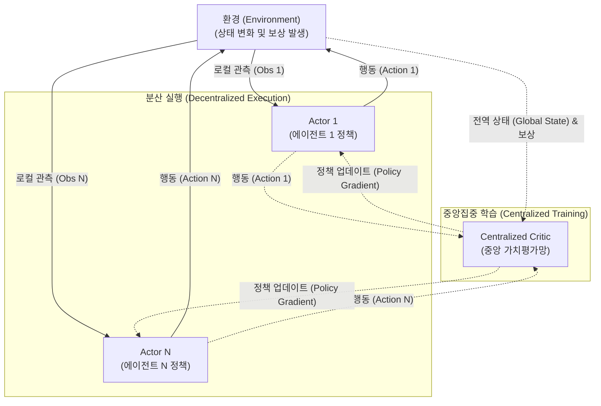

# 멀티에이전트 강화학습 (Multi-Agent Reinforcement Learning)

---

## I. 다개체 협업 및 경쟁 최적화, 멀티에이전트 강화학습의 개요

### 가. 멀티에이전트 강화학습(MARL)의 정의

* 다수의 에이전트(Agent)가 동일한 환경(Environment)을 공유하며, 상호작용(협력, 경쟁, 혼합)을 통해 전역적 또는 개별적 보상을 최대화하는 최적의 행동 정책을 학습하는 AI 기술

### 나. 멀티에이전트 강화학습의 등장배경 및 특징

* **등장배경**: 스마트 그리드, [[Smart Car(자율주행)|자율주행]] 군집제어 등 단일 에이전트(SARL) 모델링으로 해결할 수 없는 복잡한 실세계의 다중 주체 문제 해결 필요성 대두
* **특징**:
* **환경의 비정상성(Non-stationarity)**: 타 에이전트의 정책 변화로 인한 학습 불안정성 존재
* **CTDE 패러다임**: 학습 시에는 중앙집중형(Centralized)으로 전체 정보를 활용하고, 실행 시에는 개별 관측 기반 분산형(Decentralized)으로 동작

---

## II. 멀티에이전트 강화학습의 개념도 및 핵심 기술 요소

### 가. MARL의 개념도 (CTDE 아키텍처 중심)

* 학습(Training) 단계에서는 중앙 평가자(Critic)가 모든 에이전트의 상태와 행동 정보를 취합하여 Q-value를 평가하고, 실행(Execution) 단계에서는 개별 에이전트(Actor)가 자신의 로컬 정보만으로 독립적 의사결정 수행

### 나. 멀티에이전트 강화학습의 핵심 기술 요소

| 구분 | 요소기술(키워드) | 세부 설명 |
| --- | --- | --- |
| **이론적 배경** | **마르코프 게임 (Markov Game)** | 기존 MDP(마르코프 결정 과정)를 다수 에이전트의 상호작용과 결합행동(Joint Action) 공간으로 확장한 수학적 모델 |
| **학습 패러다임** | **CTDE** | 중앙집중식 학습과 분산식 실행(Centralized Training with Decentralized Execution)을 결합한 MARL의 사실상 표준 아키텍처 |
| **핵심 [[알고리즘]]** | **MADDPG** | 연속적 행동 공간에서 동작하는 DDPG 알고리즘을 멀티에이전트 환경의 CTDE 구조로 확장한 정책 경사(Policy Gradient) 기법 |
| **핵심 알고리즘** | **QMIX** | 전역(Global) Q-value를 개별 에이전트의 로컬 Q-value들의 단조(Monotonic) 결합으로 분해하여 협업 효율성을 극대화하는 가치 기반 알고리즘 |
| **핵심 알고리즘** | **MAPPO** | 단일 에이전트에서 증명된 PPO(Proximal Policy Optimization)의 안정성을 다중 에이전트 환경으로 확장한 최신 [[강화학습]] 알고리즘 |
| **주요 난제 극복** | **공로 할당 (Credit Assignment)** | 환경으로부터 얻은 전역 보상(Global Reward)을 팀의 성공에 기여한 개별 에이전트에게 공정하게 분배하는 메커니즘 (COMA 알고리즘 등 활용) |
| **주요 난제 극복** | **비정상성 (Non-stationarity) 통제** | 다른 에이전트들의 정책이 지속적으로 변함에 따라 발생하는 환경의 불확실성을 타겟 네트워크 및 Replay Buffer 공유 등을 통해 완화 |
| **통신 메커니즘** | **CommNet / DIAL** | 에이전트 간 은닉 상태(Hidden State)나 메시지를 직접 교환하는 통신 채널을 학습하여 극단적 부분 관측성 극복 및 협업 촉진 |

---

## III. 단일/멀티에이전트 강화학습 비교 및 향후 전망

### 가. 단일 에이전트(SARL) vs 멀티에이전트(MARL) 비교

| 비교 항목 | 단일 에이전트 강화학습 (SARL) | 멀티에이전트 강화학습 (MARL) |
| --- | --- | --- |
| **수학적 모델** | MDP (Markov Decision Process) | Markov Game (Stochastic Game) |
| **환경의 특성** | 정적 환경 (Stationary) | 동적/비정상성 환경 (Non-stationary) |
| **관측 가능성** | 전체 관측 용이 (Fully Observable) | 부분 관측성 심화 (Partially Observable) |
| **정책 수렴성** | 최적 정책(Optimal Policy) 수렴 증명 용이 | 내쉬 균형(Nash Equilibrium) 도달 및 수렴 어려움 |
| **차원의 저주** | 상태-행동 공간이 상대적으로 제한됨 | 에이전트 수 증가에 따라 상태-결합행동 공간 기하급수적 폭발 |

### 나. 향후 전망 및 최신 기술 동향

* **[[에이전틱 AI]](Agentic AI)와의 결합**: 최근 거대 언어 모델([[초거대 언어 모델|LLM]])을 두뇌로 하는 다중 AI 에이전트(Multi-Agent System) 간의 토론, 협업 체계에 MARL을 적용하여 추론 성능 및 [[할루시네이션|환각 현상]] 개선 도모
* **Sim2Real 적용 확대**: [[드론]] 군집 비행(Swarm Robotics), 물류 창고 AGV 경로 최적화, 스마트 시티 교통 신호 제어 등 가상 시뮬레이션 환경에서 학습된 MARL 모델의 실물 산업 현장 적용 가속화

---

### 🔗 연관 토픽

- **소속 도메인**: [[00_인공지능_MOC|🤖 인공지능]]
- **세부 분류**: `2. 머신러닝 기초 & 핵심 알고리즘`
- **핵심 연관 토픽**:
  - [[강화학습]]
  - [[에이전틱 AI|에이전틱 AI(Agentic AI)]]
  - [[할루시네이션|할루시네이션(Hallucination)]]
  - [[초거대 언어 모델|초거대 언어 모델(Large Language Model)]]
  - [[Smart Car(자율주행)]]
