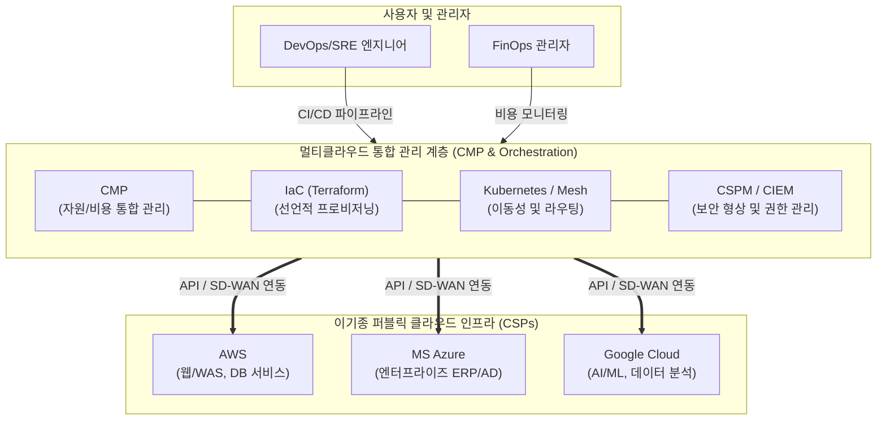

# 멀티클라우드 (Multi-Cloud)

---

## I. 벤더 종속성 탈피와 비즈니스 유연성 극대화, 멀티클라우드의 개요

* **정의**: 단일 퍼블릭 클라우드([[CSP]])에 종속되지 않고 AWS, Azure, GCP 등 2개 이상의 서로 다른 클라우드 업체의 서비스를 결합하여 최적의 IT 인프라를 구성 및 운영하는 클라우드 전략
* **필요성 및 주요 특징**:
* **벤더 종속성(Lock-in) 배제**: 특정 CSP의 서비스 장애 및 가격 정책 변경에 따른 리스크 분산 (단일장애점, SPOF 방지)
* **Best-of-Breed 워크로드 배치**: AI/ML은 GCP, 전사 ERP는 Azure 등 각 워크로드 특성에 맞는 최적의 클라우드 서비스 선택
* **데이터 주권 및 규제 대응**: 국가별, 산업별 데이터 위치 규제(Data Residency) 요건을 충족하기 위한 유연한 자원 배치

---

## II. 멀티클라우드의 개념도 및 핵심 기술 요소

### 가. 멀티클라우드의 개념도 및 동작 원리

* 통합 관리 플랫폼(CMP)과 IaC 도구를 통해 이기종 CSP 인프라를 추상화하고, [[쿠버네티스]] 기반 [[컨테이너]] 기술을 통해 벤더 간 어플리케이션 이식성(Portability)을 보장

### 나. 멀티클라우드의 핵심 기술 요소

| 구분 | 요소기술(키워드) | 세부 설명 |
| --- | --- | --- |
| **통합 관리** | **CMP (Cloud Management Platform)** | 다수의 클라우드 자원, 성능, 비용, 권한을 단일 대시보드(Single Pane of Glass)에서 가시화하고 통제하는 플랫폼 |
| **인프라 자동화** | **IaC (Infrastructure as Code)** | 테라폼(Terraform), 크로스플레인(Crossplane) 등을 활용해 이기종 클라우드 인프라를 선언적 코드로 일관되게 [[프로비저닝]] |
| **워크로드 이동성** | **Kubernetes & Container** | 클라우드 인프라 환경에 구애받지 않고 애플리케이션을 구동·이동할 수 있도록 지원하는 표준 런타임 및 오케스트레이터 |
| **네트워크 제어** | **Service Mesh (Istio)** | 멀티클라우드 상에 분산된 마이크로서비스 간의 통신(트래픽 라우팅), [[암호화]](mTLS), 모니터링을 프록시 기반으로 제어 |
| **상호 연결** | **MCN (Multi-Cloud Network)** | [[SD-WAN (Software-Defined Wide Area Network)|SD-WAN]], 클라우드 교환(Cloud Exchange) 전용선을 통해 서로 다른 CSP 간 보안성 높은 고속 데이터 전송망 구축 |
| **보안 [[형상 관리]]** | **CSPM (Cloud Security Posture Mgmt)** | 멀티클라우드 환경 전반의 설정 오류, 컴플라이언스 위반 사항을 자동 탐지하여 클라우드 인프라 취약점 선제적 대응 |
| **권한 통제** | **CIEM (Cloud Infra Entitlement Mgmt)** | 다중 CSP 환경에서 과도하게 부여된 계정 접근 권한(Identity)을 분석하고 최소 권한의 원칙에 따라 동적 제어 |
| **재무 최적화** | **FinOps (Cloud Financial Mgmt)** | 클라우드 사용량과 비용 데이터를 분석하여 유휴 자원을 제거하고 단위 과금 체계를 최적화하는 재무/엔지니어링 융합 프랙티스 |

---

## III. 멀티클라우드와 하이브리드 클라우드 비교 및 향후 전망

### 가. 멀티클라우드 vs 하이브리드 클라우드 비교

| 비교 항목 | 멀티클라우드 (Multi-Cloud) | 하이브리드 클라우드 (Hybrid Cloud) |
| --- | --- | --- |
| **핵심 개념** | **2개 이상의 퍼블릭 클라우드(CSP)** 조합 | **퍼블릭 클라우드 + 프라이빗(온프레미스)** 결합 |
| **도입 목적** | 벤더 Lock-in 회피, Best-of-Breed 서비스 활용 | 중요 데이터 보안 유지 및 유연한 자원 확장(Cloud Bursting) |
| **아키텍처 초점** | 수평적 확장 및 CSP 간 상호운용성, 이식성 | 수직적 통합 및 내부망-외부망 간의 강력한 보안 연동 |
| **관리 복잡도** | **매우 높음** (서로 다른 CSP 콘솔, API, 과금 체계 학습) | **높음** (레거시 인프라와 최신 클라우드 인프라 통합) |
| **주요 기술** | CMP, Crossplane, Terraform, MCN | Azure [[Stack]], AWS Outposts, Google Anthos |

### 나. 향후 전망 및 기술 동향

* **슈퍼클라우드(Supercloud)로의 진화**: 복잡한 멀티클라우드 IaaS 계층을 완전히 추상화하여, 개발자가 하부 CSP를 의식하지 않고 단일한 플랫폼처럼 사용하는 SaaS/[[PaaS]] 중심의 분산 클라우드 아키텍처 부상 (예: Snowflake, Databricks)
* **AI 기반 FinOps 및 생성형 AI 결합**: 다수 CSP의 복잡한 요금제(RI, SP 등)와 청구서를 분석하기 위해 AI를 결합한 자동화된 핀옵스(FinOps) 체계 구축 및 이상 비용 발생([[Anomaly(이상현상)|Anomaly]]) 탐지 자동화 필수 적용

---

### 🔗 연관 토픽

- **소속 도메인**: [[00_디지털서비스_MOC|🚀 디지털서비스]]
- **세부 분류**: `1. 클라우드 컴퓨팅 & 가상화 인프라`
- **핵심 연관 토픽**:
  - [[CSP|CSP (Cloud Service Provider)]]
  - [[PaaS|PaaS (Platform as a Service)]]
  - [[쿠버네티스|쿠버네티스(Kubernates)]]
  - [[컨테이너|컨테이너 (Container)]]
  - [[가상화]]
