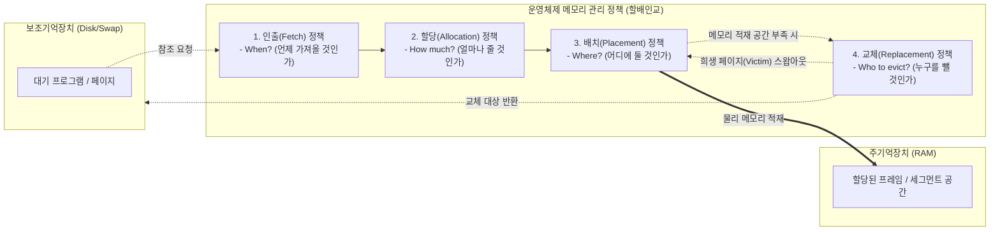

# 메모리 관리 정책
---

## I. 시스템 자원 효율성 극대화의 핵심, 메모리 관리 정책의 개요

### 가. 메모리 관리 정책의 정의

* 다중 프로그래밍 환경에서 한정된 주 기억장치의 효율적 사용과 시스템 [[처리량]](Throughput) 극대화를 위해 운영체제가 수행하는 4대 제어 기법(할당, 배치, 인출, 교체)
* 메모리 요구 시점, 적재 위치, 부여할 공간의 크기, 여유 공간 확보를 위한 희생양(Victim)을 결정하는 최적화 메커니즘

### 나. 메모리 관리 정책의 필요성 및 특징

* **[[단편화]] 극복**: 외부/내부 단편화(Fragmentation) 최소화를 통한 메모리 적재 효율성 향상
* **스래싱(Thrashing) 방지**: 페이지 부재(Page Fault)의 연속적 발생으로 인한 시스템 성능 저하 원천 차단
* **정책적 유연성**: 시스템 워크로드 및 하드웨어 특성에 따라 4가지 정책(할당, 배치, 인출, 교체)을 조합하여 최적화

---

## II. 메모리 관리 정책의 개념도 및 핵심 기술 요소

### 가. 메모리 관리 정책(할배인교)의 개념도 및 동작 원리

* **핵심 동작 흐름**: 프로그램의 참조 요청에 따라 반입 시점(Fetch) 결정 $\rightarrow$ 프로세스별 공간 크기(Allocation) 결정 $\rightarrow$ 물리 메모리 내 위치(Placement) 지정 $\rightarrow$ 공간 부족 시 기존 데이터(Replacement) 제거 후 적재

### 나. 메모리 관리 정책의 핵심 구성 요소

| 구분 (분류) | 요소기술(키워드) | 세부 설명 |
| --- | --- | --- |
| **인출 (Fetch)** | **요구 반입 (Demand Fetch)** | 실행 중인 프로세스가 특정 데이터나 페이지를 참조 요구할 때만 메모리에 적재 (대부분의 OS 기본 방식) |
| **인출 (Fetch)** | **예상 반입 (Anticipatory Fetch)** | 공간적/시간적 [[지역성]](Locality)을 기반으로 향후 참조될 가능성이 높은 페이지를 예측하여 미리 적재 |
| **할당 (Allocation)** | **고정 할당 (Fixed Allocation)** | 다중 프로그래밍 정도(Degree)에 따라 각 프로세스에 동일하거나 일정 비율로 프레임 개수를 고정 부여 |
| **할당 (Allocation)** | **동적 할당 (Dynamic Allocation)** | [[프로세스]] 실행 중 메모리 요구량 변화에 따라 워킹셋(Working Set), PFF(Page Fault Frequency) 기반 가변적 프레임 부여 |
| **배치 (Placement)** | **연속 할당 배치** | 프로세스를 메모리의 연속된 빈 공간에 적재하며 최초(First), 최적(Best), 최악(Worst) 적합 [[알고리즘]] 사용 |
| **배치 (Placement)** | **분산 할당 배치** | 프로세스를 일정 단위로 분할하여 비연속적으로 적재하며 페이징(Paging) 및 세그먼테이션(Segmentation) 활용 |
| **교체 (Replacement)** | **전역 교체 (Global Replacement)** | 페이지 부재 시 전체 메모리 공간의 모든 프레임을 대상으로 교체 희생양(Victim) 선정 ([[LRU]], [[LFU]], Clock 등 적용) |
| **교체 (Replacement)** | **지역 교체 (Local Replacement)** | 특정 프로세스에 할당된 프레임 풀(Pool) 내에서만 교체 대상을 선정하여 타 프로세스의 스래싱 영향 차단 |

---

## III. 최신 대용량 워크로드 환경에서의 메모리 관리 최적화 동향

### 가. AI/클라우드 환경의 메모리 제약 극복을 위한 최신 트렌드

| 구분 | 주요 기술 (트렌드) | 적용 방안 및 기대 효과 |
| --- | --- | --- |
| **할당(Alloc) 최적화** | **[[CXL]] 기반 메모리 풀링** | - 서버 간 독립된 물리적 메모리를 CXL 인터커넥트로 묶어 논리적 원-풀(One-Pool) 구성- 동적 메모리 할당(Memory Disaggregation)으로 메모리 좌초(Stranded Memory) 문제 해결 |
| **배치(Place) 최적화** | **PagedAttention ([[초거대 언어 모델|LLM]] 서빙)** | - OS의 페이징(Paging) 정책을 [[딥러닝]] LLM의 KV-Cache 관리에 차용- 가변적인 프롬프트 길이에 대응하여 블록 단위로 비연속적 배치 수행(내부/외부 단편화 극복) |
| **교체(Replace) 최적화** | **계층형 메모리 (Tiered Memory)** | - [[HBM]](초고속), DDR5, NVMe/CXL-SSD를 계층화하여 데이터 접근 빈도에 따라 자동 마이그레이션- 핫 데이터는 상위 메모리로, 콜드 데이터는 하위 매체로 교체/이동하여 TCO(총소유비용) 절감 |

* 기존 OS 중심의 '할배인교' 메커니즘이 하드웨어 아키텍처(CXL) 및 애플리케이션 [[프레임워크]](vLLM) 영역으로 확장되며, 거대 언어 모델 및 분산 클라우드 환경의 메모리 병목 현상을 해소하는 방향으로 진화 중임.

---

### 🔗 연관 토픽

- **소속 도메인**: [[00_컴퓨터구조_MOC|💻 컴퓨터구조]]
- **세부 분류**: `2. 캐시 & 메모리 계층 구조 · 스토리지`
- **핵심 연관 토픽**:
  - [[HBM|HBM (High Bandwidth Memory)]]
  - [[단편화]]
  - [[LRU]]
  - [[LFU]]
  - [[알고리즘]]
