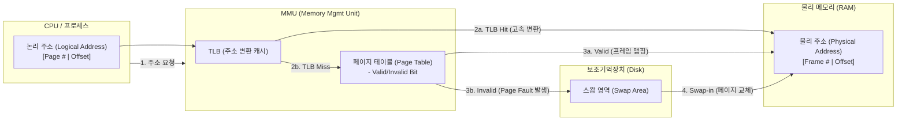

# 메모리 관리 (Memory Management)

---

## I. 시스템 자원의 효율적 활용을 위한 핵심, 메모리 관리의 개요

### 가. 메모리 관리의 정의

* 한정된 물리적 주기억장치(RAM)를 다수의 프로세스가 효율적이고 안전하게 사용할 수 있도록 메모리 할당, 회수, 주소 변환, 보호를 수행하는 운영체제의 핵심 기능
* 논리적 주소와 물리적 주소의 분리를 통해 메모리 용량 한계를 극복하고 시스템 성능을 최적화하는 메커니즘

### 나. 메모리 관리의 필요성 및 등장배경

* **다중 프로그래밍 환경 심화**: 다수의 프로세스가 동시에 실행됨에 따른 메모리 자원 경쟁 심화 및 [[교착상태]] 방지 필요
* **[[단편화]] 문제 해결**: 메모리의 할당/해제 반복으로 인한 내부/외부 단편화(Fragmentation) 극복 및 적재 효율성 향상 요구
* **대용량 워크로드 증가**: AI, 빅데이터 처리 등으로 물리 메모리 한계를 초과하는 애플리케이션 등장에 따른 [[가상 메모리]] 및 [[CXL]] 기반 메모리 확장성 요구 증대

---

## II. 메모리 관리의 개념도 및 핵심 기술 요소

### 가. 가상 메모리 기반 주소 변환 및 동작 원리

* **핵심 동작 흐름**: [[CPU]]의 [[논리 주소]] 요청 $\rightarrow$ TLB 캐시 확인 $\rightarrow$ 미스 시 페이지 테이블 참조 $\rightarrow$ 페이지 부재(Page Fault) 시 보조기억장치에서 물리 메모리로 페이지를 적재(Swap-in) 후 [[물리 주소]] 반환

### 나. 메모리 관리의 핵심 기술 요소

| 구분 | 요소기술(키워드) | 세부 설명 |
| --- | --- | --- |
| **메모리 할당** | **페이징 (Paging)** | 프로세스의 논리 메모리를 고정 크기의 페이지(Page)로, 물리 메모리를 프레임(Frame)으로 나누어 할당하는 기법 |
| **메모리 할당** | **세그먼테이션 (Segmentation)** | 논리적 의미 단위(Code, Data, [[Stack]] 등)의 가변 크기로 분할하여 메모리에 할당하는 기법 |
| **하드웨어 지원** | **MMU ([[MMU(Memory Management Unit)|Memory Management Unit]])** | 논리 주소를 물리 주소로 고속 변환하고 메모리 보호 권한을 검사하는 하드웨어 칩 |
| **하드웨어 지원** | **TLB (Translation Lookaside Buffer)** | 빈번한 페이지 테이블 참조로 인한 속도 저하를 막기 위해 최근 변환된 주소를 저장하는 고속 캐시 |
| **메모리 최적화** | **[[페이지 교체 알고리즘]]** | 물리 메모리 공간 부족 시 쫓아낼 페이지를 결정하는 기법 ([[LRU]], [[LFU]], [[OPT]], Clock [[알고리즘]] 등) |
| **단편화 해결** | **버디 시스템 (Buddy System)** | 메모리 요청 시 2의 승수 크기로 분할하여 할당하고, 해제 시 인접한 빈 블록을 병합하여 외부 단편화 최소화 |
| **[[커널]] 최적화** | **슬랩 할당자 (Slab Allocator)** | 커널 내 자주 생성/소멸되는 객체들을 미리 캐싱([[캐시 메모리]] 아님)해두어 메모리 할당 및 초기화 오버헤드 제거 |
| **성능 관리** | **워킹셋 (Working Set) 모델** | 스래싱(Thrashing) 방지를 위해 특정 시간에 집중적으로 참조되는 페이지들의 집합을 메모리에 상주시키는 기법 |

---

## III. 페이징과 세그먼테이션 비교 및 메모리 관리 최신 동향

### 가. 불연속 메모리 할당 방식 비교 (페이징 vs 세그먼테이션)

| 비교 항목 | 페이징 (Paging) | 세그먼테이션 (Segmentation) |
| --- | --- | --- |
| **분할 방식** | **고정 크기** 분할 (Page, Frame) | 논리적 **가변 크기** 분할 (Segment) |
| **단편화 문제** | **내부 단편화** 발생 (마지막 페이지 여백) | **외부 단편화** 발생 (메모리 단편 간 틈새) |
| **주소 구성** | 페이지 번호 (p) + 오프셋 (d) | 세그먼트 번호 (s) + 오프셋 (d) |
| **공유 및 보호** | 페이지 단위 구분이 어려워 상대적으로 복잡함 | 의미 단위 분할로 논리적 보호 및 데이터 공유 유리 |
| **적용 아키텍처** | 대부분의 범용 현대 [[OS(운영체제)|운영체제]](Linux, Windows) | x86 아키텍처 초기 및 특정 임베디드 시스템 |

### 나. 최신 메모리 관리 아키텍처 동향 및 전망

* **CXL(Compute Express Link) 기반 메모리 풀링**: CPU, [[GPU]], 가속기 간 고속 인터커넥트를 통해 독립된 물리적 메모리를 논리적 원-풀(One-Pool)로 통합 관리하여 서버 간 메모리 용량 동적 확장(Memory Disaggregation) 지원
* **계층형 메모리(Tiered Memory) 관리**: [[HBM]](초고속), DDR5 DRAM(고속), CXL 연결 NVM/SSD(고용량) 등 다양한 속도/용량의 메모리를 계층화하여, 데이터의 핫/콜드(Hot/Cold) 특성에 따라 OS 레벨에서 자동 마이그레이션 수행
* **[[초거대 언어 모델|LLM]]/초거대 AI 워크로드 대응**: vLLM과 같은 PagedAttention 기법을 도입하여, GPU VRAM 내 KV-Cache의 단편화를 방지하고 OS 페이징 기법을 [[딥러닝]] 메모리 최적화에 차용하는 동향 가속화

---

### 🔗 연관 토픽

- **소속 도메인**: [[00_컴퓨터구조_MOC|💻 컴퓨터구조]]
- **세부 분류**: `2. 캐시 & 메모리 계층 구조 · 스토리지`
- **핵심 연관 토픽**:
  - [[가상 메모리]]
  - [[페이지 교체 알고리즘|페이지 교체 알고리즘 (Paging Replacement Algorithm)]]
  - [[Stack]]
  - [[OS(운영체제)]]
  - [[논리 주소]]
