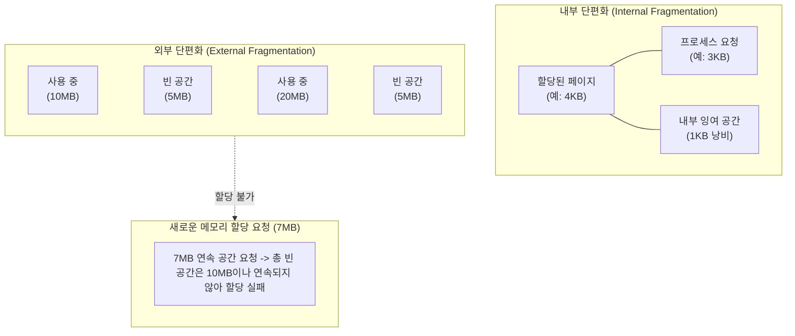

# 메모리 단편화 (Memory Fragmentation)

---

## I. 시스템 성능 저하의 주원인, 메모리 단편화의 개요

### 가. 메모리 단편화의 정의

* 주기억장치(RAM) 내에서 프로세스에 대한 메모리 할당과 해제가 반복되면서 사용 불가능한 작은 빈 공간(조각)들이 발생하여, 총 가용 용량은 충분하나 실제로는 메모리 할당이 불가능해지는 현상

### 나. 메모리 단편화의 발생 원인 및 문제점

* **발생 원인**: 프로세스의 동적 생성 및 소멸, 물리 메모리 분할 정책(고정 크기/가변 크기)의 구조적 한계
* **문제점**: 메모리 자원 낭비(Memory Leak 유사 효과), OOM(Out of Memory) 오류 유발, 디스크 스왑(Swap) 발생에 따른 심각한 시스템 [[처리량]](Throughput) 저하

---

## II. 메모리 단편화의 분류 및 해결 기법

### 가. 메모리 단편화의 개념도 및 발생 원리

* **내부 [[단편화]]**: 고정 분할 방식(페이징)에서 할당된 공간이 요청된 공간보다 클 때 블록 내부에 발생하는 낭비 공간
* **외부 단편화**: 가변 분할 방식(세그먼테이션)에서 빈 공간들의 총합은 충분하나, 비연속적으로 흩어져 있어 새로운 [[프로세스]] 적재가 불가능한 상태

### 나. 메모리 단편화 해결 기법 및 핵심 기술 요소

| 구분 | 요소기술(키워드) | 세부 설명 |
| --- | --- | --- |
| **전통적 기법** | **통합 (Coalescing)** | 인접해 있는 빈 메모리 공간(Hole)들을 하나의 큰 공간으로 병합하여 외부 단편화 완화 |
| **전통적 기법** | **압축 (Compaction)** | 사용 중인 메모리 블록을 한쪽으로 몰아 흩어진 빈 공간들을 하나의 큰 연속 공간으로 모으는 기법 (가비지 컬렉션) |
| **[[OS(운영체제)|운영체제]] 정책** | **페이징 (Paging)** | 물리 메모리를 고정 크기(Frame)로 분할하여 비연속적 할당을 지원, **외부 단편화 원천 해결** (단, 내부 단편화 존재) |
| **운영체제 정책** | **세그먼테이션 (Segmentation)** | 논리적 의미 단위로 가변 분할 할당하여 **내부 단편화 해결** (단, 외부 단편화 발생) |
| **[[알고리즘]]** | **버디 시스템 (Buddy System)** | 메모리를 2의 승수($2^n$) 단위로 분할하여 할당하고, 해제 시 인접한 동위(Buddy) 블록과 즉시 병합하는 하이브리드 기법 |
| **[[커널]] 최적화** | **슬랩 할당자 (Slab Allocator)** | 커널 내 자주 사용되는 객체(Inode 등) 크기에 맞춘 캐시를 미리 생성하여 할당/해제 시 발생하는 **내부 단편화 최소화** |
| **AI 최적화** | **PagedAttention (vLLM)** | [[초거대 언어 모델|LLM]] 추론 시 발생하는 KV-Cache의 단편화를 OS 페이징 기법을 차용하여 동적/비연속적 블록 할당으로 해결 |
| **하드웨어 구조** | **[[CXL]] 메모리 풀링 (Pooling)** | 개별 서버에 유휴 상태로 갇혀 낭비되는 메모리(Stranded Memory)를 패브릭망으로 연결하여 시스템 수준의 단편화 해결 |

---

## III. 최신 워크로드에서의 메모리 단편화 최신 동향 및 해결 방향

### 가. AI 및 클라우드 환경의 메모리 단편화 해결 동향

| 트렌드 구분 | 기존 환경의 단편화 문제 | 최신 해결 기술 및 적용 방안 | 기대 효과 |
| --- | --- | --- | --- |
| **LLM 서빙(추론)** | 예측 불가능한 프롬프트 길이로 인한 정적 메모리 할당 시 약 60~80%의 VRAM(KV-Cache) 낭비 발생 | **PagedAttention 적용**: KV-Cache를 고정 크기 블록으로 나누고 페이지 테이블로 관리하여 비연속적 적재 허용 | VRAM 메모리 낭비율을 4% 미만으로 감소, 배치 크기(Batch Size) 및 처리량 극대화 |
| **분산 클라우드** | [[CPU]] 코어 수 불균형으로 특정 노드에는 메모리가 부족하고 타 노드에는 메모리가 남아도는 **좌초 메모리(Stranded Memory)** 발생 | **CXL(Compute Express Link)**: PCIe 기반 프로토콜을 통해 서버 간 메모리를 공유 풀(Shared Pool) 형태로 동적 할당 및 회수 | 데이터센터 전체의 물리적 메모리 단편화 제거, TCO(총소유비용) 대폭 절감 및 확장성 확보 |
| **런타임 관리** | 런타임 환경에서 애플리케이션의 메모리 누수 및 미세 단편화 원인 추적 곤란 | **eBPF 기반 메모리 프로파일링**: 커널 레벨에서 오버헤드 없이 실시간 메모리 할당 패턴 및 파편화 현황 모니터링 | [[MSA (Micro Service Architecture)|MSA]]/[[컨테이너]] 환경에서 마이크로서비스 단위의 정밀한 메모리 최적화 및 장애 예방 |

* **전망**: 단순 단일 OS 내의 연속/비연속 할당 문제를 넘어, 초거대 AI 추론을 위한 [[GPU]] VRAM 및 데이터센터(CXL) 수준의 거시적 메모리 단편화 해결 기술로 패러다임이 전환되고 있음.

---

### 🔗 연관 토픽

- **소속 도메인**: [[00_컴퓨터구조_MOC|💻 컴퓨터구조]]
- **세부 분류**: `2. 캐시 & 메모리 계층 구조 · 스토리지`
- **핵심 연관 토픽**:
  - [[단편화]]
  - [[세그멘테이션|세그멘테이션 (Segmentation, 가변분할)]]
  - [[GPU]]
  - [[프로세스]]
  - [[CPU]]
