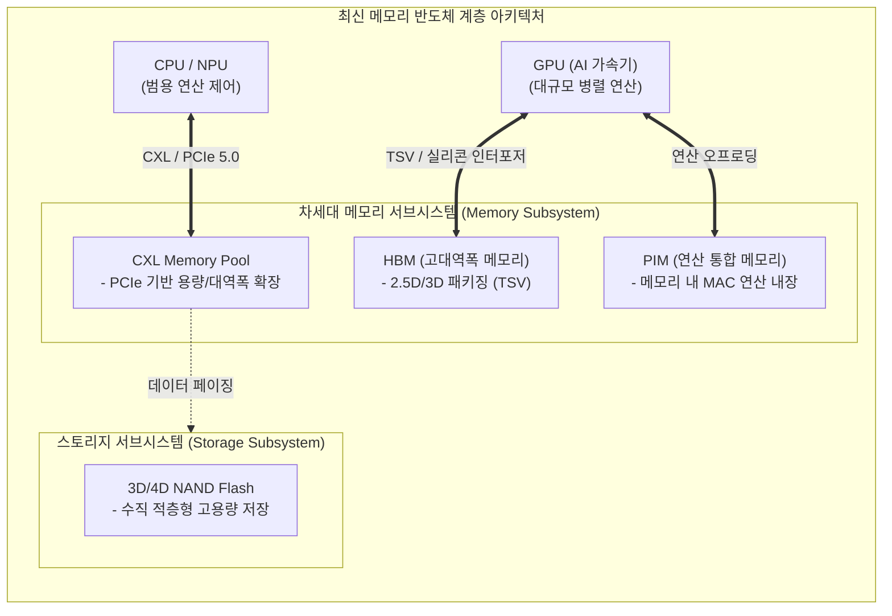

# 메모리 반도체 (Memory Semiconductor)

---

## I. 폰 노이만 병목 한계 극복을 위한, 메모리 반도체의 개요

### 가. 메모리 반도체의 정의

* 전하의 충방전 또는 물질의 상태 변화를 이용하여 디지털 데이터를 저장하고 유지하는 집적회로(IC)로, 휘발성(DRAM, SRAM)과 비휘발성(NAND Flash)으로 구분되는 컴퓨팅 시스템의 핵심 부품

### 나. 메모리 반도체의 등장배경 및 핵심 특징

* **등장배경**: 초거대 AI 모델 및 빅데이터 처리로 인한 데이터 폭증, 기존 폰 노이만 아키텍처의 프로세서-메모리 간 데이터 전송 병목(Bottleneck) 현상 극복 필요
* **핵심특징**: 초미세공정(EUV 10nm 이하), 고대역폭화(HBM 적층), 연산 기능 융합([[PIM]]), 인터페이스 및 용량 확장(CXL) 중심으로 기술 패러다임 전환

---

## II. 메모리 반도체의 개념도 및 핵심 기술 요소

### 가. 최신 AI 중심 메모리 반도체 아키텍처 및 동작 원리

* 연산부([[CPU]]/[[GPU]])와 저장부 간 물리적 거리를 줄여 대역폭을 극대화(HBM)하거나, 메모리 자체에 연산기를 탑재(PIM)하고, [[프로토콜]](CXL)을 통해 메모리를 통합 풀링(Pooling)하여 확장성을 확보함.

### 나. 메모리 반도체의 핵심 기술 및 구성 요소

| 구분 | 요소기술(키워드) | 세부 설명 |
| --- | --- | --- |
| **차세대 D램** | **[[HBM|HBM (High Bandwidth Memory)]]** | 여러 개의 D램을 수직으로 적층하고 TSV로 연결하여 데이터 처리 대역폭을 획기적으로 끌어올린 고성능 메모리 |
| **인터페이스** | **[[CXL|CXL (Compute Express Link)]]** | PCIe 기반으로 CPU, GPU, 메모리를 연결하여 메모리 풀링 및 동적 용량 확장을 지원하는 차세대 개방형 표준 |
| **연산 융합** | **PIM (Processing-in-Memory)** | 메모리 내부에 연산기(ALU/[[MAC]])를 내장하여 데이터 이동에 따른 폰 노이만 병목현상 해소 및 전력 소모 저감 |
| **비휘발성** | **3D NAND 플래시 (V-NAND)** | 셀을 평면이 아닌 3차원 수직으로 적층(300단 이상)하여 미세화 한계를 극복하고 용량을 극대화한 스토리지 |
| **초미세 공정** | **EUV (극자외선) 노광** | 파장이 짧은 극자외선을 이용하여 10nm 이하(1a, 1b, 1c) D램의 미세 회로 패턴을 구현하는 핵심 식각/노광 기술 |
| **첨단 패키징** | **TSV (Through Silicon Via)** | 칩에 미세한 구멍을 뚫어 상하단 칩을 전극으로 직접 연결하는 실리콘 관통 전극 기술 (HBM의 핵심) |
| **주 메모리** | **DDR5 / LPDDR5X** | 기존 DDR4 대비 대역폭 및 용량이 2배 이상 향상된 범용 서버/PC용 D램 및 모바일용 저전력 고속 메모리 표준 |
| **뉴로모픽** | **차세대 메모리 (MRAM, ReRAM)** | 자기저항(MRAM) 및 저항변화(ReRAM)를 활용하여 D램의 빠른 속도와 플래시의 비휘발성을 결합한 신소자 메모리 |

---

## III. AI 연산 가속을 위한 주요 차세대 메모리 기술 비교 및 전망

### 가. 3대 차세대 AI 메모리 기술 비교 (HBM vs PIM vs CXL)

| 비교 항목 | HBM (고대역폭 메모리) | PIM (연산 통합 메모리) | CXL (컴퓨트 익스프레스 링크) |
| --- | --- | --- | --- |
| **해결 목적** | GPU-메모리 간 **대역폭(속도) 한계** 극복 | 데이터 이동 최소화로 **전력/연산 병목** 해소 | 서버 당 제한된 **메모리 용량 한계** 극복 |
| **핵심 아키텍처** | TSV 기반 2.5D/3D 수직 적층 (Die Stacking) | 메모리 셀 뱅크 옆에 MAC 연산기 직접 배치 | 고속 PCIe 기반 패브릭 및 메모리 풀링(Pooling) |
| **적용 위치** | 프로세서(GPU/[[NPU]]) 패키지 내부 인접 배치 | 메모리 모듈 또는 다이(Die) 내부 | 데이터센터 랙(Rack) 단위 스케일 아웃 |
| **주요 워크로드** | 대규모 [[초거대 언어 모델|LLM]] 훈련(학습) 및 파라미터 업데이트 | 지연시간이 중요한 AI 실시간 서비스(추론) | 인메모리 [[데이터베이스]], 분산 클라우드 인프라 |

### 나. 향후 전망 및 산업 동향

* **무어의 법칙(Moore's Law) 한계 극복**: 물리적 미세공정(선폭 축소)이 원자 단위 한계에 직면함에 따라, 다수의 이종 칩을 하나의 패키지로 결합하는 **[[칩렛]](Chiplet) 및 어드밴스드 패키징(Advanced Packaging)** 기술이 메모리 반도체의 핵심 경쟁력으로 대두됨.
* **컴퓨테이셔널 메모리(Computational Memory) 진화**: 데이터 저장 역할에 머물렀던 메모리 반도체가 AI 연산의 주축으로 부상하며, 프로세서와 메모리의 경계가 허물어지는 '메모리 중심 컴퓨팅(Memory-Centric Computing)' 아키텍처로 산업 구조가 재편될 전망임.

---

### 🔗 연관 토픽

- **소속 도메인**: [[00_컴퓨터구조_MOC|💻 컴퓨터구조]]
- **세부 분류**: `2. 캐시 & 메모리 계층 구조 · 스토리지`
- **핵심 연관 토픽**:
  - [[HBM|HBM (High Bandwidth Memory)]]
  - [[PIM|PIM(Processing-In-Memory)]]
  - [[CPU]]
  - [[GPU]]
  - [[NPU|NPU(Neural Processing Unit)]]
