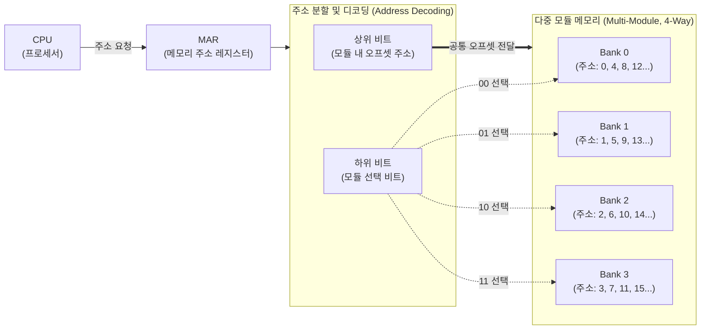

# 메모리 인터리빙 (Memory Interleaving)

---

## I. 폰 노이만 병목 극복 및 메모리 대역폭 확장을 위한, 메모리 인터리빙의 개요

### 가. 메모리 인터리빙의 정의

* 주기억장치를 독립적으로 구동 가능한 여러 개의 메모리 모듈(Bank)로 나누고, 연속적인 주소 접근 시 각 모듈에 동시(병렬) 접근하게 하여 **메모리 접근 지연시간을 은닉하고 전체 대역폭을 향상**시키는 기술

### 나. 메모리 인터리빙의 필요성 및 특징

* **등장배경**: [[CPU]] 연산 속도와 주기억장치 접근 속도 간의 격차(Bottleneck) 극복 및 메모리 대기 시간(Latency) 최소화 필요
* **주요특징**:
* **파이프라이닝 효과**: 여러 모듈의 액세스 사이클을 중첩(Overlap)하여 연속된 데이터 읽기/쓰기 [[처리량]] 극대화
* **공간적 [[지역성]](Spatial Locality) 활용**: 순차적인 메모리 주소(명령어, 배열 등) 페치 시 병렬 접근을 통한 고속화 달성

---

## II. 메모리 인터리빙의 개념도 및 핵심 기술 요소

### 가. 메모리 인터리빙의 개념도 (하위 오더 인터리빙 기준)

* **핵심 동작 흐름**: CPU가 연속된 주소(0, 1, 2, 3)를 요청할 때, 주소의 하위 비트가 각기 다른 모듈(Bank 0~3)을 순차적으로 선택하므로, 메모리 접근 사이클이 겹쳐져 대기시간 없이 데이터 반환

### 나. 메모리 인터리빙의 핵심 구성 및 기술 요소

| 구분 | 요소기술(키워드) | 세부 설명 |
| --- | --- | --- |
| **구조적 요소** | **다중 모듈 (Multi-Module)** | 독립적인 주소 디코더와 데이터 버퍼(MAR/MBR)를 가져 독자적인 읽기/쓰기 동작이 가능한 메모리 뱅크 단위 |
| **구조적 요소** | **단어 길이 (Word Length)** | 한 번의 메모리 접근(Fetch) 사이클에 읽어올 수 있는 데이터 비트 수 (인터리빙 차수에 비례하여 가상 단어 길이 증가) |
| **할당 정책** | **하위 오더 (Low-order)** | 주소의 **하위 비트**를 모듈 선택에 사용; 연속된 주소가 서로 다른 모듈에 분산되어 병렬 접근(대역폭 향상)에 유리 |
| **할당 정책** | **상위 오더 (High-order)** | 주소의 **상위 비트**를 모듈 선택에 사용; 모듈별로 연속된 주소가 할당되어 메모리 용량 확장 및 결함 격리에 유리 |
| **할당 정책** | **혼합 오더 (Mixed-order)** | 상/하위 오더를 결합하여 모듈을 여러 그룹으로 묶고, 그룹 내에서 하위 오더 인터리빙을 수행하는 하이브리드 방식 |
| **성능 요소** | **메모리 파이프라이닝** | N개의 모듈이 존재할 때 (인터리빙 차수 N), N개의 연속된 메모리 접근을 1 사이클에 중첩하여 실행하는 기법 |
| **성능 요소** | **인터리빙 차수 (Degree)** | 동시에 접근 가능한 메모리 모듈의 개수 (예: 4-way, 8-way); 차수가 높을수록 대역폭(Bandwidth) 비례 증가 |
| **장애 제어** | **결함 허용 (Fault Tolerance)** | 특정 뱅크 장애 시, 상위 오더는 해당 모듈 공간만 비활성화 가능하나, 하위 오더는 전체 메모리 공간 훼손 발생 |

---

## III. 인터리빙 기법 비교 및 최신 메모리 아키텍처 동향

### 가. 하위 오더 인터리빙 vs 상위 오더 인터리빙 비교

| 비교 항목 | 하위 오더 (Low-order) 인터리빙 | 상위 오더 (High-order) 인터리빙 |
| --- | --- | --- |
| **모듈 선택 기준** | 주소의 **하위 비트(LSB)** 영역 | 주소의 **상위 비트(MSB)** 영역 |
| **주소 할당 방식** | 연속된 주소가 **여러 모듈에 분산** 배치 | 연속된 주소가 **동일 모듈 내에 집중** 배치 |
| **연속 데이터 접근** | **동시(병렬) 접근 가능** (속도 극대화) | 동일 모듈 접근 대기 (병렬성 낮음) |
| **주요 장점** | 메모리 접근 속도 및 전체 대역폭 대폭 향상 | 메모리 모듈 추가(확장) 용이, 다중 프로그래밍 유리 |
| **치명적 단점** | 모듈 하나 고장 시 전체 메모리 시스템 마비 | 파이프라이닝 불가로 인한 대역폭 향상 효과 미미 |
| **주요 적용 분야** | 고속 메인 메모리, [[캐시 메모리]] 시스템 | 대용량 스토리지, 서버 메모리 확장 뱅크 |

### 나. 메모리 인터리빙 기반 최신 아키텍처 동향 및 전망

* **DDR5 / [[HBM]]의 뱅크 그룹(Bank Group) 아키텍처 강화**: 초고속 대역폭 달성을 위해 내부 뱅크 개수를 대폭 늘리고(예: 32개 뱅크), 뱅크 그룹 간 인터리빙을 하드웨어 수준에서 자동 최적화하여 지연시간(tFAW, tRRD 등) 완화
* **[[CXL]](Compute Express Link) 기반 메모리 풀링 적용**: 다수의 서버 노드가 공유하는 확장 메모리 풀(Memory Pool) 환경에서, PCIe 트래픽 병목을 해소하기 위해 CXL 컨트롤러 단에서의 동적 다이내믹 인터리빙(Dynamic Interleaving) 기술 필수 적용 추세

---

### 🔗 연관 토픽

- **소속 도메인**: [[00_컴퓨터구조_MOC|💻 컴퓨터구조]]
- **세부 분류**: `1. CPU 프로세서 & 마이크로아키텍처`
- **핵심 연관 토픽**:
  - [[CXL|CXL (Compute Express Link)]]
  - [[캐시 메모리]]
  - [[CPU]]
  - [[사상 기법]]
  - [[중앙처리장치|중앙처리장치 (CPU Central Processing Unit)]]
