# 메타버스 (Metaverse)

---

## I. 현실과 가상의 경계가 융합된 차세대 인터넷 패러다임, 메타버스의 개요

* **정의**: 초고속 네트워크와 실감형 기술(XR)을 기반으로 물리적 현실과 디지털 가상 공간이 융합되어, 정치·경제·사회·문화적 상호작용과 가치 창출이 일어나는 3차원 가상 세계
* **등장배경 및 특징**:
* **배경**: 공간 컴퓨팅(Spatial Computing) 기술 발전, 비대면 일상화에 따른 [[디지털 전환]], [[Web 3.0]] 기반 크리에이터 경제(Creator Economy) 활성화
* **특징**: 연속성(시간/공간 단절 없음), 상호운용성(플랫폼 간 자산/데이터 연동), 동시성(수많은 사용자 동시 참여), 독자적 경제 체계([[NFT (Non Fungible Token)|NFT]], 가상화폐)

---

## II. 메타버스의 개념도 및 핵심 기술 요소

### 가. 메타버스의 개념도 및 동작 원리 (C-P-N-D 생태계 관점)

```mermaid
flowchart LR
    subgraph User_Device["사용자 / 디바이스 (Device)"]
        direction TB
        XR["XR 기기<br/>(HMD, AR Glasses)"]
        HCI["HCI 기술<br/>(공간인식, 햅틱)"]
    end

    subgraph Network["인프라 (Network)"]
        direction TB
        5G["5G/6G 초저지연망"]
        MEC["MEC (모바일 에지 컴퓨팅)"]
    end

    subgraph Platform["플랫폼 및 엔진 (Platform)"]
        direction TB
        ENG["3D 그래픽 엔진<br/>(Unity, Unreal)"]
        AI["생성형 AI<br/>(디지털 휴먼, 3D 에셋)"]
        WEB3["Web 3.0 체계<br/>(NFT, 스마트 컨트랙트)"]
    end

    subgraph Service["융합 서비스 (Contents)"]
        direction TB
        SOC["B2C (소셜/엔터/게임)"]
        IND["B2B (산업용 디지털 트윈)"]
    end

    User_Device == ""오감 상호작용 및 명령"" ==> Network
    Network == ""초연결/초저지연 전송"" ==> Platform
    Platform == ""가상 공간 및 경제 구현"" ==> Service
    Service -. "가치 창출 및 피드백" .-> User_Device


```

* 사용자는 공간 컴퓨팅 기기(XR)를 통해 에지([[Mobile Edge Computing|MEC]])와 5G망으로 연결된 플랫폼에 접속하며, 3D 엔진과 AI로 구현된 가상 공간에서 경제/사회 활동 수행

### 나. 메타버스의 핵심 기술 요소

| 구분 | 요소기술(키워드) | 세부 설명 |
| --- | --- | --- |
| **디바이스** | **공간 컴퓨팅 (Spatial Computing)** | 물리적 공간에 3D 디지털 객체를 자연스럽게 중첩 및 상호작용 지원 (예: Vision Pro) |
| **디바이스** | **XR (eXtended Reality)** | AR, VR, MR 기술을 총망라하여 사용자에게 극대화된 시각적 몰입감을 제공하는 HMD/글래스 |
| **네트워크** | **MEC (모바일 에지 컴퓨팅)** | 코어망 부하를 줄이고 단말과 가까운 기지국에서 실시간 렌더링 연산을 수행하여 지연시간 최소화 |
| **플랫폼** | **3D 그래픽 엔진** | 물리 법칙이 적용된 실사 수준의 실시간 렌더링 및 가상 공간 저작 도구 (Unreal, Unity) |
| **데이터/AI** | **생성형 AI (Generative AI)** | 텍스트/이미지 프롬프트 기반 3D 에셋 자동 생성 및 자율적으로 행동하는 NPC(디지털 휴먼) 구현 |
| **데이터/AI** | **[[디지털 트윈|디지털 트윈 (Digital Twin)]]** | 현실 세계의 시스템, 객체, 프로세스를 가상 공간에 1:1로 동기화하여 시뮬레이션 및 예측 수행 |
| **경제체계** | **Web 3.0 / 스마트 컨트랙트** | 분산 원장 기반으로 크리에이터가 제작한 가상 자산의 소유권(NFT) 증명 및 탈중앙화 경제 구축 |
| **콘텐츠** | **아바타 (Avatar)** | 사용자의 모션(페이셜, 바디 트래킹)을 실시간으로 맵핑하여 가상 세계에 자아를 투영하는 디지털 분신 |

---

## III. 메타버스의 4대 유형 및 최신 산업 진화 동향

### 가. 메타버스의 4대 유형 (ASF 프레임워크 기준)

| 비교 항목 | 증강현실 (Augmented Reality) | 라이프로깅 (Lifelogging) | 거울세계 (Mirror Worlds) | 가상세계 (Virtual Worlds) |
| --- | --- | --- | --- | --- |
| **공간의 성격** | **현실 중심** | **현실 중심** | **가상 중심** | **가상 중심** |
| **정보의 성격** | 외부 환경 정보 | 내부 개인 정보 | 외부 환경 정보 | 내부 개인 정보 |
| **핵심 특징** | 현실 공간에 2D/3D 가상 객체 겹쳐 시각화 | 개인의 일상, 경험, 정보를 기록하고 디지털로 공유 | 현실 세계의 정보/구조를 가상 공간에 사실적 복제 | 현실과 다른 대안적 삶을 영위하는 새로운 가상 세계 |
| **대표 사례** | 포켓몬 고(Go), 차량 HUD | 소셜 미디어(SNS), 스마트워치(피트니스) | 구글 어스, 배달앱(맵 기반), 디지털 트윈 | 로블록스, 제페토, 마인크래프트 |

### 나. 향후 전망 및 산업 진화 동향

* **산업용 메타버스(Industrial Metaverse)로의 중심축 이동**: B2C(게임/소셜) 중심의 초기 하이프(Hype)에서 벗어나, 제조/의료/물류 분야의 **스마트 팩토리 시뮬레이션 및 원격 협업 기반의 B2B 디지털 트윈**으로 비즈니스 가치 창출 집중
* **생성형 AI 기반 제작 생산성 혁신**: 방대한 가상 세계 구축에 소요되는 막대한 수작업 인건비를 Text-to-3D 등 생성형 AI 툴을 통해 절감하고, 사용자 개인화 콘텐츠(UGC) 생태계 가속화 추진

---

### 🔗 연관 토픽

- **소속 도메인**: [[00_디지털서비스_MOC|🚀 디지털서비스]]
- **세부 분류**: `3. 사물인터넷 (IoT) & 스마트 플랫폼 · 메타버스`
- **핵심 연관 토픽**:
  - [[디지털 트윈|디지털 트윈 (Digital Twin)]]
  - [[XR 유형|XR(eXtended Reality) 유형]]
  - [[NFT (Non Fungible Token)]]
  - [[Web 3.0]]
  - [[C-ITS|C-ITS (Cooperative-Intelligent Transport Systems)]]
