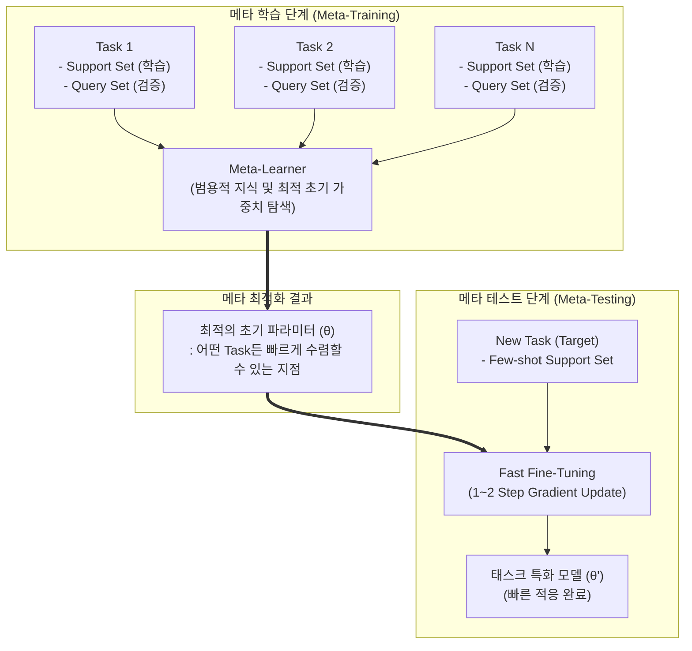

# 메타학습 (Meta-Learning)

---

## I. 소량의 데이터로 새로운 환경에 적응하는, 메타학습의 개요

### 가. 메타학습의 정의

* 기계학습 모델이 다수의 다양한 태스크(Task)를 학습하여, 처음 접하는 새로운 태스크가 주어졌을 때 소량의 데이터(Few-Shot)만으로도 빠르게 학습하고 적응하는 **'학습하는 방법을 배우는(Learning to Learn)'** [[인공지능]] 패러다임

### 나. 메타학습의 등장배경 및 핵심 특징

* **등장배경**: 기존 딥러닝의 대규모 데이터 의존성(Data Hungry) 및 [[과적합 문제]] 극복, 학습되지 않은 새로운 환경(Out-of-Distribution)에 대한 AI의 범용적 적응력 요구 증대
* **핵심특징**:
* **빠른 적응력(Fast Adaptation)**: 최소한의 업데이트(Gradient Step)로 새로운 문제 해결
* **에피소드 기반 학습(Episodic Training)**: 모델이 데이터를 N-way K-shot 형태의 '태스크' 단위로 묶어 학습
* **[[일반화]] 성능(Generalization)**: 특정 도메인에 국한되지 않는 범용적 초기 파라미터 또는 학습 규칙 도출

---

## II. 메타학습의 개념도 및 핵심 기술 요소

### 가. 메타학습의 개념도 및 동작 원리 (MAML 알고리즘 기준)

* **동작 흐름**: 다양한 Task(에피소드)의 Support/Query Set을 통해 범용적인 최적 초기 가중치($\theta$)를 도출하고, 새로운 Task 발생 시 소수의 데이터만으로 빠르게 미세조정([[Fine-Tuning|Fine-tuning]])하여 최적화($\theta'$)함

### 나. 메타학습의 핵심 기술 및 구성 요소

| 구분 | 요소기술(키워드) | 세부 설명 |
| --- | --- | --- |
| **학습 접근법** | **최적화 기반 (Optimization)** | 새로운 태스크에 빠르게 수렴할 수 있는 최적의 **초기 가중치(Initialization)**를 찾는 방식 (예: MAML, Reptile) |
| **학습 접근법** | **계량/거리 기반 (Metric)** | 데이터 간의 **[[유사도]](Distance) 공간**을 학습하여, 새로운 데이터와 기존 클래스의 거리를 비교·분류 (예: Prototypical Net, Siamese Net) |
| **학습 접근법** | **모델 기반 (Model)** | 내부 순환 신경망([[RNN (Recurrent Neural Network)|RNN]])이나 **외부 메모리(Memory)**를 활용하여 가중치를 직접적·빠르게 업데이트 (예: MANN, Meta-Net) |
| **데이터 구성** | **Support Set** | 각 태스크에서 모델이 학습(적응)하기 위해 제공되는 극소량의 훈련용 데이터 셋 |
| **데이터 구성** | **Query Set** | Support Set으로 적응된 모델의 성능을 평가하고 메타-파라미터를 업데이트하기 위한 테스트용 데이터 셋 |
| **학습 전략** | **N-way K-shot** | N개의 범주([[클래스]])에 대해 각각 K개의 데이터(Support)만 주어지는 극소량 데이터 학습 시나리오 (예: 5-way 1-shot) |
| **최신 융합** | **In-Context Learning (ICL)** | [[초거대 언어 모델|LLM]](거대언어모델)에서 파라미터 업데이트 없이 프롬프트 내의 예시(Few-shot)만으로 태스크를 수행하는 메타학습의 발현 형태 |
| **응용 분야** | **Meta-RL ([[강화학습]])** | 보상 함수나 환경의 동역학(Dynamics)이 변하더라도 에이전트가 새로운 환경의 규칙을 빠르게 파악하여 적응하는 기술 |

---

## III. 메타학습과 전이학습(Transfer Learning) 비교 및 향후 전망

### 가. 메타학습 vs 전이학습 비교

| 비교 항목 | 메타학습 (Meta-Learning) | [[전이학습|전이학습 (Transfer Learning)]] |
| --- | --- | --- |
| **핵심 목적** | **학습하는 방법(능력)** 자체를 학습 | 사전 학습된 **지식(특징 추출기)**의 [[재사용]] |
| **학습 데이터 구조** | 다수의 개별 **태스크(Task) 집합** (에피소드) | 단일 또는 소수의 **대규모 소스 도메인** 데이터 |
| **최적화 대상** | 범용적 초기 가중치, 학습률, 유사도 공간 등 | 소스 도메인에 최적화된 사전학습 가중치 (Pre-trained) |
| **타겟 데이터 요구량** | **극소량 (Few-shot, 1~5개 수준)** | 상대적으로 다량 필요 (Fine-tuning 용이 수준) |
| **새로운 Task 적응** | 1~2 스텝의 경사 하강만으로 즉각 수렴 | 다수의 에포크(Epoch)를 거친 가중치 미세조정 필요 |

### 나. 향후 전망 및 최신 기술 동향

* **LLM과 메타학습의 결합**: GPT-4 등 초대형 모델이 사전 학습 과정에서 암묵적으로 메타학습을 수행함에 따라, 별도의 모델 튜닝 없이 [[프롬프트 엔지니어링]](Few-shot Prompting)만으로 Zero-shot/Few-shot 성능을 극대화하는 방향으로 진화 중
* **[[AutoML (Automated Machine Learning)|AutoML]]로의 확장**: 하이퍼파라미터 최적화(HPO), 신경망 구조 탐색([[NAS]]) 등 기계학습 파이프라인 전체를 자동화하는 AutoML의 핵심 엔진으로 메타학습이 채택되어 MLaaS(ML as a Service)의 효율성을 혁신적으로 견인할 것으로 전망됨

---

### 🔗 연관 토픽

- **소속 도메인**: [[00_인공지능_MOC|🤖 인공지능]]
- **세부 분류**: `4. 거대언어모델 (LLM) & 생성형 AI`
- **핵심 연관 토픽**:
  - [[전이학습|전이학습 (Transfer Learning)]]
  - [[Fine-Tuning]]
  - [[프롬프트 엔지니어링|프롬프트 엔지니어링(Prompt Engineering)]]
  - [[인공지능]]
  - [[강화학습]]
