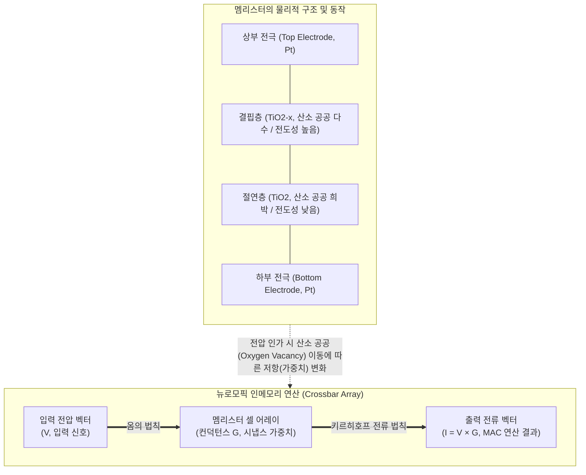

# 멤리스터 (Memristor)

---

## I. 차세대 비휘발성 소자, 멤리스터의 개요

* **정의**: 메모리(Memory)와 저항(Resistor)의 합성어로, 이전 상태의 전류 흐름(전하량)을 기억하여 전원이 차단되어도 저항값을 유지하는 제4의 수동 전자 회로 소자
* **등장배경 및 특징**:
* **등장배경**: 폰 노이만 병목현상 한계 극복, [[인공지능]](AI) 연산량 급증에 따른 초저전력·고집적 소자 요구 증대
* **핵심특징**: 비휘발성(Non-volatile), 아날로그 저항 변화를 통한 뇌의 시냅스(Synapse) 가중치 모사, 초고속 스위칭 및 고집적 크로스바 어레이(Crossbar Array) 구현 가능

---

## II. 멤리스터의 개념도 및 핵심 기술 요소

### 가. 멤리스터의 구조 개념도 및 동작 원리

* 전압의 방향과 크기에 따라 내부 산소 공공이 이동하여 저항 상태가 변하며(LRS/HRS), 이를 활용해 옴의 법칙(V=IR)과 키르히호프 법칙 기반의 하드웨어 단일 스텝 병렬 [[MAC]] 연산 수행

### 나. 멤리스터의 핵심 기술 및 구성 요소

| 구분 | 요소기술(키워드) | 세부 설명 |
| --- | --- | --- |
| **기본 소재** | **전이금속 산화물 (TiO2)** | 이산화티타늄 등 절연체 박막을 두 전극 사이에 배치하여 저항 변화 매질로 활용 |
| **저항 상태** | **LRS / HRS** | 산소 공공 연결 시 저저항 상태(LRS, On/1), 단절 시 고저항 상태(HRS, Off/0) 유지 |
| **연산 아키텍처** | **크로스바 어레이 (Crossbar Array)** | 가로/세로 전극 교차점에 멤리스터를 배치하여 병렬 행렬-벡터 곱셈(MVM)을 물리적으로 처리 |
| **물리적 연산** | **아날로그 MAC 연산** | 전압(V)과 컨덕턴스(G)의 곱을 전류(I)로 도출하고, 이를 합산하여 곱셈-누산(MAC) 1 클럭 처리 |
| **인공지능 적용** | **STDP (스파이크 타이밍 의존 가소성)** | 인공신경망(SNN)에서 입력/출력 펄스의 시간차에 따라 멤리스터의 저항(가중치)이 아날로그적으로 변화하는 특성 |
| **[[신뢰성]] 보완** | **선택 소자 (Selector, 1T1R)** | 크로스바 어레이 구조에서 인접 셀로 전류가 새는 누설 전류(Sneak Path) 문제를 차단하기 위한 [[스위치 (Layer 3 Switch)|스위치]] |
| **집적 공정** | **CMOS 호환성** | 기존 실리콘(Si) 기반 반도체 제조 공정인 백엔드(BEOL)에 통합 적층 가능하여 칩 면적 최소화 |
| **응용 메모리** | **ReRAM (저항변화메모리)** | 멤리스터의 히스테리시스(Hysteresis) 특성을 이용한 차세대 고속/고집적 비휘발성 저장 매체 |

---

## III. 멤리스터 기반 메모리(ReRAM)와 주요 메모리 비교 및 향후 전망

### 가. 멤리스터(ReRAM)와 주요 메모리 소자 비교

| 비교 항목 | ReRAM (멤리스터 기반) | SRAM (휘발성) | NAND Flash (비휘발성) |
| --- | --- | --- | --- |
| **데이터 저장 방식** | **산소 공공(저항) 변화** | 플립플롭 (트랜지스터 6개) | 플로팅 게이트 (전하 트랩) |
| **속도 (Latency)** | **매우 빠름 (~10ns)** | 가장 빠름 (~1ns) | 상대적으로 느림 (~100µs) |
| **비휘발성 여부** | **비휘발성 (유지)** | 휘발성 (전원 차단 시 소멸) | 비휘발성 (유지) |
| **집적도 및 전력** | **고집적, 초저전력** | 저집적 (면적 큼), 대기 전력 높음 | 초고집적 (3D 적층) |
| **주요 활용 분야** | **[[뉴로모픽 칩]], [[PIM]] 연산 소자** | [[CPU]] [[캐시 메모리]], 레지스터 | 대용량 스토리지 (SSD) |

### 나. 향후 전망 및 동향

* **아날로그 인메모리 컴퓨팅(AiMC)의 주력 소자 부상**: 디지털 방식의 한계를 넘어, 데이터가 저장된 메모리 셀 안에서 직접 가중치 곱셈 연산을 수행하여 [[초거대 언어 모델|LLM]] 등 초거대 AI 추론 시 전력 소모를 극적으로(수백 분의 일) 절감
* **해결 과제 및 상용화 방향**: 신소재 층의 내구성 완화, 저항 값의 산포(Variability) 안정화, Sneak Path 현상 완화를 위한 3D 크로스포인트(3D XPoint) 패키징 및 하이브리드(CMOS+Memristor) 집적 기술 고도화 진행 중

---

### 🔗 연관 토픽

- **소속 도메인**: [[00_컴퓨터구조_MOC|💻 컴퓨터구조]]
- **세부 분류**: `2. 캐시 & 메모리 계층 구조 · 스토리지`
- **핵심 연관 토픽**:
  - [[뉴로모픽 칩|뉴로모픽 칩 (Neuromorphic Chip)]]
  - [[PIM|PIM(Processing-In-Memory)]]
  - [[인공지능]]
  - [[지능형 반도체]]
  - [[스위치 (Layer 3 Switch)]]
