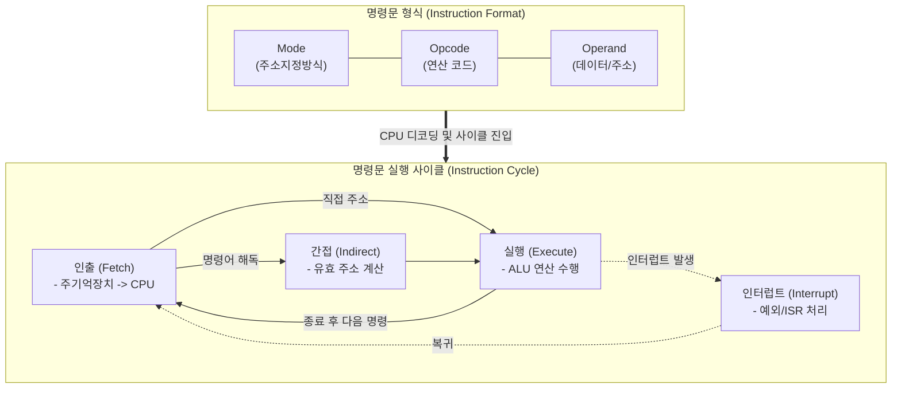

# 명령문 (Instruction)

---

## I. 컴퓨터 시스템 제어의 최소 실행 단위, 명령문(Instruction)의 개요

* **정의**: 컴퓨터의 [[중앙처리장치]]([[CPU]])가 특정 연산이나 상태 제어 작업을 수행하도록 지시하는 기계어 코드의 집합 (일반적으로 '명령어'로 혼용됨)
* **명령문 사이클(Instruction Cycle)**: CPU가 주기억장치로부터 명령문을 인출(Fetch)하고 해독(Decode)하여 실행(Execute)하는 일련의 반복 과정
* **특징**: 연산 코드(Opcode)와 피연산자(Operand)의 조합, 고정/가변 길이의 정형성, 주소지정방식(Addressing Mode)을 통한 메모리 접근 효율화

---

## II. 명령문(Instruction)의 아키텍처 및 핵심 구성 요소

### 가. 명령문의 형식(Format) 및 실행 사이클 개념도

* **핵심 동작 흐름**: 프로그램 카운터(PC)가 가리키는 주소에서 명령문을 인출(Fetch)하여 명령 레지스터(IR)에 저장하고, 디코더가 Opcode를 해독한 후 지정된 피연산자를 바탕으로 ALU에서 실행(Execute)함

### 나. 명령문(Instruction)의 핵심 구성 요소

| 구분 | 요소기술(키워드) | 세부 설명 |
| --- | --- | --- |
| **형식 (Format)** | **Opcode (연산 코드)** | 더하기(ADD), 적재(LOAD), 분기(JUMP) 등 CPU가 수행할 실제 연산의 종류를 지시하는 비트 열 |
| **형식 (Format)** | **Operand (피연산자)** | 연산의 대상이 되는 실제 데이터(Immediate) 또는 데이터가 저장된 레지스터/메모리의 주소 |
| **접근 방식** | **Addressing Mode (주소지정방식)** | Operand에 저장된 값을 해석하여 실제 데이터가 있는 유효 주소(Effective Address)를 결정하는 방식 (즉시, 직접, 간접, 레지스터 등) |
| **주요 레지스터** | **PC (Program Counter)** | 다음에 인출하여 실행할 명령문의 메모리 주소를 보관하는 레지스터 |
| **주요 레지스터** | **IR (Instruction Register)** | 메모리로부터 인출된 현재 실행 중인 명령문의 코드를 일시적으로 저장하는 레지스터 |
| **사이클 (Cycle)** | **Fetch Cycle (인출 주기)** | 메모리에 적재된 명령문을 CPU 내부로 가져오는 단계 (PC ➔ MAR ➔ MBR ➔ IR) |
| **사이클 (Cycle)** | **Execute Cycle (실행 주기)** | 디코딩된 명령문을 바탕으로 연산을 수행하고 결과를 레지스터나 메모리에 저장하는 단계 |
| **제어 단위** | **Micro-operation (마이크로 연산)** | 하나의 명령문을 실행하기 위해 제어 장치(Control Unit)가 발생시키는 가장 작은 단위의 단위 동작 |

---

## III. 명령문 세트 아키텍처(ISA) 비교 및 최신 동향

### 가. CISC vs RISC 명령문 아키텍처 비교

| 비교 항목 | CISC (Complex Instruction Set Computer) | RISC (Reduced Instruction Set Computer) |
| --- | --- | --- |
| **설계 철학** | 복잡하고 다양한 명령문을 통한 소프트웨어 단순화 | 단순하고 적은 명령문을 통한 하드웨어/실행 단순화 |
| **명령문 길이** | **가변 길이** (명령어마다 길이가 다름) | **고정 길이** (대부분 동일한 길이 적용) |
| **주소지정방식** | 매우 다양하고 복잡함 | 단순함 (Load/Store 구조 중심) |
| **파이프라이닝** | 명령문 길이가 달라 파이프라인 구현이 어려움 | 고정 길이 명령문으로 파이프라이닝 극대화 용이 |
| **주요 적용 사례** | Intel x86, AMD 데스크톱/서버 프로세서 | ARM 아키텍처, MIPS, RISC-V (모바일, 임베디드) |

### 나. 명령문 아키텍처의 최신 발전 동향

* **RISC-V 기반 오픈소스 ISA 확산**: 라이선스 비용이 없는 RISC-V(리스크 파이브) 개방형 명령어 세트가 부상하며, IoT 단말부터 클라우드 데이터센터용 맞춤형 프로세서까지 벤더 종속성 없는 반도체 설계 생태계 확장 중
* **AI/[[초거대 언어 모델|LLM]] 연산 특화 명령문 확장(Extension)**: x86의 AMX(Advanced Matrix Extensions)나 ARM의 SVE(Scalable Vector Extension) 등 텐서/행렬 곱셈([[MAC]]) 병렬 연산에 특화된 전용 명령문(Instruction)이 CPU 코어 레벨에 직접 추가되어 AI 추론 성능을 극대화하는 추세

---

### 🔗 연관 토픽

- **소속 도메인**: [[00_컴퓨터구조_MOC|💻 컴퓨터구조]]
- **세부 분류**: `1. CPU 프로세서 & 마이크로아키텍처`
- **핵심 연관 토픽**:
  - [[중앙처리장치|중앙처리장치 (CPU Central Processing Unit)]]
  - [[CPU]]
  - [[뉴로모픽 칩|뉴로모픽 칩 (Neuromorphic Chip)]]
  - [[TPU (Tensor Processing Unit)]]
  - [[지능형 반도체]]
