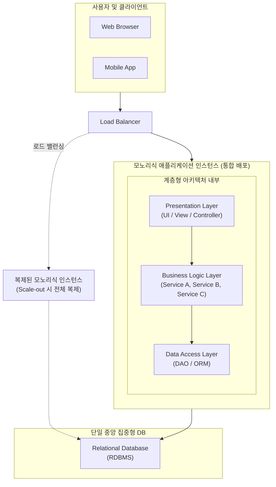

# 모노리식 아키텍처 (Monolithic Architecture)

---

## I. 모든 서비스가 하나로 통합된 구조, 모노리식 아키텍처의 개요

### 가. 모노리식 아키텍처의 정의

* 소프트웨어 애플리케이션의 모든 구성 요소(UI, 비즈니스 로직, 데이터 접근 계층 등)가 하나의 코드 베이스로 통합되어 단일 프로세스로 구동 및 배포되는 전통적인 아키텍처 설계 방식

### 나. 모노리식 아키텍처의 등장배경 및 특징

* **배경**: 초기 애플리케이션 개발 시 빠른 프로토타이핑과 단순한 배포 파이프라인 구성을 위해 채택
* **특징**:
* **단순성**: 단일 패키지(WAR, JAR 등) 빌드/배포 및 로컬 [[트랜잭션]](ACID) 관리를 통한 개발·테스트 용이성
* **[[결합도]] 심화**: 시스템 비대화 시 스파게티 코드화(Big Ball of Mud)로 인한 [[유지보수]] 한계 및 빌드 시간 증가
* **비효율적 확장**: 특정 기능에 부하가 집중되어도 애플리케이션 전체를 복제(Scale-out)해야 하는 자원 낭비 발생

---

## II. 모노리식 아키텍처의 개념도 및 핵심 구성 요소

### 가. 모노리식 아키텍처의 개념도 및 동작 원리

* **핵심 동작 흐름**: 클라이언트 요청은 로드밸런서를 거쳐 단일 애플리케이션 인스턴스로 전달되며, 내부의 강하게 결합된 계층(UI $\rightarrow$ 비즈니스 $\rightarrow$ 데이터)을 거쳐 단일 DB에서 로컬 트랜잭션으로 처리됨

### 나. 모노리식 아키텍처의 핵심 기술 및 속성 요소

| 구분 | 요소기술(키워드) | 세부 설명 |
| --- | --- | --- |
| **구조 패턴** | **계층형 (Layered)** | 프레젠테이션, 비즈니스, 영속성(데이터) 계층으로 수평 분리되어 순차적 호출 발생 |
| **배포 단위** | **단일 패키징** | 모든 코드가 컴파일되어 하나의 아카이브(EAR, WAR, JAR, EXE) 형태로 패키징 및 배포 |
| **데이터 관리** | **공유 DB (Shared DB)** | 모든 모듈과 서비스가 단일 [[데이터베이스]] 스키마를 공유하여 데이터 정합성 보장 용이 |
| **트랜잭션** | **로컬 트랜잭션 (ACID)** | 분산 트랜잭션(2PC, Saga)이 불필요하며, 단일 RDBMS의 ACID 속성만으로 [[무결성]] 보장 |
| **확장 방식** | **X축 확장 (클로닝)** | 스케일 아웃(Scale-out) 시 특정 모듈이 아닌 애플리케이션 전체 인스턴스를 복제하여 로드밸런싱 |
| **성능 요소** | **인메모리 (In-Memory) 호출** | 서비스 간 통신 시 네트워크 지연(Network Latency) 없이 [[프로세스]] 내 함수 호출로 고속 처리 |
| **결합도** | **강한 결합 (Tight Coupling)** | 모듈 간 의존성이 높아 하나의 모듈 수정이나 장애가 전체 시스템에 영향을 미치는 구조적 취약성 |
| **기술 스택** | **단일 기술 스택 종속** | 프로젝트 시작 시 결정된 언어, [[프레임워크]](예: Java/Spring)에 전체 시스템이 종속됨 |

---

## III. 모노리식 vs 마이크로서비스(MSA) 비교 및 최신 아키텍처 동향

### 가. 모노리식 아키텍처와 마이크로서비스 아키텍처(MSA) 비교

| 비교 항목 | 모노리식 아키텍처 (Monolithic) | 마이크로서비스 아키텍처 ([[MSA (Micro Service Architecture)|MSA]]) |
| --- | --- | --- |
| **구성 및 배포** | 모든 기능이 하나의 패키지로 배포됨 | 독립적인 비즈니스 기능 단위로 분할 배포됨 |
| **시스템 확장성** | 전체 시스템 복제 확장 (비효율적) | 특정 부하 집중 서비스만 개별 확장 가능 (효율적) |
| **장애 영향도** | 부분 장애가 전체 시스템 장애로 확산 가능성 높음 | 서비스 간 격리성(Isolation)으로 국소적 장애로 제한 |
| **트랜잭션/데이터** | 단일 DB 기반 로컬 트랜잭션 (ACID 보장 쉬움) | 서비스별 독립 DB, 분산 트랜잭션 및 결과적 정합성(BASE) |
| **초기 구축 비용** | 낮고 빠름 (개발, 테스트, 배포 파이프라인 단순) | 매우 높음 (API [[게이트웨이]], 서비스 메시 등 인프라 복잡) |

### 나. 최신 아키텍처 동향: 모듈러 모노리스(Modular Monolith)의 부상

* **MSA 회의론 및 한계 체감**: 넷플릭스 등 빅테크 주도로 MSA가 유행하였으나, 분산 시스템이 가져오는 네트워크 지연, 데이터 정합성 유지 비용, 인프라 복잡도로 인해 오버헤드를 겪는 기업 증가
* **모듈러 모노리스로의 회귀 및 진화**: 시스템 내부는 철저히 경계가 지워진 모듈(Domain-Driven Design 활용)로 분리하여 결합도를 낮추되, 실행과 배포는 물리적으로 통합된 단일 프로세스(Monolith)로 수행하는 방식 부상 (최근 Amazon Prime Video의 서버리스/MSA 구조에서 모노리스 구조로 전환하여 인프라 비용 90% 절감 사례가 대표적)

---

### 🔗 연관 토픽

- **소속 도메인**: [[00_디지털서비스_MOC|🚀 디지털서비스]]
- **세부 분류**: `4. 데이터 플랫폼 & 개방형 API 생태계`
- **핵심 연관 토픽**:
  - [[무결성]]
  - [[프레임워크]]
  - [[MSA (Micro Service Architecture)]]
  - [[트랜잭션]]
  - [[데이터베이스]]
