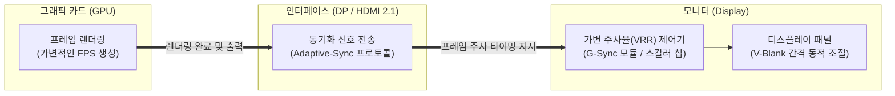

# 모니터 동기화 (Monitor Synchronization)

---

## I. 화면 왜곡 방지를 위한 디스플레이 제어, 모니터 동기화의 개요

### 가. 모니터 동기화의 정의

* 그래픽 카드([[GPU]])의 프레임 생성 속도(FPS)와 모니터의 화면 재생 빈도(주사율, Hz)를 일치시켜, 화면 찢어짐(Tearing)이나 끊김(Stuttering) 현상을 방지하는 디스플레이 제어 기술

### 나. 모니터 동기화의 등장배경 및 특징

* **등장배경**: 고성능 GPU 등장으로 모니터 주사율을 초과하는 프레임이 생성되거나 반대로 프레임이 급감할 때 발생하는 시각적 아티팩트(Artifact) 해결 필요
* **핵심특징**:
* **가변 주사율(VRR)**: 고정된 모니터 주사율을 GPU의 렌더링 속도에 맞춰 실시간으로 동적 변경
* **입력 지연(Input Lag) 최소화**: 전통적인 수직 동기화(V-Sync)의 단점인 응답 지연을 하드웨어 및 소프트웨어적으로 극복

---

## II. 모니터 동기화의 개념도 및 핵심 기술 요소

### 가. 동적 모니터 동기화(VRR)의 개념도 및 동작 원리

* **핵심 동작 흐름**: GPU가 하나의 프레임 렌더링을 완료할 때마다 모니터에 신호를 보내면, 모니터의 VRR 제어기가 수직 여백(V-Blank) 시간을 조절하여 즉시 패널에 프레임을 주사함

### 나. 모니터 동기화의 핵심 기술 및 구성 요소

| 구분 | 요소기술(키워드) | 세부 설명 |
| --- | --- | --- |
| **해결 대상(현상)** | **Tearing (화면 찢어짐)** | GPU의 프레임 전송 속도가 모니터 주사율과 어긋나, 한 화면에 2개 이상의 프레임이 겹쳐 보이는 현상 |
| **해결 대상(현상)** | **Stuttering (화면 끊김)** | GPU 프레임 생성 속도가 모니터 주사율보다 낮을 때, 동일 프레임이 반복 출력되며 미세하게 끊기는 현상 |
| **기본 기술** | **V-Sync (수직 동기화)** | GPU의 성능을 강제로 모니터 주사율(예: 60Hz)에 고정하는 기술 (입력 지연 및 스터터링 유발 단점) |
| **가변 주사율** | **VRR (Variable Refresh Rate)** | HDMI 2.1 규격에 포함된 범용 동기화 기술로, 콘솔 게임기(PS5, Xbox) 및 최신 TV에 널리 적용됨 |
| **표준 규격** | **VESA Adaptive-Sync** | VESA(비디오 전자공학 표준위원회)에서 제정한 DisplayPort(DP) 기반의 로열티 없는 범용 동적 동기화 표준 |
| **보완 기술** | **LFC (Low Framerate Compensation)** | GPU의 프레임이 모니터의 최소 주사율(예: 48Hz) 밑으로 떨어질 때, 프레임을 복제하여 끊김을 방지하는 기술 |
| **최적화 기법** | **Fast Sync / Enhanced Sync** | V-Sync를 끈 것처럼 GPU는 최대 성능으로 렌더링하되, 모니터 주사율에 맞춰 가장 최신 프레임만 출력하는 기술 |
| **응답 최적화** | **NVIDIA Reflex** | 동기화 기술과 결합하여 [[CPU]]와 GPU 간의 렌더링 큐([[Queue]])를 비워 시스템 입력 지연(Input Lag)을 최소화 |

---

## III. 적응형 동기화 주요 기술 비교 및 최신 동향

### 가. 3대 적응형 모니터 동기화 기술 비교

| 비교 항목 | NVIDIA G-Sync (Ultimate/Native) | AMD FreeSync (Premium) | VESA Adaptive-Sync / HDMI VRR |
| --- | --- | --- | --- |
| **개발/주도** | NVIDIA | AMD | VESA / HDMI Forum |
| **구현 방식** | **전용 하드웨어 모듈 탑재** | 범용 스칼러 칩 (소프트웨어 제어) | 범용 스칼러 칩 (소프트웨어 제어) |
| **라이선스/비용** | 유료 라이선스 (모니터 단가 상승) | 무료 (오픈 스탠다드 기반) | 무료 (표준 규격 포함) |
| **동작 범위** | 1Hz ~ 최대 주사율 (매우 넓음) | 특정 구간 (예: 48Hz ~ 144Hz) | 디스플레이 스펙에 따라 상이함 |
| **품질 인증** | 엔비디아의 엄격한 화질/지연 테스트 | AMD의 등급별(Tier) 자체 인증 | VESA 인증 로고 (AdaptiveSync Display) |

### 나. 향후 전망 및 산업 진화 동향

* **통합 및 호환성 확대 (G-Sync Compatible)**: 전용 하드웨어 모듈이 필수였던 G-Sync가 VESA 표준 기반의 FreeSync 모니터에서도 소프트웨어적으로 호환되도록 허용(G-Sync Compatible)하면서 기술 간 경계가 허물어지는 추세임
* **게이밍을 넘어선 가전 기기로의 확장**: PC 모니터를 넘어 OLED/Mini-LED 기반의 스마트 TV와 최신 콘솔 기기(PlayStation, Xbox)에 HDMI 2.1 기반 VRR 기능이 기본 탑재되며, 고해상도 엔터테인먼트의 필수 기술로 자리매김함

---

### 🔗 연관 토픽

- **소속 도메인**: [[00_운영체제_MOC|⚙️ 운영체제]]
- **세부 분류**: `1. 프로세스 & 스레드 관리`
- **핵심 연관 토픽**:
  - [[처리량]]
  - [[스케줄러|스케줄러 (Scheduler)]]
  - [[스레싱|스레싱 (Thrashing)]]
  - [[CPU]]
  - [[GPU]]
