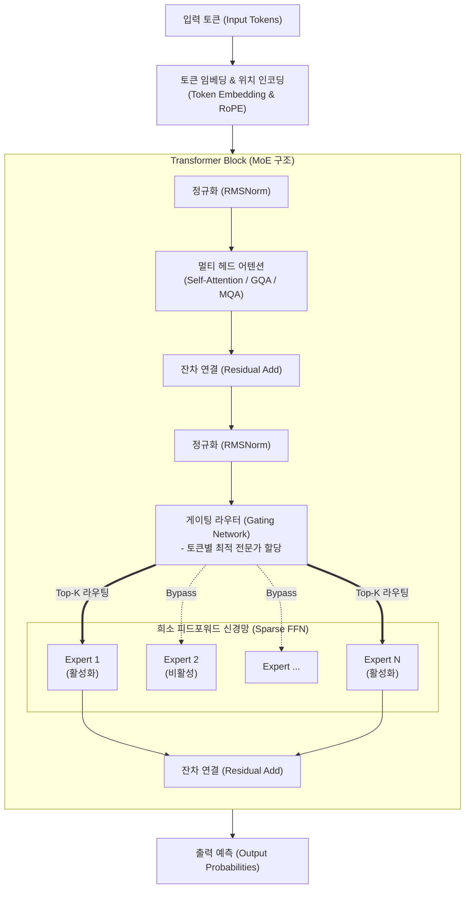

# 모델 구조 (AI Model Architecture)

---

## I. 최적의 추론을 위한 인공신경망의 뼈대, AI 모델 구조의 개요

* **정의**: 입력 데이터를 분석 및 특징을 추출하고, 학습된 가중치(Weight) 연산을 통해 최적의 결과(추론)를 도출하기 위한 인공신경망 계층(Layer)의 수학적·논리적 배치 구조
* **등장배경**: 기존 [[RNN (Recurrent Neural Network)|RNN]]/[[CNN]] 기반의 순차적 데이터 처리 한계(기울기 소실, 장기 의존성 문제), 초거대 파라미터 확장에 따른 연산 비용 및 메모리 병목 심화
* **특징**: [[트랜스포머|트랜스포머(Transformer)]] 기반 병렬 처리, 어텐션(Attention) 메커니즘을 통한 문맥 이해, 파라미터 활성화 효율을 극대화하는 희소(Sparse) 구조 도입

---

## II. 최신 LLM 모델 구조의 개념도 및 핵심 기술 요소

### 가. 트랜스포머 기반 MoE(다중 전문가) 모델의 개념도 및 동작 원리

* **핵심 동작 흐름**: 입력 토큰이 위치 정보(RoPE)와 결합된 후, 어텐션(GQA)을 통해 문맥 연관성을 파악하고, 라우터가 토큰별로 최적의 하위 신경망(Expert)만 선택적으로 활성화하여 연산량을 최소화함

### 나. 최신 AI 모델 구조의 핵심 기술 및 구성 요소

| 분류 | 요소기술(키워드) | 세부 설명 |
| --- | --- | --- |
| **핵심 아키텍처** | **Transformer** | RNN을 대체하여 Self-Attention만으로 시퀀스 데이터를 병렬 처리하는 최신 AI 모델의 사실상 표준 구조 |
| **연산 효율화** | **MoE ([[MOE(Mixture of Experts)|Mixture of Experts]])** | 전체 파라미터 중 입력 데이터에 특화된 일부 전문가(FFN) 네트워크만 활성화하여 추론 속도 및 전력 효율 극대화 |
| **문맥 인지** | **GQA (Grouped Query Attention)** | Key와 Value 헤드를 그룹화하여 메모리(KV Cache) 사용량을 줄이고 추론 속도를 높이는 최적화 기법 |
| **위치 정보** | **RoPE (회전 위치 임베딩)** | 토큰 간의 상대적 거리를 벡터 공간 내 회전 변환으로 인코딩하여 모델의 텍스트 길이 확장성(Context Window) 부여 |
| **학습 안정화** | **RMSNorm** | 기존 LayerNorm에서 평균 이동 연산을 생략하고 분산만으로 정규화하여 학습 속도 및 연산 효율성 향상 |
| **비선형성 부여** | **SwiGLU** | Swish와 GLU를 결합한 활성화 함수로, 모델의 표현력을 높이고 기울기 소실(Gradient Vanishing) 방지 |
| **신규 아키텍처** | **SSM (State Space Model)** | 트랜스포머의 $O(N^2)$ 연산 복잡도를 선형 시간 $O(N)$으로 줄여 무한대에 가까운 문맥 처리가 가능한 차세대 구조 |
| **데이터 결합** | **Multimodal Fusion** | 텍스트, 이미지, 오디오 등 이종 데이터를 단일 임베딩 공간으로 투영(Projection)하여 교차 추론하는 결합 구조 |

---

## III. AI 모델 구조 최적화 방식 비교(Dense vs Sparse) 및 향후 전망

### 가. 최신 거대 모델의 양대 설계 방식 비교 (Dense vs MoE)

| 비교 항목 | Dense Model (밀집 모델) | Sparse Model (희소 모델 / MoE) |
| --- | --- | --- |
| **동작 방식** | 추론 시 모든 파라미터(Weight)가 활성화되어 연산 참여 | 추론 시 라우터가 선택한 일부 파라미터(Expert)만 활성화 |
| **연산량 (FLOPs)** | 파라미터 크기에 정비례하여 기하급수적으로 증가 | 총 파라미터가 커도 실제 연산량은 활성화된 크기에 한정 |
| **메모리 요구량 (VRAM)** | 전체 모델 크기만큼의 메모리 상시 필요 (상대적 적음) | 다수의 Expert를 모두 적재해야 하므로 방대한 VRAM 요구 |
| **주요 적용 모델** | Meta Llama 3, Google Gemma, OpenAI GPT-3 | Mistral Mixtral 8x7B, Google Gemini 1.5, OpenAI GPT-4 |

### 나. 모델 구조의 향후 전망 및 기술적 진화 방향

* **비-트랜스포머(Non-Transformer) 아키텍처의 부상**: 트랜스포머의 메모리 병목 현상(KV Cache)을 근본적으로 해결하기 위해, 상태 공간 모델(SSM) 기반의 **Mamba(맘바)**, **RWKV** 등 선형 복잡도를 가진 RNN 계열 구조 재조명 및 도입 가속화
* **온디바이스(On-Device) AI를 위한 [[sLLM (Smaller Large Language Model)|sLLM]] 구조 최적화**: 스마트폰 등 에지 기기 런타임 탑재를 위해, 파라미터 수를 7B 이하로 줄이면서도 양자화(Quantization)와 가지치기(Pruning)를 모델 구조 설계 단계부터 반영한 경량화 아키텍처 설계 주류화

---

### 🔗 연관 토픽

- **소속 도메인**: [[00_인공지능_MOC|🤖 인공지능]]
- **세부 분류**: `3. 딥러닝 핵심 아키텍처 & 신경망`
- **핵심 연관 토픽**:
  - [[트랜스포머|트랜스포머(Transformer)]]
  - [[RNN (Recurrent Neural Network)]]
  - [[MOE(Mixture of Experts)]]
  - [[초거대 언어 모델|초거대 언어 모델(Large Language Model)]]
  - [[인공지능]]
