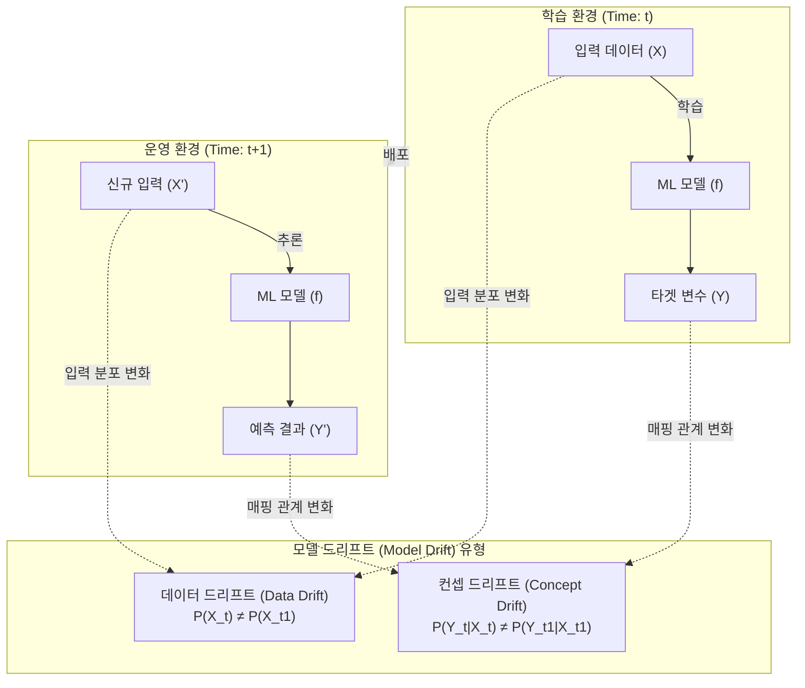

# 모델 드리프트 (데이터 드리프트 & 컨셉 드리프트)

---

## I. 머신러닝 성능 열화의 주범, 모델 드리프트(Model Drift)의 개요

* **정의**: 학습 시점(Training)과 운영 시점(Production) 환경의 차이로 인해, 시간이 지남에 따라 머신러닝 모델의 예측 성능과 정확도가 점진적 또는 급격하게 저하되는 현상
* **주요 원인**: 입력 데이터 분포의 변화(데이터 드리프트) 및 독립/종속 변수 간의 논리적 관계 변화(컨셉 드리프트)
* **특징**: [[MLOps]] 기반 지속적 모니터링 요구, 성능 임계치 기반 자동 재학습(Continuous Training) 파이프라인 필수

---

## II. 모델 드리프트의 발생 메커니즘 및 핵심 탐지/대응 기술

### 가. 데이터 드리프트와 컨셉 드리프트의 발생 개념도

* 학습 데이터와 실 운영 데이터 간의 통계적 특성 차이($P(X)$) 또는 정답 추론 로직의 근본적 변화($P(Y\vert{}X)$)로 인해 모델 [[무결성]] 훼손 발생

### 나. 모델 드리프트의 핵심 탐지 및 대응 요소 기술

| 구분 | 요소 기술 (키워드) | 세부 설명 |
| --- | --- | --- |
| **분포 탐지** | PSI (Population Stability [[RDBMS 인덱스(index)|Index]]) | 학습 데이터와 운영 데이터 간의 타겟/변수 분포 차이를 수치화하여 드리프트 수준 측정 |
| **통계 검정** | KL Divergence / KS Test | 두 확률 분포 간의 거리(정보량 차이) 측정 및 누적 분포 함수 기반 통계적 유의성 검정 |
| **변화 탐지** | DDM / EDDM | 오차율(Error Rate)의 통계적 제어 상한선을 설정하여 점진적/급격한 컨셉 드리프트 탐지 |
| **윈도우 탐지** | ADWIN (Adaptive Windowing) | 가변적인 데이터 윈도우 크기를 적용하여 스트리밍 데이터 환경에서 분포 변화 실시간 탐지 |
| **대응 전략** | Window-based Retraining | 최근 N주, N개월 등 특정 기간의 최신 슬라이딩 윈도우 데이터만을 사용하여 모델 재학습 |
| **대응 전략** | Online Learning | 데이터 스트림이 유입될 때마다 실시간 또는 미니 배치 단위로 모델의 가중치를 지속 업데이트 |
| **대응 전략** | Feature Drop / Engineering | 드리프트가 심하게 발생한 특정 피처를 제거하거나, 새로운 외부 환경 변수를 추가하여 성능 복원 |
| **운영 인프라** | MLOps CT 파이프라인 | Feature Store 연동 및 성능 저하 알람 발생 시 자동으로 재학습(CT)을 트리거하는 파이프라인 |

---

## III. 데이터 드리프트와 컨셉 드리프트 비교 및 향후 전망

### 가. 데이터 드리프트 vs 컨셉 드리프트 상세 비교

| 비교 항목 | 데이터 드리프트 (Data Drift / Covariate Shift) | 컨셉 드리프트 (Concept Drift / Real Drift) |
| --- | --- | --- |
| **개념/정의** | 입력 데이터(X)의 통계적 분포가 변경되는 현상 | 입력(X)과 정답(Y) 간의 매핑 관계(패턴)가 변경되는 현상 |
| **통계적 표현** | $P_{train}(X) \neq P_{prod}(X)$ | $P_{train}(Y\Vert{}X) \neq P_{prod}(Y\Vert{}X)$ |
| **발생 원인** | 사용자 인구통계 변화, 센서 노이즈, 외부 환경 변화 | 거시 경제 변화, 소비자 트렌드/행동 양식 변화, 규제 변경 |
| **발생 예시** | 여름철 학습 모델에 겨울철 온도 데이터가 지속 유입됨 | 과거 정상이었던 금융 거래 패턴이 현재는 사기(Fraud)로 분류됨 |
| **대응 방안** | 입력 피처 재조정(Scaling/Normalization), [[이상치]] 처리 | 최신 정답 레이블(Y) 재수집 및 전면적인 모델 재학습 |

### 나. 모델 드리프트 대응 최신 동향 및 전략

* **Shadow Mode 배포 전략**: 신규 재학습된 모델을 즉시 전환하지 않고, 기존 모델과 병렬로 추론(Shadow/Canary)하여 실제 환경에서의 드리프트 해소 여부를 사전 검증
* **[[초거대 언어 모델|LLM]] 환경의 Semantic Drift 대응**: 생성형 AI 및 LLM 도입에 따라 단순 수치 분포가 아닌 '프롬프트의 의미론적 변화(Semantic Drift)'를 탐지하기 위한 언어 모델 전용 모니터링(예: Arize, Evidently AI) 및 RAG(검색 증강 생성) 최적화 도입 확산 중임

---

### 🔗 연관 토픽

- **소속 도메인**: [[00_인공지능_MOC|🤖 인공지능]]
- **세부 분류**: `1. 수학 · 통계학 & 데이터 전처리`
- **핵심 연관 토픽**:
  - [[MLOps]]
  - [[이상치]]
  - [[왜도 & 첨도|왜도(skewness) & 첨도(kurtosis)]]
  - [[초거대 언어 모델|초거대 언어 모델(Large Language Model)]]
  - [[유사도|유사도(Similarity)]]
