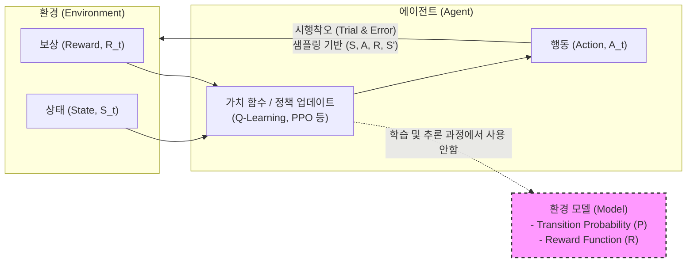

# 모델 프리 (Model-free)

---

## I. 환경에 대한 사전 지식 없이 학습하는, 모델 프리(Model-free) 강화학습의 개요

* **정의**: 마르코프 결정 과정(MDP)의 상태 변환 확률($P$)과 보상 함수($R$)를 모르는 상태에서, 에이전트가 환경과의 직접적인 상호작용을 통해 최적의 정책이나 가치 함수를 추정하는 [[강화학습]] 기법
* **배경**: 복잡한 현실 세계의 정확한 환경 모델(Dynamics)을 수학적으로 모델링하기 불가능한 문제(Curse of Dimensionality) 극복 필요
* **특징**: 시행착오(Trial and Error) 기반 학습, 모델 [[편향]](Model Bias) 부재로 인한 높은 점근적 성능(Asymptotic Performance), 낮은 샘플 효율성(Sample Inefficiency)

---

## II. 모델 프리 강화학습의 개념도 및 핵심 기술 요소

### 가. 모델 프리 기반 강화학습의 동작 원리 개념도

* 환경 모델(상태 변이 확률, 예측 보상)을 구축하거나 활용하지 않음
* 에이전트는 오직 상호작용을 통해 획득한 경험 데이터 튜플 $(S_t, A_t, R_{t+1}, S_{t+1})$에 전적으로 의존하여 가치(Value)나 정책(Policy)을 직접 최적화함

### 나. 모델 프리 강화학습의 핵심 요소 기술

| 분류 | 요소기술(키워드) | 세부 설명 |
| --- | --- | --- |
| **가치 평가 방식** | 몬테카를로 (MC) | 에피소드가 종료될 때까지 대기한 후, 실제 획득한 누적 보상(Return)을 기반으로 가치 업데이트 |
| **가치 평가 방식** | 시간차 학습 (TD) | 에피소드 종료 전, 다음 타임스텝의 예측된 가치 추정치(Bootstrapping)를 활용해 점진적 업데이트 |
| **가치 기반 (Value)** | Q-Learning | 행동-가치 함수(Q)를 직접 근사하는 Off-policy 기반의 대표적 TD 제어 [[알고리즘]] |
| **가치 기반 (Value)** | SARSA | 현재 따르고 있는 정책을 유지하며 Q함수를 업데이트하는 On-policy 기반 TD 알고리즘 |
| **정책 기반 (Policy)** | REINFORCE | 가치 함수를 거치지 않고, 목적 함수의 그래디언트를 계산하여 정책 확률 분포를 직접 최적화 |
| **심층 강화학습** | DQN (Deep Q-Network) | Q-Learning에 심층 신경망(DNN)과 경험 재생(Experience Replay), 타겟 네트워크를 결합 |
| **심층 강화학습** | PPO (Proximal Policy [[OPT|Opt]].) | 신뢰 영역(Trust Region) 내에서 클리핑(Clipping)을 통해 정책을 점진적/안정적으로 업데이트 |
| **심층 강화학습** | SAC (Soft Actor-Critic) | 최대 엔트로피 [[프레임워크]] 기반으로, 에이전트의 탐험(Exploration)을 극대화하는 Off-policy 알고리즘 |

---

## III. 모델 프리와 모델 기반 강화학습 비교 및 발전 동향

### 가. Model-free vs Model-based 강화학습 비교

| 비교 항목 | Model-free (모델 프리) | Model-based (모델 기반) |
| --- | --- | --- |
| **학습 메커니즘** | 경험(상호작용) $\rightarrow$ 가치/정책 업데이트 | 경험 $\rightarrow$ 모델 학습 $\rightarrow$ 계획(Planning) $\rightarrow$ 가치/정책 |
| **환경 모델 (Dynamics)** | 불필요 ($P, R$ 모름) | 필수 ($P, R$을 추정하거나 주어짐) |
| **샘플 효율성** | **낮음** (수많은 실제 상호작용 에피소드 필요) | **높음** (학습된 모델 내부에서 가상 시뮬레이션 가능) |
| **연산 복잡도** | 상대적으로 낮음 (경험 수집에 의존) | 높음 (환경 모델 갱신 및 탐색 트리 연산 등) |
| **오류 편향 (Bias)** | 편향 없음 (실제 환경 데이터만 사용) | **모델 편향(Model Bias)** 발생 (모델의 오차가 누적됨) |
| **대표 알고리즘** | Q-Learning, SARSA, DQN, PPO, A3C | Dyna-Q, MCTS 기반(AlphaGo), MuZero, Dreamer |

### 나. 모델 프리 강화학습의 한계점 및 최신 트렌드

* **한계점 (Sample Inefficiency)**: 모델 프리 방식은 최적의 정책을 찾기 위해 천문학적 횟수의 시행착오가 필요하므로, 로봇 제어나 [[Smart Car(자율주행)|자율주행]] 등 데이터 수집 비용이 크고 위험이 따르는 실제 물리(Physical) 환경 적용에 한계가 존재함
* **최신 트렌드**:
1. **오프라인 강화학습 (Offline RL)**: 실시간 상호작용 없이 기 확보된 대규모 정적 데이터셋만으로 모델 프리 기반 정책을 최적화 (예: CQL 알고리즘)
2. **하이브리드(Hybrid) 접근**: Model-based의 샘플 효율성과 Model-free의 높은 최종 성능을 결합하여, 상상(Imagination)을 통해 학습하는 DreamerV3, MuZero 형태의 아키텍처로 진화 중임

---

### 🔗 연관 토픽

- **소속 도메인**: [[00_인공지능_MOC|🤖 인공지능]]
- **세부 분류**: `1. 수학 · 통계학 & 데이터 전처리`
- **핵심 연관 토픽**:
  - [[강화학습]]
  - [[Q러닝]]
  - [[Smart Car(자율주행)]]
  - [[편향]]
  - [[심화강화학습]]
