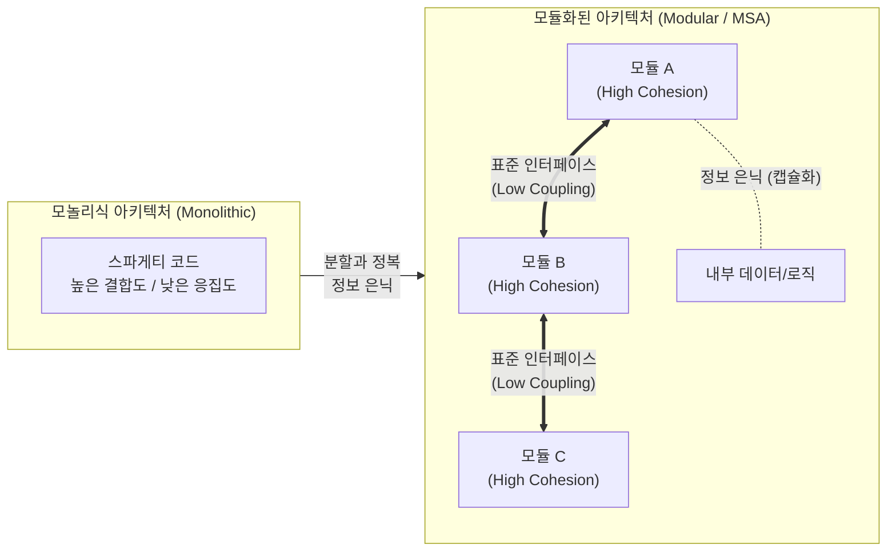

# 모듈화 (Modularity)

---

## I. 소프트웨어 복잡도 해결의 핵심, 모듈화의 개요

- **정의**: 복잡한 시스템을 이해하기 쉽고 유지보수가 용이하도록 독립적이고 교체 가능한 단위(모듈)로 분할하여 설계 및 구현하는 소프트웨어 공학 기법
- **등장배경**: 대규모 소프트웨어의 시스템 복잡도 및 결합도 증가, 유지보수 비용 급증, 병렬 개발 및 소프트웨어 재사용성 요구 증대
- **특징**: 분할과 정복(Divide & Conquer)을 통한 복잡도 감소, 높은 응집도(High Cohesion)와 낮은 결합도(Low Coupling), 정보 은닉(Information Hiding)

---

## II. 모듈화의 개념도 및 핵심 설계 원리

### 가. 모듈화의 개념도 및 동작 원리

* 전체 시스템을 기능/도메인 단위로 분해하여 모듈 내부의 연관성(응집도)을 최대화하고, 모듈 간 외부 의존성(결합도)은 최소화함
* 모듈 간 통신은 캡슐화된 묵시적/명시적 표준 인터페이스를 통해서만 수행하여 시스템의 교체 및 재사용성을 보장함

### 나. 모듈화의 핵심 설계 원칙 및 구성 요소

| 구분 | 핵심 기술/요소 | 세부 설명 |
| --- | --- | --- |
| **설계 원칙** | 분할과 정복 (Divide & Conquer) | 복잡하고 거대한 문제를 독립적으로 해결 가능한 작은 문제로 분할 |
| **설계 원칙** | 정보 은닉 (Information Hiding) | 모듈 내부의 데이터 및 구현 상세를 캡슐화하여 외부 접근을 원천 차단 |
| **평가 요소** | 결합도 (Coupling) | 모듈 간 의존성 정도 (자-스-제-외-공-내 순으로 낮을수록 품질 우수) |
| **평가 요소** | 응집도 (Cohesion) | 모듈 내부 요소들의 연관성 (우-논-시-절-통-순-기 순으로 높을수록 품질 우수) |
| **구현 기술** | 인터페이스 (Interface) | 모듈 간 상호작용을 위해 약속된 명시적이고 표준화된 통신 접점 |
| **구현 단위** | 컴포넌트 (Component) | 명확한 인터페이스를 가지며 독립적으로 배포 및 조립 가능한 바이너리 모듈 |
| **최신 적용** | MSA (Microservices Architecture) | 비즈니스 도메인 중심의 독립 배포 가능한 마이크로서비스 단위의 모듈화 |
| **최신 적용** | PBC (Packaged Business Capability) | 조립 가능한(Composable) 비즈니스 역량 단위로 캡슐화된 모듈 패키징 |

---

## III. 모듈화 패러다임의 발전 과정 및 향후 전망

### 가. 모듈화 패러다임 발전 과정 비교

| 비교 항목 | [[객체지향]] (OOP) | CBD 방법론 | 마이크로서비스 (MSA) | Composable Architecture |
| --- | --- | --- | --- | --- |
| **모듈 단위** | [[클래스]](Class), 객체 | 컴포넌트 (Component) | 마이크로서비스 (Service) | PBC (Packaged Business Capability) |
| **분할 기준** | 실세계 사물, 역할 | [[재사용]] 가능한 기능 세트 | 도메인 주도 설계 ([[DDD (Domain Driven Design)|DDD]]) | 독립적 비즈니스 역량 |
| **결합 방식** | 메시지 패싱 | 인터페이스 (API, Socket) | REST API, gRPC | [[API Gateway]], Event Mesh |
| **핵심 가치** | 코드 재사용, [[다형성]] | 조립을 통한 생산성 향상 | [[클라우드 네이티브]], 독립 배포 | 비즈니스 민첩성 극대화, 융합 |

### 나. 모듈화 적용 시 고려사항 및 최신 트렌드

* **최신 트렌드**: 시스템 중심의 기술적 모듈화(MSA)를 넘어, 변화하는 시장에 신속히 대응하기 위해 비즈니스 역량(PBC)을 블록처럼 조립하는 **Composable Enterprise** 형태로 진화 중임
* **한계점 및 해결방안**: 과도한 모듈화(Micro-level)는 서비스 간 통신 오버헤드(Network Latency) 및 분산 [[트랜잭션]] 복잡성을 초래하므로, 도메인 주도 설계(DDD)의 Bounded Context를 활용한 **모듈의 적정 크기 산정(Right-Sizing)** 및 Service Mesh 도입이 필수적임

---

### 🔗 연관 토픽

- **소속 도메인**: [[00_소프트웨어공학_MOC|🏗️ 소프트웨어공학]]
- **세부 분류**: `4. 아키텍처 스타일 & 객체지향 설계 원리`
- **핵심 연관 토픽**:
  - [[캡슐화|캡슐화 (encapsulation)]]
  - [[응집도]]
  - [[클래스]]
  - [[MSA (Micro Service Architecture)]]
  - [[재사용]]
