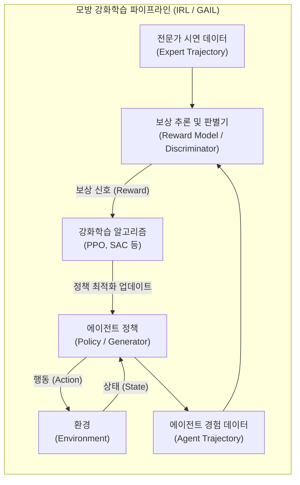

# 모방 강화학습 (Imitation Reinforcement Learning)

---

## I. 보상함수 설계 한계 극복, 모방 강화학습의 개요

### 가. 모방 강화학습의 정의

* 복잡한 환경에서 에이전트가 전문가의 시연(Demonstration) 데이터를 관찰하고, 이를 바탕으로 보상 함수를 역산(IRL)하거나 정책을 직접 학습(GAIL)하여 최적의 행동을 도출하는 융합형 머신러닝 기법

### 나. 모방 강화학습의 필요성 및 특징

* **필요성**: [[Smart Car(자율주행)|자율주행]], 로보틱스 등 수많은 변수가 존재하는 환경에서 엔지니어가 직접 완벽한 보상 함수(Reward Function)를 수학적으로 설계하기 어려운 한계점 극복
* **특징**:
* **보상 추론 (Reward Inference)**: 전문가의 시연 궤적에 내재된 의도와 가치를 역으로 학습
* **샘플 효율성 (Sample Efficiency)**: 초기 무작위 탐색(Random Exploration) 비용을 줄여 수렴 속도 극대화
* **분포 일치 (Occupancy Matching)**: 에이전트의 상태-행동 확률 분포를 전문가의 분포와 일치시킴

---

## II. 모방 강화학습의 아키텍처 및 핵심 기술 요소

### 가. 모방 강화학습의 아키텍처 및 동작 원리 (IRL / GAIL 기반)

* 판별기(Discriminator)가 전문가 데이터와 에이전트의 경험 데이터를 비교하여 보상 신호를 자체적으로 생성함
* 에이전트는 생성된 보상을 극대화하는 방향으로 PPO 등의 [[강화학습]](RL) 알고리즘을 통해 정책을 지속 업데이트함

### 나. 모방 강화학습의 핵심 기술 요소

| 구분 | 핵심 기술 (키워드) | 세부 설명 |
| --- | --- | --- |
| **학습 방법론** | 역강화학습 (IRL) | 전문가의 행동 시연을 기반으로 환경에 내재된 미지의 보상 함수를 수학적으로 역산 |
| **학습 방법론** | GAIL (Generative Adversarial IL) | 적대적 신경망([[GAN (Generative Adversarial Network)|GAN]]) 구조를 차용하여 생성자(에이전트)와 판별자를 경쟁시키는 모방학습 기법 |
| **학습 방법론** | 행동 복제 (BC, Behavioral Cloning) | 상태와 행동을 직접 매핑하는 지도학습으로, 강화학습 전 초기 정책(Policy) 안정화에 활용 |
| **데이터 및 평가** | 시연 데이터 (Demonstration) | 사람이나 기존 최고 수준의 에이전트가 환경과 상호작용하여 남긴 연속된 상태-행동 쌍의 궤적 |
| **데이터 및 평가** | 점유도 측정 (Occupancy Measure) | 전문가와 에이전트가 특정 상태와 행동을 방문하는 빈도(확률 분포)의 차이를 계산하여 오차 축소 |
| **최적화 기법** | 보상 모델링 (Reward Modeling) | 전문가의 궤적 또는 인간의 선호도 피드백을 딥러닝으로 훈련시켜 보상값을 스칼라로 예측하는 모델 |
| **최적화 기법** | RL 최적화 (PPO, TRPO) | 판별기나 보상모델이 제공한 보상 신호를 최대화하기 위해 정책 신경망의 가중치를 안전하게 갱신 |
| **응용 기술** | RLHF (RL from Human Feedback) | 인간의 선호도 피드백을 전문가 시연으로 간주하여 언어 모델 등을 정렬(Alignment)하는 미세조정 기법 |

---

## III. 전통적 강화학습과의 비교 및 최신 활용 동향

### 가. 전통적 강화학습 vs 모방 강화학습 비교

| 비교 항목 | 전통적 강화학습 (Traditional RL) | 모방 강화학습 (Imitation RL) |
| --- | --- | --- |
| **학습 기반** | 에이전트의 자체 시행착오 (Trial & Error) 탐색 | 양질의 전문가 시연(Demonstration) 데이터 모방 |
| **보상 함수 설계** | 도메인 전문가(엔지니어)가 규칙 기반으로 수동 정의 | 전문가 시연 데이터로부터 알고리즘이 스스로 추론 (IRL 등) |
| **학습 수렴 속도** | 희소 보상 환경에서 초기 맹목적 탐색으로 인해 매우 느림 | 시연 데이터 가이드 활용으로 초기 탐색이 단축되어 매우 빠름 |
| **주요 한계점** | 복잡한 작업 시 보상 해킹(Reward Hacking) 발생 우려 | 모델 성능이 수집된 전문가 데이터의 질과 양에 강하게 종속됨 |
| **주요 활용 분야** | 보드게임(알파고), 물리 엔진 기반 로봇 제어 최적화 | 자율주행, 휴머노이드 제어, 대규모 언어 모델([[초거대 언어 모델|LLM]]) 정렬 학습 |

### 나. 모방 강화학습의 향후 전망 및 동향

* **LLM과 RLHF의 결합 확산**: ChatGPT 등장 이후, 인간의 선호도를 모방하는 RLHF(인간 피드백 기반 강화학습) 기술이 생성형 AI의 환각(Hallucination) 방지 및 윤리적 정렬(Alignment)을 위한 필수 표준으로 자리매김함
* **체화된 [[인공지능]](Embodied AI) 제어**: 시뮬레이션 환경의 한계를 넘어, 인간이 원격 조작(Teleoperation)으로 남긴 로봇 팔 및 주행 시연 데이터를 모방하여 즉각적으로 물리적 세계에 적용하는 오프라인 강화학습(Offline RL) 연구 가속화

---

### 🔗 연관 토픽

- **소속 도메인**: [[00_인공지능_MOC|🤖 인공지능]]
- **세부 분류**: `2. 머신러닝 기초 & 핵심 알고리즘`
- **핵심 연관 토픽**:
  - [[강화학습]]
  - [[인공지능]]
  - [[초거대 언어 모델|초거대 언어 모델(Large Language Model)]]
  - [[GAN (Generative Adversarial Network)]]
  - [[지도학습]]
