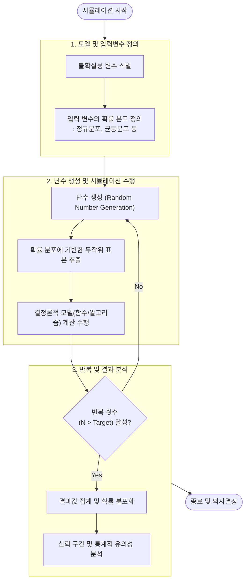

# 몬테카를로 시뮬레이션 (Monte Carlo Simulation)

---

## I. 불확실성 환경의 확률적 해법, 몬테카를로 시뮬레이션의 개요

### 가. 몬테카를로 시뮬레이션의 정의

* 불확실성을 내포한 환경에서 무작위 추출(Random Sampling)된 난수를 반복적으로 생성 및 입력하여, 함수의 값을 통계적 확률 분포로 도출하는 확률론적 시뮬레이션 기법

### 나. 몬테카를로 시뮬레이션의 필요성 및 특징

* **필요성**: 변수가 너무 많거나 수학적으로 명확한 닫힌 해(Closed-form solution)를 구하기 어려운 복잡한 시스템의 근사해 도출 필요
* **특징**:
* **대수의 법칙 (Law of Large Numbers)**: 반복 횟수가 증가할수록 산출된 통계적 확률이 수학적 진값에 수렴함
* **유연성 및 확장성**: 입력 변수의 확률 분포만 정의되면 금융, AI, 엔지니어링 등 다양한 도메인에 적용 가능
* **결과 시각화**: 단일 결과값이 아닌 발생 가능한 결과의 범위와 확률(신뢰구간)을 제공함

---

## II. 몬테카를로 시뮬레이션의 개념도 및 핵심 구성 요소

### 가. 몬테카를로 시뮬레이션의 아키텍처 및 동작 원리

* 확률 분포를 기반으로 난수를 무작위 추출하고, 이를 모델에 대입하여 계산하는 과정을 수천~수만 번 반복 수행함으로써 결과의 통계적 신뢰성을 확보함

### 나. 몬테카를로 시뮬레이션의 핵심 기술 요소

| 분류 | 요소기술(키워드) | 세부 설명 |
| --- | --- | --- |
| **이론적 기반** | 대수의 법칙 (Law of Large Numbers) | 표본의 크기(반복 횟수)가 커질수록 표본 평균이 모집단의 통계적 평균(진값)에 수렴함 |
| **이론적 기반** | [[중심극한정리]] (CLT) | 표본의 크기가 충분히 클 때, 모집단의 분포와 무관하게 표본 평균의 분포가 정규분포를 따름 |
| **입력 모델링** | 난수 생성 (Random Number Generation) | 의사난수 생성기(PRNG)를 활용하여 편향성 없는 무작위 표본 값 생성 |
| **입력 모델링** | 확률 분포 (Probability Distribution) | 입력 변수의 실제 발생 가능성을 수학적([[정규분포]], 로그정규분포 등)으로 모델링 |
| **수행 기법** | 반복 수행 (Iteration / Loop) | 컴퓨팅 파워를 활용한 대규모 독립적 연산 반복으로 대수의 법칙 성립 요건 충족 |
| **수행 기법** | 결정론적 수학 모델 (Deterministic Model) | 추출된 난수 입력값을 바탕으로 결과값을 산출하는 내부 비즈니스 로직 또는 시스템 함수 |
| **최적화 기법** | 분산 감소 기법 (Variance Reduction) | 층화 추출, 대조변수 기법 등을 통해 적은 횟수의 반복으로도 표본 오차를 줄이고 수렴 속도를 향상 |
| **결과 분석** | 신뢰 구간 (Confidence Interval) | 산출된 결과의 범위와 불확실성 수준을 정량화하여 의사결정에 활용 가능한 지표 제공 |

---

## III. 유사 모델 비교 및 최신 활용 동향

### 가. 결정론적 시뮬레이션과 확률론적(몬테카를로) 시뮬레이션 비교

| 비교 항목 | 결정론적 (Deterministic) 시뮬레이션 | 확률론적 (Stochastic / Monte Carlo) 시뮬레이션 |
| --- | --- | --- |
| **입력 변수** | 확정된 단일 상수값 (Fixed Values) | 확률 분포를 가진 무작위 난수 (Random Variables) |
| **출력 결과** | 항상 동일한 단일 결과(점 추정치) 도출 | 다양한 경우의 수를 포함한 확률 분포(구간 추정치) 도출 |
| **불확실성 반영** | 외부 환경 변수 및 불확실성 반영 불가 | 리스크 및 불확실성을 통계적으로 정량화하여 반영 가능 |
| **컴퓨팅 자원** | 상대적으로 낮은 연산 자원 요구 | 수만 번 이상의 반복 수행으로 높은 연산 자원(병렬 처리) 요구 |

### 나. 몬테카를로 시뮬레이션의 최신 동향 및 향후 전망

* **AI/강화학습과의 융합 (MCTS)**: 난수 시뮬레이션을 트리 탐색 알고리즘과 결합한 **몬테카를로 트리 탐색(Monte Carlo Tree Search)** 기법으로 발전하여, 알파고(AlphaGo) 등 현대 AI의 핵심 의사결정 알고리즘으로 자리매김함
* **양자 컴퓨팅 기반 가속 (QMC)**: 기존 고전 컴퓨터의 PRNG 한계 및 엄청난 연산 시간을 극복하기 위해, 양자 중첩 원리를 활용한 양자 몬테카를로 시뮬레이션(Quantum Monte Carlo) 연구가 금융공학 및 신약 개발 분야를 중심으로 활발히 진행 중임

---

### 🔗 연관 토픽

- **소속 도메인**: [[00_프로젝트관리_MOC|📋 프로젝트관리]]
- **세부 분류**: `5. 애자일 프로젝트 관리 & 개발 운영 (Agile PM)`
- **핵심 연관 토픽**:
  - [[중심극한정리|중심극한정리 (Central Limit Theorem)]]
  - [[정규분포|정규분포(Normal Distribution)]]
  - [[3점 산정]]
  - [[일정단축 기법]]
  - [[프로젝트 위험관리]]
