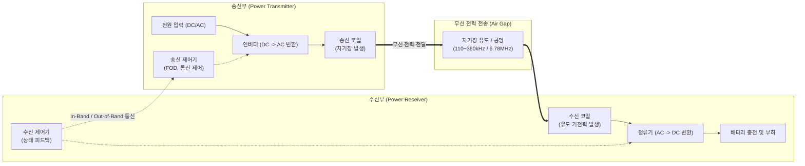

요청하신 지시사항과 1교시형 모범답안 양식에 맞추어, **'무선 충전 기술(Wireless Charging Technology)'** 기술사 답안을 작성해 드립니다.

답안 작성 전 최신 무선 충전 표준(WPC Qi2 v2.0/2.2.1, 자석 정렬 기법 MPP) 및 충전 방식(자기 유도, 자기 공명, 전자기파)에 대한 최신 동향 사실관계 검증을 2회 완료하였습니다.

---

# 무선 충전 기술 (Wireless Charging Technology)

---

## I. 선 없는 전력 전송의 혁신, 무선 충전 기술의 개요

* **정의**: 전자기 유도, 자기 공명, 전자기파(RF) 등의 물리적 원리를 활용하여 케이블이나 접점 연결 없이 전력을 송신부에서 수신부로 무선 전송하여 기기의 배터리를 충전하는 기술
* **필요성 및 특징**:
* **편의성 및 내구성 향상**: 단자 노출이 없어 마모 방지, 완벽한 방수/방진 설계(Fully-sealed) 가능, 감전 위험 감소
* **모빌리티 및 IoT 확장**: 스마트폰과 웨어러블을 넘어 전기차(EV), [[드론]], 생체 삽입형 의료기기 등으로 적용처 급속 확대
* **주요 전송 방식**: 코일 간 근접 결합을 이용하는 자기 유도 방식, 공진 주파수를 이용하는 자기 공명 방식, 마이크로파를 쏘는 전자기파 방식 등 3가지로 분류됨

---

## II. 무선 충전 기술의 아키텍처 및 핵심 구성요소

### 가. 무선 충전 시스템의 아키텍처 및 동작 원리

* 송신부의 코일에 고주파 교류 전류를 흘려 자기장을 발생시키고, 수신부 코일에서 패러데이 전자기 유도 법칙 등에 의해 유도 기전력을 생성하여 배터리를 충전하는 구조임
* 충전 효율 최적화 및 화재 방지 안전성을 위해 송수신부 간 지속적인 데이터 통신 및 이물질 탐지(FOD)를 수행함

### 나. 무선 충전 방식의 핵심 기술 요소

| 구분 | 요소기술(키워드) | 세부 설명 |
| --- | --- | --- |
| **전력 전송 방식** | 자기 유도 (Inductive) | 인접한 두 코일 간의 전자기 유도를 활용, 효율이 높으나(90% 이상) 거리가 매우 짧음 (Qi 표준) |
| **전력 전송 방식** | 자기 공명 (Resonant) | 송수신 코일의 동일한 공진 주파수를 이용, 수 미터(m) 내 다중 기기 충전 가능 (AirFuel 표준) |
| **전력 전송 방식** | 전자기파 (RF) | 안테나를 통해 마이크로파 파장으로 전력을 전송, 원거리 전송이 가능하나 전송 효율이 극히 낮음 |
| **최적화 및 제어** | MPP (Magnetic Power Profile) | 자석을 이용해 송수신 코일의 물리적 정렬을 완벽히 맞추어 에너지 전송 손실을 최소화하는 기술 |
| **최적화 및 제어** | 주파수/전압 제어 | 송신 주파수 및 듀티 사이클을 가변하여 기기의 전력 요구량(Load) 변화에 맞게 최적 전력을 전송 |
| **안전성 및 보호** | FOD (Foreign Object Detection) | 코일 사이에 동전, 열쇠 등 금속 이물질이 존재할 경우 발열을 방지하기 위해 즉각 전력을 차단하는 기술 |
| **안전성 및 보호** | 인체 보호 기준 (EMF/SAR) | 전자기장 노출 한계 및 전자파 흡수율(SAR) 규제(EN 62311 등)를 준수하여 인체 유해성을 차단 |
| **통신 [[프로토콜]]** | In-Band / Out-of-Band | 전력 전송과 동일한 주파수로 통신(In-Band)하거나, BLE 등 별도 대역(Out-of-Band)으로 상태 정보 교환 |

---

## III. 무선 충전 전송 기술 비교 및 최신 표준 동향

### 가. 무선 전력 전송 3대 방식 비교

| 비교 항목 | 자기 유도 방식 (Magnetic Induction) | 자기 공명 방식 (Magnetic Resonance) | 전자기파 방식 (RF / Microwave) |
| --- | --- | --- | --- |
| **핵심 원리** | 전자기 유도 (패러데이 법칙) | 전자기적 공명 (동일 공진 주파수) | 안테나 기반 마이크로파 방사 |
| **전송 거리** | 수 mm ~ 수 cm (거의 밀착 必) | 수십 cm ~ 수 m (중거리 전송) | 수 m ~ 수 km (원거리 전송) |
| **전송 효율** | 매우 높음 (70~90% 이상) | 중간 (거리/다중 충전 시 저하) | 매우 낮음 (인체 유해성 고려 필요) |
| **주요 주파수** | 110 ~ 360 kHz 대역 | 6.78 MHz (ISM 대역) | 900 MHz, 2.4 / 5.8 GHz 대역 |
| **주요 활용 분야** | 스마트폰, 웨어러블, 스마트 워치 | 전기차(EV), 다중 기기 동시 충전 | 초소형 IoT 센서, 우주 태양광 발전 |

### 나. 무선 충전 기술 최신 동향 및 향후 전망

* **Qi2 (WPC v2.x) 표준의 확산**: 2023년 제정된 Qi2 표준은 애플 MagSafe 기술을 기반으로 한 자석 정렬 기술(MPP)을 공식 채택하여, 기존 위치 이탈로 인한 발열 한계를 극복하고 충전 속도를 최대 25W까지 안정적으로 제공하는 기기가 시장에 본격 출시됨
* **모빌리티 및 주방 가전 대전력 무선화**: 전기차 무선 충전 국제 표준(SAE J2954) 고도화를 통한 플러그 없는 주차 충전 환경 구축과 더불어, WPC의 'Ki Cordless Kitchen' 표준 제정으로 주방 가전 분야에서도 최대 2,200W급 대전력 무선 충전 생태계로 적용 범위가 획기적으로 넓어지고 있음

---

### 🔗 연관 토픽

- **소속 도메인**: [[00_네트워크_MOC|🌐 네트워크]]
- **세부 분류**: `3. 전송 계층 & 트래픽 / 혼잡 제어 (L4)`
- **핵심 연관 토픽**:
  - [[프로토콜]]
  - [[드론|드론 (Drone; 무인기)]]
  - [[Wi-Fi 7|WI-FI 7 (IEEE 802.11be)]]
  - [[CDN|CDN(Contents Delivery Network)]]
  - [[Point-to-Point]]
