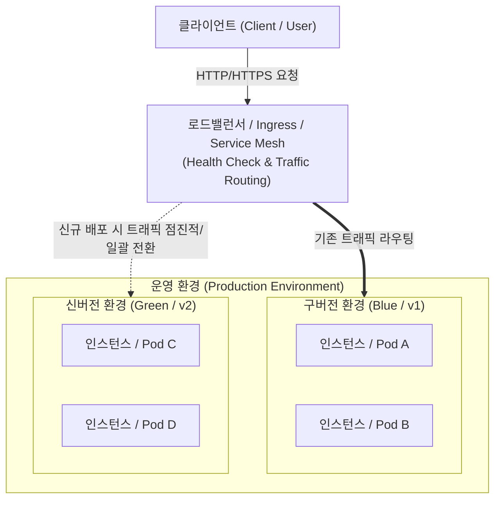

# 무중단 배포 (Zero-Downtime Deployment)

---

## I. 서비스 연속성을 보장하는 현대적 배포 전략, 무중단 배포의 개요

### 가. 무중단 배포의 정의

* 새로운 버전의 소프트웨어나 애플리케이션을 운영 환경에 배포할 때, 서비스 중단 시간(Downtime) 없이 트래픽을 안전하게 전환하여 사용자 경험을 보장하는 배포 기법임.

### 나. 무중단 배포의 필요성 및 특징

* **[[HA(High Availability)|고가용성]](HA) 확보**: 24/365 서비스 연속성 보장 및 배포 중단에 따른 비즈니스 손실 방지
* **롤백(Rollback) 안정성**: 신규 버전 배포 중 장애 감지 시 신속하게 구버전으로 트래픽 원복 지원
* **유연한 트래픽 제어**: 로드밸런서(LB) 및 Service Mesh를 활용하여 트래픽을 점진적으로 전환 및 모니터링 가능

---

## II. 무중단 배포의 개념도 및 핵심 기술 요소

### 가. 무중단 배포의 개념도 및 동작 원리

* **동작 흐름**: 사용자의 요청은 L4/L7 로드밸런서로 인입되며, 헬스체크(Health Check)를 통과한 정상 상태의 신규 [[인스턴스]](v2)로 트래픽을 안전하게 이전함.
* 트래픽 이전 방식에 따라 롤링(순차적), 블루-그린(일괄), 카나리(점진적) 배포 방식으로 나뉨.

### 나. 무중단 배포의 핵심 기술 요소

| 분류 | 요소기술(키워드) | 세부 설명 |
| --- | --- | --- |
| **인프라 제어** | 로드밸런서 / Ingress | 트래픽을 분산하고, 신규 인스턴스의 헬스체크 결과에 따라 라우팅 대상을 자동 갱신 |
| **상태 모니터링** | Readiness / Liveness Probe | 신규 프로세스의 부팅 및 서비스 준비가 완료되었는지(Warm-up) 판단하여 트래픽 할당 |
| **배포 전략** | 롤링 배포 (Rolling Update) | 구버전 인스턴스를 하나씩 순차적으로 새 버전으로 교체하여 점진적으로 배포하는 전략 |
| **배포 전략** | 블루-그린 (Blue-Green) | 신버전(Green) 환경을 구버전(Blue)과 동일하게 구축 후, 트래픽을 일괄 전환하는 전략 |
| **배포 전략** | 카나리 배포 (Canary) | 소수의 트래픽(예: 5%)만 신버전으로 라우팅하여 검증한 뒤, 점진적으로 전체 적용하는 전략 |
| **소프트웨어 설계** | 하위 호환성 (Backward Comp.) | 구/신버전 API 및 DB 구조가 공존하는 동안 장애가 발생하지 않도록 버전 계약 유지 |
| **[[프로세스]] 제어** | 우아한 종료 (Graceful Shutdown) | 기존 인스턴스가 삭제될 때 진행 중인 [[트랜잭션]] 요청을 완료한 후 안전하게 종료 (SIGTERM 처리) |
| **자동화 파이프라인** | Progressive Delivery | Argo Rollouts, Flagger 등을 활용하여 프로메테우스 등 메트릭 기반 자동 배포 및 롤백 수행 |

---

## III. 3대 주요 무중단 배포 전략 비교 및 최신 동향

### 가. 무중단 배포 주요 전략 (롤링, 블루/그린, 카나리) 비교

| 비교 항목 | 롤링 배포 (Rolling) | 블루-그린 배포 (Blue-Green) | 카나리 배포 (Canary) |
| --- | --- | --- | --- |
| **트래픽 전환** | 점진적 (인스턴스 단위 교체) | 일괄 전환 (라우팅 규칙 한 번에 변경) | 점진적 (일부 비율 유입 → 확대) |
| **서버 자원 요구량** | N + a (소규모 여유 자원 필요) | 2N (운영 환경과 동일 규모 구축 필요) | N + a (초기 소수 자원으로 테스트) |
| **롤백(Rollback)** | 느림 (역순으로 순차적 재배포 필요) | 매우 빠름 (로드밸런서 라우팅 원복) | 빠름 (라우팅 비율 원복) |
| **하위 호환성 민감도** | 높음 (배포 중 두 버전 동시 서비스) | 낮음 (일괄 전환되므로 충돌 적음) | 높음 (배포 중 두 버전 동시 서비스) |
| **주요 활용 및 장점** | Kubernetes 기본 배포 전략 지원 | 대규모 마이그레이션, 빠른 롤백 필요 시 | A/B 테스트, 신규 기능 검증 및 리스크 축소 |

### 나. 무중단 배포 기술의 진화 및 향후 전망

* **점진적 배포(Progressive Delivery)의 표준화**: 최근 [[클라우드 네이티브]] 기반 [[MSA (Micro Service Architecture)|MSA]] 환경에서는 단순 스크립트 기반 배포를 넘어, ArgoCD, Flagger, Istio(Service Mesh)를 결합한 GitOps 체계로 발전 중임.
* 메트릭(에러율, 지연시간)을 실시간 분석하여 임계치 초과 시 트래픽을 자동으로 차단하고 롤백하는 지능형 자동화 배포가 산업의 표준 트렌드로 자리매김하고 있음.

---

### 🔗 연관 토픽

- **소속 도메인**: [[00_소프트웨어공학_MOC|🏗️ 소프트웨어공학]]
- **세부 분류**: `6. 소프트웨어 테스팅 & 품질 보증 (QA/QC)`
- **핵심 연관 토픽**:
  - [[MSA (Micro Service Architecture)]]
  - [[클라우드 네이티브]]
  - [[인스턴스]]
  - [[쿠버네티스|쿠버네티스(Kubernates)]]
  - [[Debugging]]
