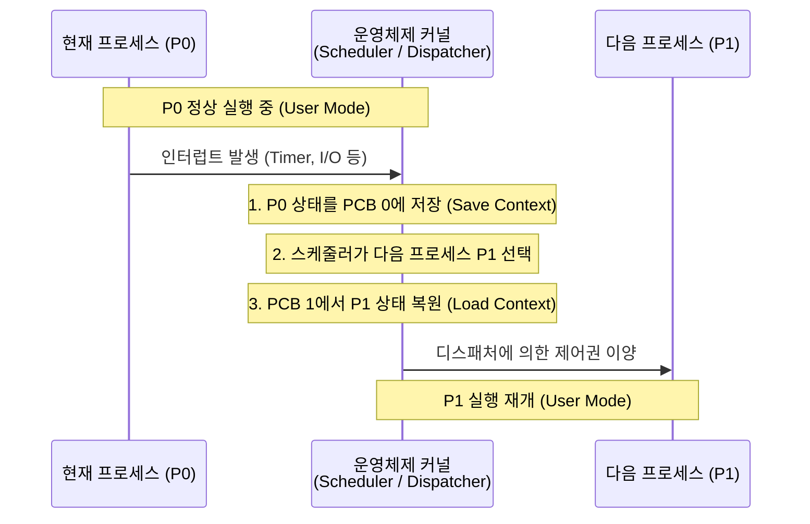

# 문맥 교환 (Context Switching)

---

## I. 멀티태스킹의 핵심, 문맥 교환의 개요

### 가. 문맥 교환의 정의

* 단일 [[CPU]] 환경에서 여러 프로세스를 동시 수행하기 위해, 현재 실행 중인 프로세스의 상태(Context)를 보관하고 다음 실행할 프로세스의 상태를 CPU에 적재하는 메커니즘
* 인터럽트나 시스템 콜 발생 시 [[커널]] 모드로 전환되어 스케줄러와 디스패처에 의해 수행되는 운영체제의 핵심 제어 흐름

### 나. 문맥 교환의 필요성 및 특징

* **시분할 멀티태스킹 지원**: 주어진 Time Quantum(타임 슬라이스) 동안만 CPU를 할당하여 여러 응용 프로그램의 동시 실행 환경 제공
* **CPU 활용률 및 응답성 극대화**: I/O 대기 상태 진입 시 유휴 CPU를 다른 대기 프로세스에 즉시 할당하여 시스템 [[처리량]](Throughput) 향상
* **성능 오버헤드 동반**: 레지스터 저장 및 복원, 메모리 맵핑 변경, TLB Flush 및 캐시 미스(Cache Miss)로 인한 필수적인 시스템 처리 비용 발생

---

## II. 문맥 교환의 개념도 및 핵심 기술 요소

### 가. 문맥 교환의 동작원리

* 실행 중인 프로세스의 레지스터 및 메모리 상태를 커널 메모리(PCB)에 저장하고, 스케줄링된 새 프로세스의 정보를 복원하여 CPU 레지스터를 갱신함
* 사용자 모드에서 커널 모드로의 권한 전환(Mode Switch) 및 상태 복원 후 다시 사용자 모드로 복귀하는 과정이 수반됨

### 나. 문맥 교환의 핵심 기술 및 구성 요소

| 구분 | 요소기술(키워드) | 세부 설명 |
| --- | --- | --- |
| **제어 블록** | PCB ([[PCB(Process Control Block)|Process Control Block]]) | 프로세스의 상태, 프로그램 카운터(PC), 레지스터, 메모리 한계, 열린 파일 목록 등을 저장하는 커널 내 자료구조 |
| **제어 블록** | TCB (Thread Control Block) | 스레드 단위 문맥 교환 시 필요한 스레드 고유 ID, PC, SP([[Stack]] Pointer), [[스케줄링]] 정보 등을 저장하는 자료구조 |
| **제어 모듈** | [[스케줄러|스케줄러 (Scheduler)]] | Ready [[Queue]]에 대기 중인 [[프로세스]] 중 우선순위 및 [[알고리즘]](RR, CFS 등)에 따라 다음 실행 대상을 선정 |
| **제어 모듈** | 디스패처 (Dispatcher) | 스케줄러가 선택한 프로세스에 CPU 제어권을 넘기고, 실제 레지스터 상태 복원과 사용자 모드 전환을 수행 |
| **핵심 레지스터** | PC (Program Counter) | 프로세스가 일시 중단된 시점을 기억하여, 재개 시 실행을 이어갈 다음 명령어의 메모리 주소를 가리키는 레지스터 |
| **핵심 레지스터** | SP (Stack Pointer) | 각 프로세스 및 스레드의 함수 호출 스택, 지역 변수 상태가 저장된 현재 메모리 위치를 가리키는 레지스터 |
| **메모리 제어** | [[MMU(Memory Management Unit)|MMU]] & TLB | 가상 주소 공간 전환 시 [[물리 주소]] 매핑을 위해 MMU를 재설정하고, TLB 캐시를 플러시(Flush)하여 메모리 보호 수행 |
| **발생 트리거** | [[인터럽트]] / 트랩 | 타임 슬라이스 만료(Timer), 입출력 완료(H/W Interrupt), 페이지 폴트, 시스템 콜(Trap) 등에 의해 교환 메커니즘 트리거 |

---

## III. 문맥 교환 유형 비교 및 오버헤드 최소화 동향

### 가. 프로세스 문맥 교환과 스레드 문맥 교환 비교

| 비교 항목 | 프로세스(Process) 문맥 교환 | 스레드(Thread) 문맥 교환 |
| --- | --- | --- |
| **공유 영역** | 없음 (완전 독립적인 가상 주소 공간 사용) | Code, Data, Heap 영역을 프로세스 내에서 공유 |
| **교환 대상** | PCB 전체 기반 ([[가상 메모리]] 공간 전체 전환 필요) | TCB 기반 (PC, SP, 범용 레지스터 등 필수 상태만 전환) |
| **메모리 캐시** | 주소 공간 변경으로 인한 대규모 TLB 플러시 발생 | 동일 프로세스 내 스레드 간 전환 시 기존 TLB 캐시 유지 |
| **오버헤드 수준** | 높음 (Cache Miss 무효화 증가, 시스템 부하 큼) | 낮음 (캐시 로컬리티 보존, 상대적으로 경량화된 전환) |

### 나. 문맥 교환 오버헤드 최소화 및 최신 동향

* **경량 가상 스레드(Virtual Thread) 도입**: Java 21의 Virtual Thread, Go 언어의 Goroutine 등 커널 수준이 아닌 사용자 수준(User-level) 런타임 스레드를 활용하여 고비용의 OS 커널 문맥 교환 오버헤드를 원천적으로 회피함
* **ASID(Address Space ID) 하드웨어 지원**: 가상 [[메모리 관리]] 시 TLB 항목에 프로세스 ID 태그(ASID)를 부여하여, 문맥 교환 시 전체 TLB를 지우지 않고 다른 프로세스의 메모리 매핑 캐시를 안전하게 보존·재활용하는 기법 적용
* **지연된 상태 복원(Lazy Context Switching)**: FPU(부동소수점 연산 장치)와 같은 크기가 큰 레지스터 상태는 문맥 교환 시마다 즉시 저장/복원하지 않고, 새 프로세스가 실제 FPU 명령을 최초로 사용할 때만 지연 처리하여 불필요한 스위칭 비용을 최소화함

---

### 🔗 연관 토픽

- **소속 도메인**: [[00_운영체제_MOC|⚙️ 운영체제]]
- **세부 분류**: `1. 프로세스 & 스레드 관리`
- **핵심 연관 토픽**:
  - [[프로세스]]
  - [[스케줄링]]
  - [[인터럽트|인터럽트 (Interrupt)]]
  - [[스케줄러|스케줄러 (Scheduler)]]
  - [[PCB(Process Control Block)]]
