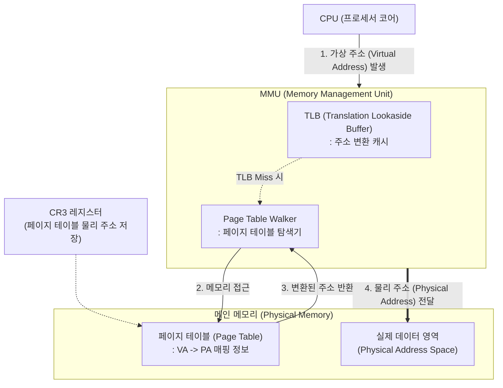

# 물리 주소 (Physical Address)

---

## I. 하드웨어 메모리의 실제 위치를 식별하는, 물리 주소의 개요

### 가. 물리 주소의 정의

* [[CPU]]가 주소 버스(Address Bus)를 통해 메인 메모리(RAM)나 주변 장치의 특정 기억 장소에 직접 접근하기 위해 사용하는 실제 하드웨어의 절대 주소

### 나. 물리 주소의 필요성 및 특징

* **접근 제어 및 격리**: 가상 주소(Virtual Address)에서 물리 주소로의 변환 과정을 통해 [[프로세스]] 간 메모리 영역 침범 방지 및 보호
* **하드웨어 종속성**: 시스템에 장착된 실제 메모리 모듈(DIMM 등)의 용량과 주소 버스의 대역폭에 의해 전체 주소 공간의 크기가 결정됨
* **I/O 디바이스 통신**: [[DMA(Direct Memory Access)]] 및 IOMMU 등을 통해 주변 디바이스([[GPU]], NIC 등)가 메모리에 직접 읽기/쓰기를 수행하기 위한 기준 위치 제공

---

## II. 물리 주소 변환 개념도 및 핵심 기술 요소

### 가. 물리 주소 변환(Address Translation) 아키텍처 및 동작 원리

* CPU에서 생성된 논리적 가상 주소는 [[MMU(Memory Management Unit)|MMU]] 내의 TLB를 먼저 참조하며, TLB Miss 발생 시 CR3 레지스터가 가리키는 메모리 내 페이지 테이블을 탐색(Walk)하여 최종 물리 주소를 산출함

### 나. 물리 주소 및 주소 변환 핵심 기술 요소

| 구분 | 요소기술(키워드) | 세부 설명 |
| --- | --- | --- |
| **주소 변환 하드웨어** | MMU (Memory Mgmt Unit) | 논리 주소를 물리 주소로 매핑하고 메모리 보호 권한(Read/Write)을 검사하는 하드웨어 칩 |
| **주소 변환 하드웨어** | IOMMU | I/O 디바이스가 사용하는 가상 주소를 호스트의 물리 주소로 변환하여 장치 격리 및 DMA 보안 제공 |
| **캐시 및 레지스터** | TLB (Translation Lookaside Buffer) | 최근에 변환된 가상-물리 주소 매핑 쌍을 저장하는 고속 캐시 메모리로 변환 지연시간 최소화 |
| **캐시 및 레지스터** | CR3 레지스터 | 현재 실행 중인 프로세스의 페이지 디렉터리 시작 '물리 주소'를 보관하는 제어 레지스터 |
| **자료구조** | 페이지 테이블 (Page Table) | 가상 주소의 페이지 번호와 물리 주소의 프레임(Frame) 번호 간의 매핑 정보를 저장하는 배열 |
| **[[가상화]] 지원** | EPT / NPT ([[그림자페이지 기법|Shadow Paging]]) | 가상머신(VM)의 게스트 물리 주소(GPA)를 하이퍼바이저의 호스트 물리 주소([[HPA (Horizontal Pod Autoscaler)|HPA]])로 변환 (2단계 페이징) |
| **전송 채널** | 주소 버스 (Address Bus) | MMU에서 산출된 물리 주소 신호를 메인 메모리 칩으로 전달하는 물리적 배선 (Bus 폭이 메모리 용량 결정) |
| **성능 최적화** | HugePages (대용량 페이지) | 기본 4KB 대신 2MB, 1GB 단위로 물리 메모리 프레임을 할당하여 TLB Miss 발생 빈도를 획기적으로 낮춤 |

---

## III. 논리 주소와의 비교 및 물리 메모리 아키텍처 최신 동향

### 가. 논리 주소(Virtual Address)와 물리 주소(Physical Address) 비교

| 비교 항목 | [[논리 주소]] / 가상 주소 (Logical / Virtual) | 물리 주소 (Physical) |
| --- | --- | --- |
| **정의** | CPU와 실행 중인 프로세스가 인식하는 주소 | 실제 물리적 메모리(RAM)에 접근하기 위한 주소 |
| **할당 주체** | 컴파일러, 링커, OS | 하드웨어 칩셋 메모리 컨트롤러, MMU |
| **공간의 크기** | CPU 아키텍처(32bit, 64bit)에 의해 논리적으로 한정됨 | 장착된 실제 RAM 모듈 용량 및 주소 버스 대역폭에 종속 |
| **가시성** | 사용자 프로세스 애플리케이션에 노출됨 | [[OS(운영체제)|운영체제]] [[커널]] 및 하드웨어(디바이스 드라이버)에 제한적 노출 |

### 나. 물리 주소 공간의 확장 및 최신 메모리 동향

* **[[CXL]](Compute Express Link) 기반 메모리 풀링**: 단일 노드의 물리적 램(DIMM) 한계를 극복하기 위해, PCIe 5.0 기반의 CXL 인터페이스를 통해 이기종 메모리 및 타 서버의 메모리를 로컬 물리 주소 공간으로 확장하는 메모리 계층화(Tiering) 기술 상용화
* **GPU Direct Storage (GDS)**: 스토리지 디바이스와 GPU 간 통신 시 CPU 메모리의 물리 주소 공간(Bounce Buffer)을 거치지 않고, DMA를 통해 GPU 메모리로 직접 데이터를 전송하여 AI 학습 데이터 로딩 병목을 해소하는 아키텍처 확산

---

### 🔗 연관 토픽

- **소속 도메인**: [[00_운영체제_MOC|⚙️ 운영체제]]
- **세부 분류**: `1. 프로세스 & 스레드 관리`
- **핵심 연관 토픽**:
  - [[논리 주소]]
  - [[MMU(Memory Management Unit)]]
  - [[프로세스]]
  - [[커널|커널(Kernel)]]
  - [[OS(운영체제)]]
