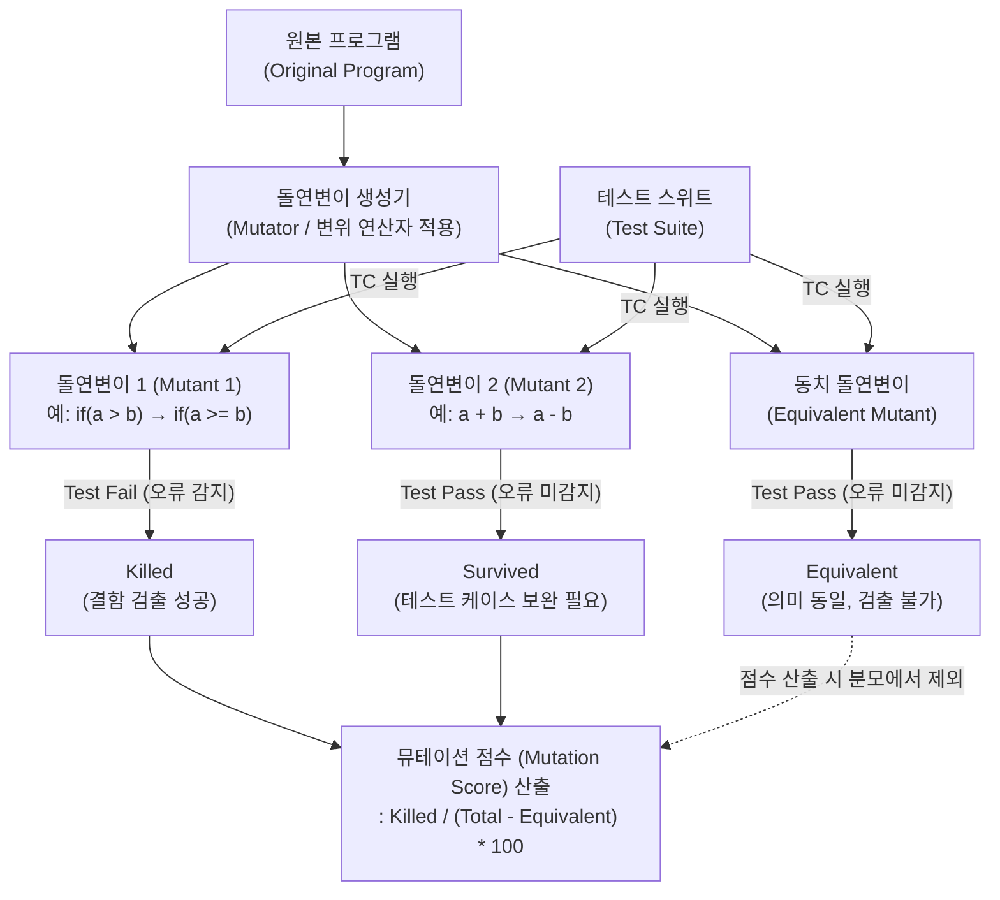

# 뮤테이션 테스트 (Mutation Test)

---

## I. 테스트 케이스의 신뢰성 검증 기법, 뮤테이션 테스트의 개요

### 가. 뮤테이션 테스트의 정의

* 프로그램 소스 코드에 의도적으로 미세한 오류(돌연변이)를 주입한 후, 기존 **테스트 케이스(Test Suite)가 이를 결함으로 적발해 내는지(Kill) 확인**하여 테스트 품질을 평가하는 결함 기반(Fault-based) 테스트 기법임

### 나. 뮤테이션 테스트의 필요성 및 특징

* **살충제 패러독스(Pesticide Paradox) 극복**: 100%의 [[코드 커버리지]](구문/분기)가 실제 잠재 결함의 검출 능력을 보장하지 못하는 기존 커버리지 지표의 한계 보완
* **테스트 케이스 품질의 정량화**: 단순 수행 완료 여부가 아닌, 식별된 오류의 비율(Mutation Score)을 통해 테스트 스위트의 견고성을 수치화
* **자동화 도구 의존성**: 무수히 많은 변이(Mutant) 생성 및 반복 실행을 위해 PITest(Java), Stryker(JS/C#), mutmut(Python) 등 전용 자동화 [[프레임워크]] 필수

---

## II. 뮤테이션 테스트의 아키텍처 및 핵심 구성요소

### 가. 뮤테이션 테스트의 아키텍처 및 동작 원리

* 원본 코드에 변이 연산자를 적용해 다수의 돌연변이를 생성하고, 테스트 수행 결과를 통해 Killed/Survived 판별 후 뮤테이션 점수(Mutation Score)를 산출함

### 나. 뮤테이션 테스트의 핵심 기술 및 구성 요소

| 분류 | 요소기술(키워드) | 세부 설명 |
| --- | --- | --- |
| **코드 변이** | 뮤테이션 [[연산자]] (Mutation Operator) | 소스 코드를 체계적으로 변경하는 규칙 (예: AOR(산술 연산자 대체), LCR(논리 연산자 대체) 등) |
| **코드 변이** | 돌연변이 (Mutant) | 뮤테이션 연산자가 1회 이상 적용되어 인위적인 결함(Fault)이 포함된 소스 코드 버전 |
| **상태 판별** | Killed (사멸) | 테스트 케이스가 돌연변이 코드의 반환값을 기존과 다르다고 판단하여 **Fail**을 발생시킨 상태 (긍정적 결과) |
| **상태 판별** | Survived (생존) | 테스트 케이스가 돌연변이 코드를 정상으로 판단하여 **Pass**시킨 상태 (테스트 케이스 누락/부실 의미) |
| **상태 판별** | 동치 돌연변이 (Equivalent Mutant) | 구문은 변경되었으나, 원본과 논리적/의미적(Semantic)으로 완전히 동일하여 항상 Survived 되는 돌연변이 |
| **평가 지표** | 뮤테이션 점수 (Mutation Score) | 테스트 품질 지표로, **(Killed 돌연변이 수) / (전체 돌연변이 수 - 동치 돌연변이 수) × 100** 으로 계산 |
| **성능 최적화** | 바이트코드 변이 (Bytecode Mutation) | 소스 코드가 아닌 컴파일된 바이너리/바이트코드(예: .class)를 직접 변이하여 재컴파일 오버헤드 제거 |
| **성능 최적화** | 약한 돌연변이 (Weak Mutation) | 프로그램 전체 종료 시점의 출력이 아닌, 변이된 구문 실행 직후의 내부 상태 변화만 비교하여 수행 속도 극대화 |

---

## III. 뮤테이션 테스트의 한계점 극복 및 최신 동향

### 가. 뮤테이션 테스트의 한계점 극복 및 최신 동향

* **컴퓨팅 오버헤드 최소화 (Incremental & Cloud-Native)**: 거대한 코드베이스 전체를 테스트하는 비용을 줄이기 위해, CI/CD 파이프라인 연동 시 PR(Pull Request)에서 변경된 코드(Diff) 주변으로만 변이를 제한하는 **점진적(Incremental) 뮤테이션 기법** 표준화
* **[[초거대 언어 모델|LLM]] 기반 동치 돌연변이(Equivalent Mutant) 탐지**: 전통적 방식에서 인간이 직접 판별해야 했던 동치 돌연변이를 AST(추상 구문 트리) 구조 분석과 대규모 언어 모델(LLM)을 결합하여 자동 식별 및 제거(Pruning)하는 지능형 연구 활발
* **고차 돌연변이(HOM, Higher Order Mutation) 활용 강화**: 단일 오류(First Order)가 아닌 두 개 이상의 복합적인 오류가 결합된 HOM을 생성하여, 소프트웨어의 복잡한 결함 간 상호작용(Fault Coupling) 검출 능력을 강화하는 방향으로 진화 중임

---

### 🔗 연관 토픽

- **소속 도메인**: [[00_소프트웨어공학_MOC|🏗️ 소프트웨어공학]]
- **세부 분류**: `2. 애자일(Agile) & 지속적 통합/배포(CI/CD)`
- **핵심 연관 토픽**:
  - [[TDD|TDD (Test Driven Development)]]
  - [[코드 커버리지|코드 커버리지(Code Coverage)]]
  - [[프레임워크]]
  - [[리그레션 테스트|리그레션(회귀, Regression) 테스트]]
  - [[소프트웨어 테스트 원리|테스트 원리]]
