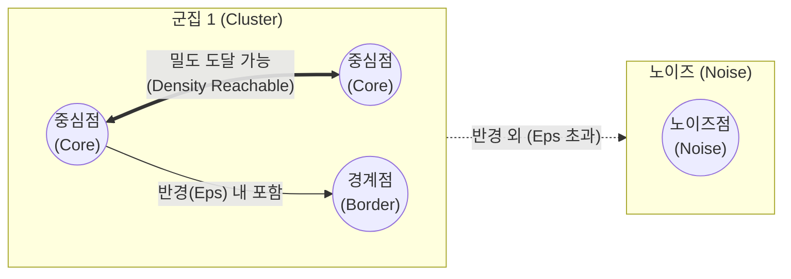

# 밀도기반 클러스터링 (DBSCAN)

---

## I. 임의의 형태 군집 탐색 및 이상치 제거, DBSCAN의 개요

### 가. DBSCAN(Density-Based Spatial Clustering of Applications with Noise)의 정의

* 데이터의 밀도(Density)를 기준으로 촘촘하게 분포된 데이터 포인트를 묶어 군집을 형성하고, 어느 군집에도 속하지 않는 밀도 낮은 영역의 데이터를 노이즈([[이상치]])로 판별하는 [[비지도 학습]] 기반 군집화 [[알고리즘]]

### 나. DBSCAN의 필요성 및 특징

* **비선형/임의 형태 군집 탐색**: 기하학적이고 복잡한 형태의 데이터 분포에서도 정확한 군집 식별 가능
* **사전 K값 설정 불필요**: K-Means와 달리 사전에 군집의 수(K)를 지정할 필요가 없어 데이터 탐색적 분석에 용이
* **노이즈 강건성(Robustness)**: 밀도가 낮은 영역의 데이터를 이상치(Outlier)로 자체 배제하여 군집의 품질 향상

---

## II. DBSCAN의 개념도 및 핵심 기술 요소

### 가. DBSCAN의 개념도 및 동작 원리

* 특정 반경(Eps) 내에 최소 데이터 수(MinPts) 이상의 포인트가 존재하면 중심점(Core Point)으로 지정하고, 중심점들을 서로 연결(Density Reachable)하여 하나의 군집으로 점진적 확장함. 반경 내에 속하지 않는 고립된 포인트는 노이즈(Noise)로 처리함.

### 나. DBSCAN의 핵심 구성 요소

| 구분 | 요소기술(키워드) | 세부 설명 |
| --- | --- | --- |
| **핵심 파라미터** | Eps (Epsilon, $\epsilon$) | 특정 데이터 포인트의 이웃을 정의하기 위한 탐색 반경 (거리 기준) |
| **핵심 파라미터** | MinPts (Minimum Points) | 하나의 군집을 형성하기 위해 Eps 반경 내에 있어야 하는 최소 데이터 개수 |
| **포인트 분류** | 중심점 (Core Point) | 반경 Eps 내에 자신을 포함하여 MinPts 이상의 데이터를 갖는 포인트 |
| **포인트 분류** | 경계점 (Border Point) | Eps 내 데이터 수는 MinPts보다 적지만, Core Point의 반경 내에 속한 포인트 |
| **포인트 분류** | 노이즈 (Noise / Outlier) | Core Point도 아니고 Border Point도 아닌, 밀도가 낮은 지역의 고립된 포인트 |
| **도달성(Reachability)** | 직접 밀도 도달 가능 | 포인트 p가 중심점 q의 반경 Eps 내에 속해 직접 연결 가능한 상태 |
| **도달성(Reachability)** | 밀도 도달 가능 | 중심점들의 체인 구조($p_1, p_2, ..., p_n$)를 통해 간접적으로 연결된 상태 |
| **연결성(Connectivity)** | 밀도 연결 (Density Connected) | 특정 중심점 o를 통해 두 포인트 p와 q가 상호 간 밀도 도달이 가능한 상태 |

---

## III. K-Means와의 비교 및 DBSCAN 최신 동향

### 가. K-Means와 DBSCAN 알고리즘 비교

| 비교 항목 | K-Means | [[DBSCAN(밀도 기반 클러스터링)|DBSCAN]] |
| --- | --- | --- |
| **군집 형성 기준** | 중심점(Centroid)과의 거리 | 데이터 간의 밀도 (Density) |
| **군집의 형태** | 구형, 원형 (비선형 분포 처리 취약) | 임의의 형태, 기하학적 형태 가능 |
| **군집 수(K) 지정** | 분석가가 사전에 필수 지정 (K값 설정) | 불필요 (Eps, MinPts만 설정) |
| **이상치(Noise) 처리** | 취약 (모든 데이터를 특정 군집에 강제 할당) | 우수 (조건 미달 시 노이즈로 자동 분리) |
| **한계점** | 초기 중심점 위치에 따라 결과 변동 심함 | 다양한 밀도를 가진 데이터셋에서는 성능 저하 |

### 나. DBSCAN의 한계 극복 및 최신 동향

* **다양한 밀도 처리 한계 극복 (HDBSCAN)**: 기존 DBSCAN은 단일 Eps를 사용하여 밀도가 서로 다른 군집들을 동시에 탐색하기 어려운 한계가 있음. 이를 극복하기 위해 계층적 클러스터링(Hierarchical Clustering) 개념을 결합하여 다양한 밀도의 군집을 자동으로 추출하는 **HDBSCAN** 알고리즘이 널리 활용됨
* **대용량 데이터 분산 처리 확장**: 연산 복잡도가 $O(n^2)$에 달하는 문제를 해결하기 위해, 공간 인덱싱(R-Tree, K-D Tree) 기법을 적용하여 연산 속도를 $O(n \log n)$으로 개선하고, Apache Spark MLLib 기반의 분산/병렬 DBSCAN 아키텍처로 진화 중임

---

### 🔗 연관 토픽

- **소속 도메인**: [[00_인공지능_MOC|🤖 인공지능]]
- **세부 분류**: `1. 수학 · 통계학 & 데이터 전처리`
- **핵심 연관 토픽**:
  - [[DBSCAN(밀도 기반 클러스터링)]]
  - [[이상치]]
  - [[비지도 학습]]
  - [[이상 감지]]
  - [[K-평균 알고리즘]]
