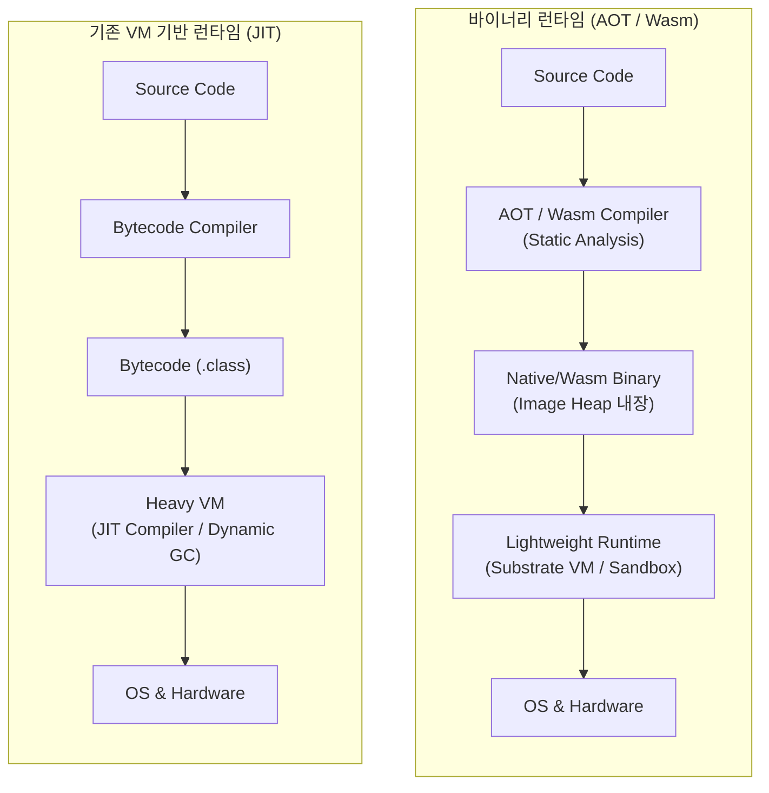

# 바이너리 런타임

---

## I. 클라우드 네이티브 최적화의 핵심, 바이너리 런타임의 개요

### 가. 바이너리 런타임의 정의

* 무거운 가상머신(VM)이나 실시간 통역(JIT) 과정 없이, 사전 컴파일된(AOT) 기계어나 WebAssembly(Wasm) 포맷을 [[샌드박스]] 및 초경량 환경에서 직접 실행하는 독립적 실행 환경.
* 클라우드 워크로드 및 엣지 컴퓨팅 생태계에서 애플리케이션의 고속 기동(Fast Startup)과 메모리 풋프린트 최소화를 달성하기 위해 도입된 차세대 런타임 아키텍처임.

### 나. 바이너리 런타임의 등장배경 및 특징

* **등장배경**:
* **서버리스/FaaS 확산**: 기존 JVM/V8 엔진의 초기 구동 지연(Cold Start) 문제 해결 필요.
* **[[컨테이너]] 경량화**: 마이크로서비스([[MSA (Micro Service Architecture)|MSA]]) 확장에 따른 컴퓨팅 리소스 및 메모리 사용량 절감 요구 증대.

* **주요 특징**:
* **초고속 기동성**: 빌드 타임에 [[클래스]] 및 초기화 상태를 바이너리에 스냅샷(Image Heap)으로 포함하여 즉시 실행함.
* **최소 리소스 소모**: 런타임에 JIT 컴파일러 등 무거운 엔진을 배제하여 메모리 및 [[CPU]] 오버헤드를 극단적으로 최소화함.
* **플랫폼 독립성 및 격리성**: Wasm 런타임 등을 통한 뛰어난 이식성 및 보안 샌드박스(Security Sandbox)를 제공함.

---

## II. 바이너리 런타임의 개념도 및 핵심 기술 요소

### 가. 바이너리 런타임의 개념도 및 동작 원리

* 소스 코드를 런타임이 아닌 **빌드 타임(AOT)** 에 정적 분석을 거쳐 기계어 또는 샌드박스 바이너리로 완벽히 변환하는 구조임.
* JIT 컴파일 및 동적 클래스 로딩을 제거하고, **Image Heap** 형태로 초기화 데이터를 바이너리에 주입하여 최소한의 런타임(Substrate VM 등) 위에서 즉각 동작함.

### 나. 바이너리 런타임의 핵심 기술 요소

| 분류 | 핵심 기술 (키워드) | 세부 설명 |
| --- | --- | --- |
| **빌드/컴파일** | AOT (Ahead-of-Time) | 프로그램 실행 전 소스나 바이트코드를 타겟 디바이스의 기계어로 사전 컴파일하여 런타임 오버헤드 제거 |
| **빌드/컴파일** | 도달성 분석 (Reachability) | 정적 분석을 통해 실행 시점에 호출되지 않는 불필요한 영역(Dead Code)을 제거하여 바이너리 크기 최적화 |
| **최적화 기법** | 이미지 힙 (Image Heap) | 애플리케이션 초기화 상태(메모리 스냅샷)를 바이너리 내에 직접 패키징하여 구동 속도 극대화 |
| **최적화 기법** | LTO (Link-Time Optimization) | 링킹 단계에서 여러 오브젝트 파일을 통합 분석하고 전역 최적화를 수행하여 성능 향상 및 크기 최소화 |
| **런타임 환경** | Substrate VM | GraalVM 기반 네이티브 바이너리 실행을 위해 내장되는 초경량 런타임 (스레드 [[스케줄링]], 경량 GC 수행) |
| **런타임 환경** | Wasm Sandbox | WebAssembly 바이너리를 호스트 OS와 안전하게 격리된 환경에서 실행하는 초경량 가상머신 (Wasmtime, WasmEdge) |
| **보안/인터페이스** | WASI (Wasm System Interface) | 런타임 내의 Wasm 바이너리가 OS의 파일, 네트워크 리소스 등에 안전하게 접근할 수 있도록 통제하는 표준 시스템 API |
| **[[메모리 관리]]** | 경량 GC (Garbage Collector) | 런타임 오버헤드를 줄이기 위한 단순화된 메모리 회수 기법 (Epsilon GC, Serial GC 등 제한적 적용) |

---

## III. 기존 JIT 런타임과 바이너리 런타임 비교 및 향후 전망

### 가. JIT(VM) 런타임과 AOT(바이너리) 런타임 비교

| 비교 항목 | 기존 JIT (VM) 런타임 | 바이너리 (AOT / Wasm) 런타임 |
| --- | --- | --- |
| **설계 철학** | 런타임 동적 최적화 및 유연성 확보 | 빌드 타임 정적 최적화 및 극단적 경량화 |
| **초기 구동 속도** | 느림 (Warm-up 시간 소요, 콜드 스타트 문제 발생) | 매우 빠름 (스냅샷 기반 즉시 기동, 콜드 스타트 해결) |
| **메모리 풋프린트** | 큼 (JIT 컴파일러 및 메타데이터 상주 필요) | 작음 (경량화된 최소 런타임만 실행 파일에 포함) |
| **최고 성능 (Peak)** | 런타임 프로파일링(동적 정보) 기반 고도의 런타임 최적화로 높음 | 정적 컴파일의 구조적 한계로 동적 런타임 최적화 부재 (JIT 대비 다소 낮을 수 있음) |
| **런타임 유연성** | 동적 클래스 로딩, 리플렉션(Reflection) 자유로움 | 리플렉션, 동적 프록시 등 사용 시 빌드 타임에 사전 메타데이터 등록 필수 |
| **적용 워크로드** | 장기 실행(Long-running) 데몬, 모놀리식 아키텍처 서버 | 서버리스(FaaS), 초경량 마이크로서비스(MSA), 엣지([[EDGE|Edge]])/IoT 디바이스 |
| **대표 솔루션** | JVM(HotSpot), JavaScript V8 Engine, CLR | GraalVM Native Image, Wasmtime, Wasmer |

### 나. 향후 전망 및 기술 동향

* **PGO(Profile-Guided Optimization) 도입**: 바이너리 런타임의 최대 약점인 '정적 컴파일로 인한 최고 성능(Peak Performance) 저하'를 극복하기 위해, 실제 실행 프로파일 정보를 바탕으로 코드를 재구성하는 PGO 방식의 하이브리드 최적화가 필수적으로 적용되는 추세임.
* **차세대 컨테이너 런타임으로의 진화**: 무거운 도커([[도커|Docker]])/리눅스 컨테이너 환경을 대체하거나 보완하기 위해 Wasm 기반의 초경량 런타임(Kwasm, Spin 등)이 Kubernetes 환경에 통합되며 차세대 서버리스 컴퓨팅 및 [[온디바이스 AI]] 인프라의 핵심 표준으로 발전 중임.

---

### 🔗 연관 토픽

- **소속 도메인**: [[00_운영체제_MOC|⚙️ 운영체제]]
- **세부 분류**: `6. 커널 아키텍처 & 입출력 시스템`
- **핵심 연관 토픽**:
  - [[EDGE|edge]]
  - [[컨테이너|컨테이너 (Container)]]
  - [[스케줄링]]
  - [[도커|도커 (Docker)]]
  - [[MSA (Micro Service Architecture)]]
