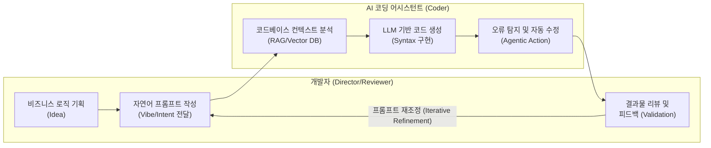

# 바이브코딩 (Vibe Coding)

---

## I. 의도 중심의 차세대 개발 패러다임, 바이브코딩의 개요

* **정의**: 자연어를 활용하여 AI 코딩 어시스턴트에게 개발 의도(Vibe)와 흐름만 전달하고, 실제 구체적인 코드(Syntax) 작성은 AI가 자율적으로 수행하는 새로운 소프트웨어 개발 패러다임
* 안드레이 카파시(Andrej Karpathy) 등 주요 AI 전문가들에 의해 주창되며, 최근 Cursor, Windsurf 등의 AI 네이티브 IDE 등장과 함께 확산됨
* **특징**: 의도 중심(Intent-Driven) 프로그래밍, 인간-AI 협업 기반의 개발 생산성 기하급수적 향상, 문법 지식 의존도 감소 및 진입장벽 완화

---

## II. 바이브코딩의 개념도 및 핵심 기술 요소

### 가. 바이브코딩의 개념도 및 동작 원리

* 개발자는 전체 구조 설계 및 비즈니스 요구사항을 자연어로 전달하고, AI 에이전트가 문법적 코드 작성, 디버깅, 최적화를 수행하는 반복적(Iterative) 피드백 루프 구조임

### 나. 바이브코딩의 핵심 구성 요소

| 분류 | 핵심 기술 (키워드) | 세부 설명 |
| --- | --- | --- |
| **기반 모델** | [[초거대 언어 모델|LLM]] (Large Language Model) | 코드 생성, 리팩토링, 자연어 명령 이해를 수행하는 핵심 지능 (GPT-4o, Claude 3.5 Sonnet 등) |
| **개발 환경** | AI Native IDE | 프로젝트 전체 컨텍스트를 실시간으로 인지하여 개발을 보조하는 통합 개발 환경 (Cursor, Windsurf 등) |
| **문맥 제어** | RAG 기반 컨텍스트 인지 | 로컬 디렉토리, 기존 레거시 코드, API 문서를 참조하여 프로젝트에 최적화된 코드 생성 지원 |
| **상호작용** | Prompt Engineering | 명확한 아키텍처 지시 및 AI 환각(Hallucination) 최소화를 위한 체계적인 자연어 프롬프트 설계 |
| **자율 실행** | Agentic Workflow | 단순 코드 자동완성(Copilot)을 넘어, 컴파일 에러 탐지 및 코드 수정을 자율적으로 수행하는 에이전트 기술 |
| **품질 검증** | AI-Assisted Testing | 생성된 코드에 대한 유닛 테스트 생성 및 엣지 케이스 점검을 AI가 자동으로 수행하여 [[신뢰성]] 확보 |

---

## III. 전통적 코딩과의 비교 및 향후 전망

### 가. 전통적 코딩(Traditional Coding)과 바이브코딩 비교

| 비교 항목 | 전통적 코딩 (Traditional Coding) | 바이브코딩 (Vibe Coding) |
| --- | --- | --- |
| **개발의 중심축** | 구문(Syntax) 및 로직 직접 구현 중심 | 의도(Intent) 및 아키텍처 설계 중심 |
| **개발자의 역할** | 코드를 직접 타이핑하는 작성자 (Coder) | AI를 지휘하고 결과물을 검증하는 감독자 (Director) |
| **문제 해결 방식** | StackOverflow 등 검색 후 수동 적용 | AI에게 프롬프트 지시를 통한 자동 생성 및 적용 |
| **생산성 및 속도** | 개발자의 숙련도에 비례하여 선형적 증가 | AI 활용 능력에 따라 기하급수적(Exponential) 증가 |
| **필요 핵심 역량** | 프로그래밍 언어 문법, [[알고리즘]] 구현 능력 | [[프롬프트 엔지니어링]], 시스템 설계, 코드 리뷰 역량 |

### 나. 향후 전망 및 시사점

* **개발자 역량의 패러다임 변화**: 코딩 기술(How to build)보다 비즈니스 문제 정의 및 아키텍처 설계(What to build) 역량이 핵심 경쟁력으로 대두됨
* **보안 및 품질 검증([[DevSecOps]]) 중요성 증대**: AI가 생성한 코드에 내재될 수 있는 보안 취약점, 라이선스 침해, 환각(Hallucination) 오류를 통제하기 위한 자동화된 검증 파이프라인(CI/CD) 및 코드 리뷰 체계의 정교화가 필수적임

---

### 🔗 연관 토픽

- **소속 도메인**: [[00_인공지능_MOC|🤖 인공지능]]
- **세부 분류**: `4. 거대언어모델 (LLM) & 생성형 AI`
- **핵심 연관 토픽**:
  - [[프롬프트 엔지니어링|프롬프트 엔지니어링(Prompt Engineering)]]
  - [[공공부문 초거대AI 도입, 활용 가이드라인 2.0(2025.04)]]
  - [[인공지능 학습용 데이터 품질관리 가이드라인 v3.1]]
  - [[초거대 언어 모델|초거대 언어 모델(Large Language Model)]]
  - [[DevSecOps]]
