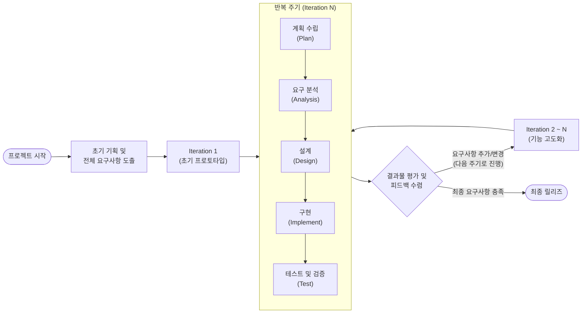

# 반복적 개발 모델 (Iterative Model)

---

## I. 변화에 유연한 진화형 SDLC, 반복적 개발 모델의 개요

### 가. 반복적 개발 모델의 정의

* 시스템 전체 요구사항을 여러 번의 짧은 개발 주기(Iteration)로 분할하여, 반복적인 분석·설계·구현·테스트를 거쳐 소프트웨어의 완성도를 점진적으로 높여가는 개발 생명주기([[SDLC]]) 모델임.
* 초기 프로토타입이나 골격(Skeleton)을 먼저 구축한 후, 지속적인 사용자 피드백을 반영하여 기능을 구체화하고 개선하는 진화적 접근 방식임.

### 나. 반복적 개발 모델의 등장배경 및 특징

* **등장배경**: 요구사항 변경 수용이 어려운 [[워터폴|폭포수]](Waterfall) 모델의 경직성 극복 및 개발 후반부 리스크 집중 현상 해결 필요.
* **특징**:
* **조기 가시성 확보**: 개발 초기부터 작동하는 소프트웨어를 제공하여 사용자 요구사항 오해 방지.
* **위험 분산 및 완화**: 주기(Iteration)마다 검증을 수행하여 기술적, 사업적 리스크를 조기 식별 및 조치.
* **애자일([[Agile]]) 근간**: [[스크럼]]([[SCRUM|Scrum]]), XP 등 현대 애자일 방법론의 핵심 프로세스로 활용.

---

## II. 반복적 개발 모델의 개념도 및 핵심 기술 요소

### 가. 반복적 개발 모델의 동작 원리 및 개념도

* 짧은 주기(보통 2~4주)의 타임박스(Timebox) 내에서 `계획 -> 분석 -> 설계 -> 구현 -> 테스트`의 미니 프로젝트를 반복 수행.
* 각 주기 종료 시 실행 가능한 버전을 산출하며, 사용자 평가(Review)를 통해 다음 주기의 백로그(Backlog)에 피드백을 반영함.

### 나. 반복적 개발 모델의 핵심 구성 요소

| 분류 | 요소기술(키워드) | 세부 설명 |
| --- | --- | --- |
| **주기 관리** | 타임박싱 (Timeboxing) | 각 반복 주기(Iteration)의 기간을 고정하여 일정 지연을 방지하고 예측 가능성 확보 |
| **요구사항 관리** | 백로그 (Backlog) | 전체 요구사항 및 추가/변경 사항을 우선순위에 따라 목록화하여 주기별 할당 |
| **개발 기법** | 프로토타이핑 (Prototyping) | 사용자 인터페이스나 핵심 로직을 빠르게 구현하여 피드백 수집 및 타당성 검증 |
| **코드 품질** | 리팩토링 (Refactoring) | 반복 개발에 따른 누더기 코드(Technical Debt) 방지를 위해 외부 동작 변경 없이 내부 구조 개선 |
| **검증 및 통합** | CI/CD (지속적 통합/배포) | 빈번한 코드 병합과 자동화된 빌드/테스트를 통해 결함을 조기 발견하고 릴리즈 주기 단축 |
| **위험 관리** | 리스크 기반 식별 (Risk-driven) | 개발 초기 반복 주기에 아키텍처 등 가장 위험도와 불확실성이 높은 요소를 우선 해결 |
| **평가/피드백** | 리뷰 및 회고 (Review/Retrospective) | 매 주기 종료 시 작동하는 SW를 시연하고, [[프로세스]] 개선점을 도출하여 다음 주기에 반영 |

---

## III. 유사 모델 비교 및 향후 활용 방향

### 가. 개발 모델 간 특성 비교 (반복적 vs 점증적 vs 폭포수)

| 비교 항목 | 반복적 모델 (Iterative) | 점증적 모델 (Incremental) | [[폭포수 모델]] (Waterfall) |
| --- | --- | --- | --- |
| **핵심 철학** | **진화적 (Evolution)** | **조립식 (Addition)** | **순차적 (Sequential)** |
| **개발 방식** | 전체의 뼈대를 만들고 살을 붙이며 **깊이(Detail)**를 더해감 (스케치 후 덧칠) | 완성된 개별 모듈을 하나씩 추가하여 **범위(Scope)**를 넓혀감 (퍼즐 맞추기) | 단계를 엄격히 구분하여 한 번에 전체 시스템 완성 (빅뱅 릴리즈) |
| **요구사항 수용** | 진행 중 변경 수용 매우 용이 | 모듈 추가 시 변경 수용 가능 | 초기 확정 후 변경 수용 곤란 |
| **초기 릴리즈** | 기능은 부족하나 전체 흐름 동작 | 흐름은 단절되나 특정 기능 완벽 동작 | 릴리즈 불가능 (후반부에 집중) |
| **적용 프로젝트** | 요구사항 불명확, 혁신적 신규 서비스 | 요구사항 비교적 명확, [[모듈화]] 용이 시스템 | 요구사항 명확, 대규모 인프라 구축 |

* **실무적 적용**: 현대의 소프트웨어 공학(IID, 애자일 등)에서는 반복적(Iterative) 방식과 점증적(Incremental) 방식을 결합하여, 핵심 모듈을 먼저 점증적으로 도입하고 이를 반복적으로 고도화하는 하이브리드 형태로 널리 활용되고 있음.

---

### 🔗 연관 토픽

- **소속 도메인**: [[00_소프트웨어공학_MOC|🏗️ 소프트웨어공학]]
- **세부 분류**: `1. 소프트웨어 개발 생명주기(SDLC) & 방법론`
- **핵심 연관 토픽**:
  - [[Agile]]
  - [[SDLC]]
  - [[폭포수 모델]]
  - [[워터폴]]
  - [[SCRUM]]
