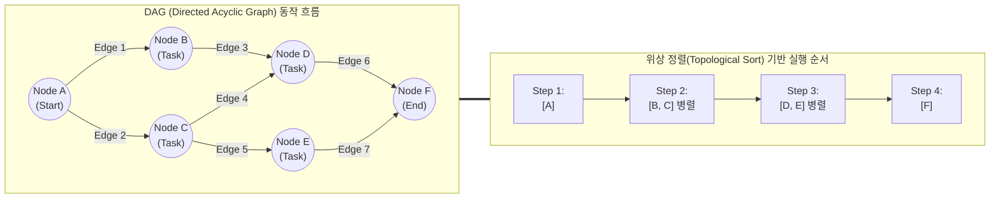

# 방향성 비순환 그래프(DAG)

---

## I. 복잡한 의존성 관리와 병렬 처리 최적화 자료구조, 방향성 비순환 그래프(DAG)의 개요

### 가. 방향성 비순환 그래프(DAG)의 정의

* 정점(Vertex) 간의 연결이 방향(Directed)을 가지면서, 시작점으로 다시 돌아오는 순환(Cycle) 경로가 존재하지 않는(Acyclic) 그래프 기반의 비선형 자료구조임.
* 선후 관계(의존성)가 명확한 작업 [[스케줄링]], 데이터 파이프라인 흐름 제어, 분산 원장 기술(DLT)에서 병렬 처리와 확장성을 극대화하기 위해 활용됨.

### 나. 방향성 비순환 그래프(DAG)의 필요성 및 특징

* **선행 조건 완벽 제어**: 노드 간의 위계와 선후 관계를 수학적으로 명확히 정의하여 [[교착상태]](Deadlock) 방지.
* **병렬 처리 최적화**: 의존성이 없는 독립적인 노드들을 식별하여 동시(Concurrency) 실행 및 연산 가속화.
* **위상 정렬(Topological Sorting) 지원**: 모든 노드를 방향성에 거스르지 않게 순서대로 나열하여 효율적인 실행 스케줄링 보장.

---

## II. 방향성 비순환 그래프(DAG)의 개념도 및 핵심 기술 요소

### 가. 방향성 비순환 그래프(DAG)의 개념도 및 동작 원리

* 작업 A가 완료되어야 B, C가 실행 가능하며, 순환 루프가 없으므로 무한 대기 없이 위상 정렬 순서대로 안전하게 병렬 처리(Step 2, Step 3) 수행됨.

### 나. 방향성 비순환 그래프(DAG)의 핵심 기술 요소

| 구분 | 요소기술(키워드) | 세부 설명 |
| --- | --- | --- |
| **구성 요소** | 정점 (Vertex / Node) | 단일 작업(Task), 데이터 포인트, 혹은 트랜잭션을 나타내는 기본 단위 |
| **구성 요소** | 간선 ([[EDGE|Edge]] / Link) | 노드 간의 방향성 있는 연결로, 데이터의 흐름이나 작업의 선후 의존성 표현 |
| **핵심 [[알고리즘]]** | 위상 정렬 (Topological Sort) | 진입 차수(In-degree)가 0인 노드부터 순차적으로 나열하여 의존성을 위배하지 않는 실행 순서 도출 |
| **핵심 알고리즘** | 사이클 탐지 (Cycle Detection) | DFS(깊이 우선 탐색) 기반 역방향 간선(Back Edge) 존재 여부를 확인하여 비순환성 검증 |
| **최적화 기법** | 임계 경로 (Critical Path) | 시작점부터 종료점까지 가장 긴 실행 시간을 갖는 경로를 계산하여 전체 공정 시간 단축 제어 |
| **동작 메커니즘** | 지연 평가 (Lazy Evaluation) | Apache Spark 등에서 최종 액션(Action)이 호출될 때까지 DAG 구성만 하고 실제 연산은 지연시킴 |
| **동작 메커니즘** | 태스크 오케스트레이션 | Airflow 등에서 각 태스크의 성공/실패 상태를 추적하고, 후행 태스크의 실행 여부 결정 |
| **분산 원장** | 방향성 [[트랜잭션]] 참조 | 블록체인에서 신규 트랜잭션이 이전의 여러 트랜잭션을 직접 참조(검증)하며 원장 생성 |

---

## III. 방향성 비순환 그래프(DAG)의 자료구조 비교 및 최신 활용 동향

### 가. 일반 그래프, 트리, DAG의 구조적 비교

| 비교 항목 | 일반 그래프 (General Graph) | 트리 (Tree) | 방향성 비순환 그래프 (DAG) |
| --- | --- | --- | --- |
| **방향성 유무** | 방향 / 무방향 모두 가능 | 방향성 있음 (부모 -> 자식) | 반드시 방향성 존재 (Directed) |
| **순환(Cycle)** | 순환 허용 (루프 가능) | 비순환 (Acyclic) | 비순환 (Acyclic) |
| **계층/부모 수** | 다중 부모/자식 허용 | 1개의 부모만 허용 (루트 제외) | 다중 부모 허용 (유연한 의존성) |
| **탐색 복잡도** | 매우 높음 (무한 루프 방지 필요) | 낮음 (최단 경로 유일) | 중간 (위상 정렬을 통한 선형화) |
| **주요 활용처** | SNS 관계망, 네비게이션 경로 탐색 | 디렉토리 구조, 계층형 DB, DOM | 데이터 파이프라인, [[스케줄러]], DLT |

### 나. DAG 기술의 최신 활용 동향 및 전망

* **모던 데이터 스택(MDS) 표준**: Apache Airflow(작업 스케줄링), dbt(데이터 변환 파이프라인) 등에서 데이터 엔지니어링의 표준 워크플로우 엔진 아키텍처로 완전 채택됨.
* **분산 원장 기술(DLT)의 진화**: IOTA, Hedera Hashgraph, Sui/Aptos(Mempool [[합의 알고리즘]]) 등에서 기존 선형 블록체인의 TPS 한계와 높은 수수료 문제를 해결하기 위해 블록 없는 DAG 기반 원장 구조로 확장 중.
* **[[MLOps]] 파이프라인 고도화**: Kubeflow, MLflow 등 [[인공지능]] 모델 학습/평가/배포 파이프라인에서 단계별 재현성 보장과 분산 [[GPU]] 병렬 처리 극대화를 위해 DAG 기반 아키텍처 적극 도입.

---

### 🔗 연관 토픽

- **소속 도메인**: [[00_컴퓨터구조_MOC|💻 컴퓨터구조]]
- **세부 분류**: `1. CPU 프로세서 & 마이크로아키텍처`
- **핵심 연관 토픽**:
  - [[알고리즘]]
  - [[GPU]]
  - [[스케줄링]]
  - [[스케줄러|스케줄러 (Scheduler)]]
  - [[인공지능]]
