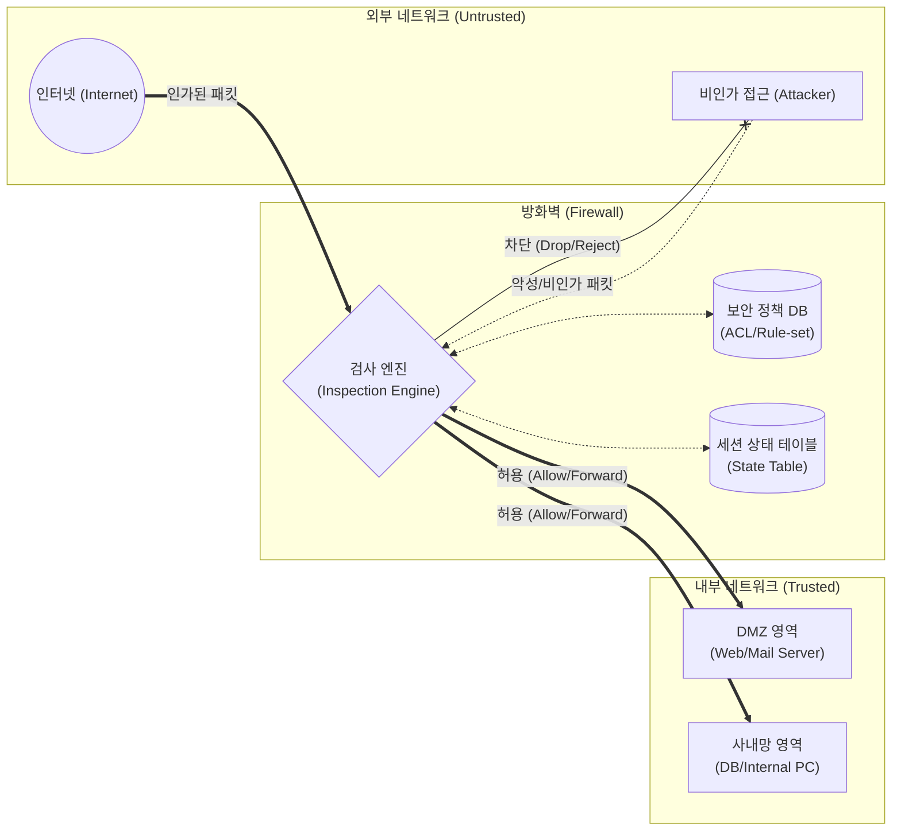

# 방화벽 (Firewall)

---

## I. 네트워크 접근 통제의 1차 방어선, 방화벽의 개요

### 가. 방화벽의 정의

* 신뢰할 수 없는 외부 네트워크(Internet)와 신뢰할 수 있는 내부 네트워크(Intranet) 사이에서, 사전에 정의된 보안 규칙(Rule-set)에 따라 트래픽의 허용 및 차단을 제어하는 보안 시스템
* IP 주소, 포트 번호, [[프로토콜]] 및 [[세션]] 상태 정보 등을 기반으로 불법적인 접근을 원천 차단하는 네트워크 보안의 핵심 인프라임

### 나. 방화벽의 필요성 및 특징

* **단일 방어 지점(Choke Point)**: 내부와 외부망의 유일한 통로에 배치하여 보안 정책의 집중적 관리 및 효율적 모니터링 수행
* **접근 통제(Access Control)**: 인가되지 않은 트래픽 차단 및 내부 자산(서버, DB, 단말) 보호
* **네트워크 분리(Segmentation)**: 신뢰도에 따라 네트워크 영역(DMZ, 사내망 등)을 논리적/물리적으로 분리 및 격리

---

## II. 방화벽의 개념도 및 핵심 기술 요소

### 가. 방화벽의 개념도 및 동작 원리

* 외부에서 유입되는 인바운드 패킷을 검사 엔진이 보안 정책(ACL)과 세션 상태(State Table)를 대조하여 검사함
* 규칙에 부합하는 정상 트래픽은 내부 네트워크(DMZ/사내망)로 전달(Forward)하고, 위배되는 트래픽은 즉시 폐기(Drop/Reject)함

### 나. 방화벽의 핵심 기술 요소

| 구분 | 요소기술(키워드) | 세부 설명 |
| --- | --- | --- |
| **기본 통제** | 패킷 필터링 (Packet Filtering) | L3(Network), L4(Transport) 계층의 헤더 정보(IP, Port, Protocol)를 검사하여 트래픽 허용/차단 |
| **상태 관리** | 상태 기반 감시 (Stateful Inspection) | 활성화된 연결([[Session Layer|Session]])의 상태 정보를 메모리에 저장하여, 컨텍스트 기반으로 동적 패킷 제어 |
| **심층 검사** | 애플리케이션 프록시 (App Proxy) | L7 계층에서 클라이언트-서버 간 연결을 중계하며 방화벽이 대리 통신하여 페이로드 심층 검사 |
| **심층 검사** | DPI (Deep Packet Inspection) | 패킷의 헤더뿐만 아니라 데이터(Payload) 영역까지 분석하여 애플리케이션 식별 및 악성코드 탐지 |
| **네트워크** | NAT (Network Address Translation) | 사설 IP와 공인 IP를 상호 변환하여 내부 네트워크 구조를 은닉하고 IP 자원 고갈 문제 해결 |
| **보안 통신** | [[VPN]] 지원 ([[IP Sec|IPsec]] / SSL) | 공중망을 통해 원격지 접속자나 지사와 안전하게 통신할 수 있는 [[암호화]] 터널링 기능 제공 |
| **정책 관리** | ACL (Access Control List) | 방화벽 검사 엔진이 참조하는 트래픽 제어 룰셋으로, 순차적(Top-Down)으로 적용되는 접근 제어 목록 |
| **가시성** | 로깅 및 감사 (Logging & Auditing) | 인가 및 차단된 모든 접속 시도와 트래픽 내역을 기록하여 향후 보안 사고 추적 및 포렌식에 활용 |

---

## III. 전통적 방화벽과 차세대 방화벽(NGFW) 비교 및 최신 동향

### 가. 전통적 방화벽(Legacy)과 차세대 방화벽(NGFW) 비교

| 비교 항목 | 전통적 방화벽 (Legacy Firewall) | 차세대 방화벽 (NGFW) |
| --- | --- | --- |
| **주요 방어 계층** | L3 (네트워크), L4 (전송) 계층 | L7 (애플리케이션) 계층 포함 전 계층 |
| **검사 방식** | 헤더 정보 확인, 상태 기반 감시(Stateful) | DPI(심층 패킷 분석) 기반 페이로드 검사 |
| **식별 및 통제 대상** | IP 주소, 포트(Port), 프로토콜 | 애플리케이션, 사용자(User-ID), 콘텐츠(Content-ID) |
| **기능 통합 여부** | 단일 접근 통제 중심 | IPS, Anti-Virus, [[샌드박스]], URL 필터링 통합 |
| **위협 대응 능력** | 알려진 단순 포트 기반 위협 차단 | 지능형 지속 위협(APT) 및 우회 공격 방어 |

### 나. 방화벽 기술의 최신 동향 및 전망

* **[[클라우드 네이티브]] 전환 (FWaaS)**: 인프라가 클라우드로 이동함에 따라, 물리적 어플라이언스 종속성을 탈피하여 [[SASE(Secure Access Service Edge)]] 아키텍처 기반의 FWaaS(Firewall as a Service) 도입이 가속화됨
* **제로 트러스트(ZTA) 결합 및 마이크로 [[세그멘테이션]]**: 내부망은 안전하다는 기존 경계 보안 모델에서 벗어나, [[컨테이너]] 및 VM 단위로 방화벽 정책을 세밀하게 적용하는 마이크로 세그멘테이션(Micro-segmentation) 기술로 진화 중임
* **AI/ML 기반 정책 자동화**: 수만 개의 복잡한 ACL 정책을 AI가 분석하여 중복/충돌 룰을 제거하고, 비정상 트래픽 패턴을 학습하여 동적으로 차단 룰을 생성하는 지능형 관리 체계로 발전하고 있음

---

### 🔗 연관 토픽

- **소속 도메인**: [[00_보안_MOC|🛡️ 보안]]
- **세부 분류**: `3. 네트워크 & 엔드포인트 · 인프라 보안`
- **핵심 연관 토픽**:
  - [[SASE(Secure Access Service Edge)]]
  - [[클라우드 컴퓨팅 취약점 및 대응기술]]
  - [[샌드박스|샌드박스 (Sandbox)]]
  - [[SecaaS (Security as a Service)]]
  - [[VPN|VPN(Virtual Private Network)]]
